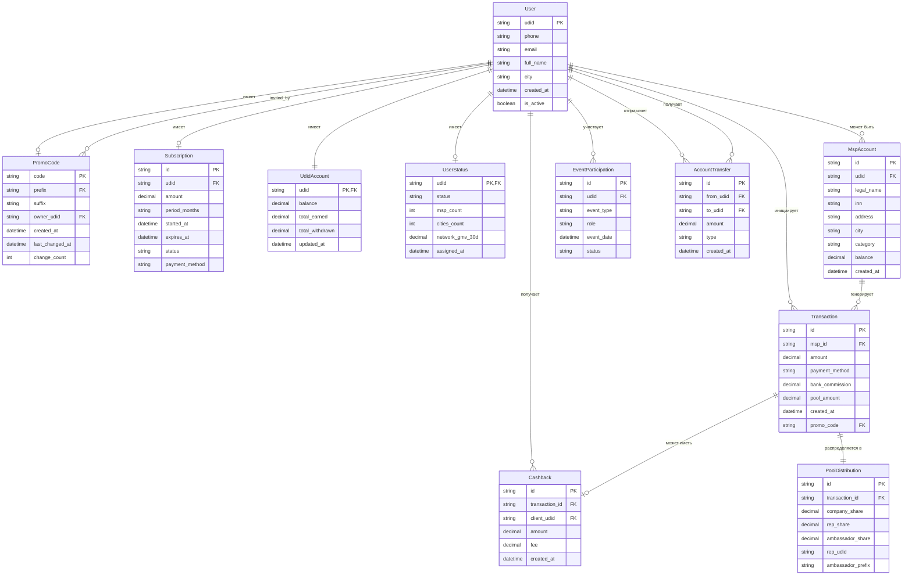
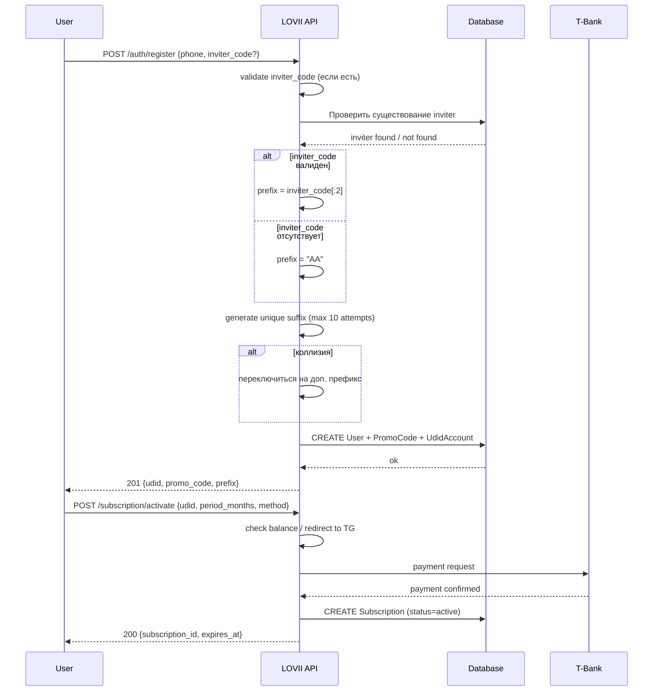
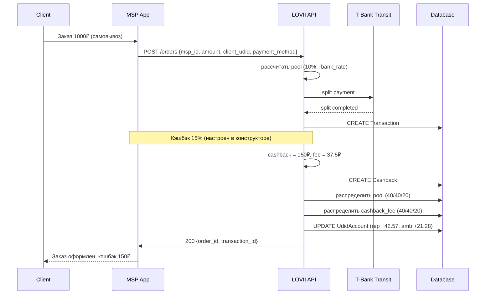

> ⚠️ **АРХИВ.** Данный документ устарел. Актуальная версия — `workspace/docs/BRD.md` (v1.4).

Поехали! 🚀

Ниже — полный пакет из 5 документов. Копируйте каждый блок в отдельный файл с указанным именем.

---

# ═══════════════════════════════════════
# 📄 ДОКУМЕНТ 1 из 5: BRD.md
# ═══════════════════════════════════════

```markdown
# LOVII — Бизнес-требования к реферальной системе
## BRD (Business Requirements Document)

**Версия:** 1.0  
**Дата:** 2026-08-25  
**Статус:** Канонический  
**Аудитория:** Ведущий разработчик  
**Язык:** Русский + технические термины на английском

---

## 1. Глоссарий

| Термин | Определение |
|---|---|
| **UDID** | Уникальный идентификатор пользователя в системе LOVII. Создаётся в момент регистрации. |
| **Промокод** | Строка формата `PPXXXX` (6 символов). Способ встать в структуру + привязка к подписке + канал начислений. |
| **Префикс промокода** | Первые 2 символа промокода. Определяет «ветку» (Амбассадора). |
| **Суффикс промокода** | Последние 4 символа промокода. Уникальны в рамках префикса. |
| **Алфавит промокода** | 33 символа: `23456789ABCDEFGHJKLMNPQRSTUVWXYZ`. Исключены: 0, 1, I, O. |
| **Амбассадор** | Владелец ветки (уникального префикса). Получает 20% от пула LOVII по промокодам своей ветки. |
| **Представитель** | Пользователь с активной подпиской, приглашающий других. Получает 40% от пула LOVII. |
| **МСП** | Микро/малое предприятие, продающее товары/услуги через платформу. |
| **Клиент МСП** | Покупатель (физлицо), оплачивающий заказ. |
| **Активный статус** | Состояние промокода, при котором начисления идут его владельцу. Зависит от подписки. |
| **Пул LOVII** | Комиссия платформы с заказа: 10% нагрузки на МСП минус комиссия банка-эквайера. |
| **Сплит 40/40/20** | Базовое распределение пула LOVII: Компания 40% / Представитель 40% / Амбассадор 20%. |
| **UDID-счёт** | Внутренний рублёвый баланс пользователя. Копится, можно выводить, тратить, переводить. |
| **МСП-счёт** | Отдельный счёт МСП для бухгалтерской отчётности. Обнуляется после выплат на р/с ИП/ЮЛ. |
| **Транзитный счёт** | Счёт Т-Банка для мультисплита платежей. Принадлежит банку, управляется через API. |
| **Кэшбэк** | Баллы/рубли, начисляемые клиенту МСП. Выдаётся точкой из чека по конструктору лояльности. |
| **Конструктор лояльности** | Инструмент МСП для настройки кэшбэка (%, условия, акции). |
| **Школа** | Событие для Представителей. Учат Мэры. |
| **Академия** | Событие для Мэров. Преподают Губернаторы. |
| **Каникулы** | Событие для Губернаторов. Оплачивает Компания. |

---

## 2. Роли и иерархия

### 2.1. Дерево ролей

```
Основатель (UDID: osnovatel, Промокод: AAAAAA)
│
└── Амбассадор (уникальный префикс, выдаётся Основателем)
       │
       └── Представитель (любой пользователь с активной подпиской)
              │
              └── МСП (может быть одновременно с ролью Представителя)
                     │
                     └── Клиент МСП (покупатель)
```

### 2.2. Атрибуты ролей

| Роль | Условие получения | Ключевые атрибуты |
|---|---|---|
| **Основатель** | Создатель системы | UDID: `osnovatel`, Промокод: `AAAAAA`, Префикс: `AA` (зарезервирован) |
| **Амбассадор** | Создан Основателем вручную | Уникальный префикс (2 символа), собственный промокод `PPXXXX` |
| **Представитель** | Регистрация по чужому промокоду + активная подписка | Промокод `PPXXXX`, UDID-счёт |
| **Мэр** | Статус Представителя: ≥ 30 подключённых МСП | Все атрибуты Представителя + бейдж + доступ к Школе как наставник |
| **Губернатор** | Статус Представителя: 3+ городов × 30+ МСП + выручка сети ≥ 15 млн ₽/мес | Все атрибуты Мэра + доступ к Академии как преподаватель + право на Каникулы |
| **МСП** | Регистрация (бесплатно, по любому промокоду или своему) | Каталог, МСП-счёт, конструктор лояльности |

### 2.3. Принцип сосуществования ролей

**Роли НЕ взаимоисключающие.** Один пользователь может быть:
- Владельцем МСП + Представителем (если приглашает других)
- Амбассадором + МСП (если сам продаёт на платформе)
- Мэром + МСП (если его МСП входит в его же сеть)

Каждая роль даёт свои начисления по своим правилам.

---

## 3. Промокоды

### 3.1. Формат

```
[PP][XXXX]
  │   │
  │   └── 4 символа, случайная генерация по алфавиту
  └────── 2 символа, префикс ветки (наследуется от пригласившего)
```

**Алфавит (33 символа):** `23456789ABCDEFGHJKLMNPQRSTUVWXYZ`  
**Исключения:** `0`, `1`, `I`, `O` (визуальная неоднозначность)

### 3.2. Правила генерации

| Сценарий | Алгоритм |
|---|---|
| Регистрация с промокодом `INVITER_CODE` | `PREFIX = INVITER_CODE[0:2]`<br>`SUFFIX = random(33^4)`<br>`PROMO = PREFIX + SUFFIX` |
| Регистрация без промокода | `PREFIX = "AA"` (Основатель)<br>`SUFFIX = random(33^4)`<br>`PROMO = "AA" + SUFFIX` |
| Создание Амбассадора Основателем | Основатель выбирает свободный 2-символьный префикс<br>`SUFFIX = random(33^4)`<br>`PROMO = PREFIX + SUFFIX` |

### 3.3. Ёмкость системы

| Уровень | Ёмкость |
|---|---|
| Один префикс (1 Амбассадор) | 33⁴ = **1 185 921** кодов |
| Всего префиксов | 33² = **1 089** (включая `AA` Основателя) |
| Общий потенциал | ~**1,29 млрд** промокодов |

### 3.4. Коллизии

**Определение:** сгенерированный `PREFIX + SUFFIX` уже занят в системе.

**Поведение:**
1. Пользователь не получает уведомлений о коллизии.
2. Система автоматически:
   - Проверяет уникальность суффикса в рамках префикса.
   - При коллизии → переключается на **дополнительный префикс** того же Амбассадора.
   - Например: основной `BJ` → дополнительный `B1` → `B2` и т.д.
3. Новые коды с дополнительными префиксами валидны и участвуют в той же ветке Амбассадора.

**Лимит префиксов на Амбассадора:** не менее 3 (настраивается).

### 3.5. Смена промокода

**Правила:**
- Не чаще **1 раза в 30 дней**.
- Меняется **только суффикс**, префикс остаётся (пользователь остаётся в той же ветке).
- Прошлые начисления остаются у прежнего промокода (не пересчитываются).
- Подписка сохраняется.
- Структура привязки к вышестоящему не меняется.

**Алгоритм:**
```
1. Проверить: с последней смены прошло ≥ 30 дней
2. Сгенерировать новый SUFFIX (random)
3. Обновить запись: old_SUFFIX → new_SUFFIX
4. Все начисления по новым транзакциям → на UDID-счёт владельца
5. Старые начисления (до смены) → без изменений
```

### 3.6. Резервирование

| Промокод | Владелец | Изменяемость |
|---|---|---|
| `AAAAAA` | Основатель | **Неизменяемый**, зарезервирован навсегда |

---

## 4. Подписка

### 4.1. Назначение

Подписка — это «премиум-аккаунт», который:
- Даёт право **приглашать** других пользователей.
- Фактически = статус **«Представитель»**.
- Определяет **активность промокода** (владелец получает начисления или нет).

### 4.2. Тарифы

| Тариф | Стоимость | Кому доступен |
|---|---|---|
| Базовая подписка | **600 ₽/мес** | Все пользователи |
| Подписка по промокоду Основателя | **199 ₽/мес** (акция) | По промокоду `AAAAAA` |

### 4.3. Состояния подписки

| Состояние | Условие | Поведение |
|---|---|---|
| **Активна** | Оплачен текущий период | Начисления по промокоду → UDID-счёт владельца |
| **Истекла** | Период закончился, не оплачен | Начисления → в Компанию (LOVII) |
| **Не оплачена** | Никогда не оплачивалась | Начисления → в Компанию (LOVII) |

### 4.4. Способы оплаты

| Способ | Описание |
|---|---|
| Банковская карта / СБП | Прямая оплата через Т-Банк |
| С UDID-счёта | Списание с внутреннего баланса (если достаточно средств) |
| Комбинированная | Частично с UDID-счёта, частично картой |

**Минимальный период оплаты:** 1 месяц.  
**Максимальный период оплаты:** 12 месяцев (включая оплату с UDID-счёта).

### 4.5. Связь подписки и промокода

```
Промокод существует всегда (создан при регистрации)
        │
        ▼
Подписка определяет активность:
        │
        ├── Активна → начисления владельцу промокода
        │
        └── Неактивна → начисления в Компанию
```

**Важно:** промокод можно **сменить** даже при неактивной подписке (с соблюдением лимита 1/30 дней), но без подписки он не приносит дохода.

---

## 5. Статусы Представителя

### 5.1. Лестница

```
Представитель → Мэр → Губернатор
```

### 5.2. Условия перехода

| Статус | Условие | Бейдж | Доступ к событиям |
|---|---|---|---|
| **Представитель** | По умолчанию (при наличии активной подписки) | 🥈 | Школа (как ученик) |
| **Мэр** | ≥ 30 подключённых МСП | 🥇 | Школа (как наставник) + Академия (как ученик) |
| **Губернатор** | 3+ городов × 30+ МСП + выручка сети ≥ 15 млн ₽/мес | 👑 | Академия (как преподаватель) + Каникулы |

### 5.3. Расчёт показателей

**Количество МСП** = количество МСП, зарегистрированных по промокодам Представителя **и его подчинённых** (вся ветка).

**Города** = уникальные города из адресов МСП в ветке.

**Выручка сети** = суммарный GMV всех МСП в ветке за последние 30 дней.

### 5.4. Автоматический переход

Статус пересчитывается **ежедневно** в 03:00 по МСК. При достижении условий новый статус присваивается автоматически.

При понижении показателей ниже порога — статус **не понижается** (one-way progression).

### 5.5. Бонусы и плюшки

Статусы дают доступ к **бонусам, премиям и плюшкам от Компании**:
- Расширенная аналитика
- Приоритетная поддержка
- Участие в событиях
- Брендированные материалы
- **Финансовая доля остаётся 40%** — статус не меняет %, только открывает возможности.

---

## 6. События (3 в год)

### 6.1. Школа

| Параметр | Значение |
|---|---|
| **Аудитория** | Представители |
| **Наставники** | Мэры |
| **Цель** | Обучение, онбординг, передача опыта |
| **Частота** | Определяется календарём (минимум 1 раз в год) |
| **Расходы** | На площадку, материалы — несёт Компания |

### 6.2. Академия

| Параметр | Значение |
|---|---|
| **Аудитория** | Мэры |
| **Преподаватели** | Губернаторы |
| **Цель** | Продвинутое обучение, обмен практиками |
| **Частота** | Определяется календарём (минимум 1 раз в год) |
| **Расходы** | На площадку, материалы — несёт Компания |

### 6.3. Каникулы

| Параметр | Значение |
|---|---|
| **Аудитория** | Губернаторы |
| **Формат** | Поездка / отдых за счёт Компании |
| **Цель** | Мотивация, нетворкинг, признание |
| **Частота** | 1 раз в год |
| **Расходы** | Полностью несёт Компания |

---

## 7. Экономика

### 7.1. Слой 1: Маршрутизация платежа (1000 ₽)

```
Клиент платит 1000 ₽
   │
   ├── Банк-эквайер (3,108% карта / 0,7% СБП)  → 31,08 / 7,00 ₽
   ├── Торговая точка (90% нагрузки)            → 900 ₽
   └── Пул LOVII (10% − банк)                   → 68,92 / 93,00 ₽
```

**Пул LOVII** = основа для распределения.

### 7.2. Слой 2: Распределение пула (40/40/20)

| Получатель | Доля | Пример с 68,92 ₽ (карта) | Пример с 93,00 ₽ (СБП) |
|---|---|---|---|
| **Компания (LOVII)** | 40% | 27,57 ₽ | 37,20 ₽ |
| **Представитель** (владелец промокода МСП) | 40% | 27,57 ₽ | 37,20 ₽ |
| **Амбассадор** (префикс ветки) | 20% | 13,78 ₽ | 18,60 ₽ |

**Никто другой не получает** — только эти 3 уровня.

### 7.3. Слой 3: Кэшбэк (если МСП настроил в конструкторе)

**Условие:** кэшбэк начисляется **только если МСП сам настроил** его через конструктор лояльности.

**Механика:**
```
1. Клиент платит 1000 ₽
2. По слою 1: точка получает 900 ₽
3. Точка выдаёт кэшбэк из чека: например, 15% = 150 ₽
4. 150 ₽ → клиенту (баллы / на UDID-счёт)
5. LOVII берёт 25% от 150 ₽ = 37,5 ₽ (платит точка сверху)
6. 37,5 ₽ распределяется:
   - LOVII 40%      → 15,00 ₽
   - Представитель 40% → 15,00 ₽
   - Амбассадор 20%    → 7,50 ₽
```

**Расчёт комиссии LOVII за кэшбэк:**
```
LOVII_комиссия = Сумма_кэшбэка_клиенту × 25%
LOVII_40%      = LOVII_комиссия × 40%
Представитель  = LOVII_комиссия × 40%
Амбассадор     = LOVII_комиссия × 20%
```

### 7.4. Сводный пример (1000 ₽, карта, кэшбэк 15%)

| Участник | Сумма | Основание |
|---|---|---|
| Клиент | 1000 ₽ заплатил + 150 ₽ кэшбэк получил | Товар + кэшбэк |
| Банк | 31,08 ₽ | Эквайринг 3,108% |
| МСП | 900 − 150 − 37,5 = **712,5 ₽** | 90% чека − кэшбэк − комиссия LOVII |
| LOVII (пул) | 68,92 ₽ | 6,892% от чека |
| LOVII (кэшбэк-комиссия) | 15 ₽ | 25% × 150 × 40% |
| LOVII итого | 27,57 + 15 = **42,57 ₽** | (минус роялти, если применимо) |
| Представитель | 27,57 + 15 = **42,57 ₽** | Пул + кэшбэк-комиссия |
| Амбассадор | 13,78 + 7,5 = **21,28 ₽** | Пул + кэшбэк-комиссия |

---

## 8. Счета

### 8.1. UDID-счёт (внутренний баланс)

| Параметр | Значение |
|---|---|
| **Владелец** | Каждый пользователь (UDID) |
| **Валюта** | Рубли |
| **Назначение** | Начисления по промокоду, кэшбэк |
| **Операции** | Копится, выводится (СБП), тратится внутри, переводится другим участникам |
| **Обнуление** | Нет (баланс может расти бесконечно) |

### 8.2. МСП-счёт (отчётный)

| Параметр | Значение |
|---|---|
| **Владелец** | МСП (юрлицо / ИП) |
| **Валюта** | Рубли |
| **Назначение** | Бухгалтерская отчётность, контроль выплат |
| **Операции** | Приём от продаж → выплата на р/с ИП/ЮЛ → обнуление |
| **Обнуление** | Да, после каждой выплаты |

### 8.3. Оплата подписки с UDID-счёта

**Алгоритм:**
```
1. Пользователь инициирует оплату подписки
2. Проверить: UDID_баланс ≥ стоимость_подписки × период
3. Если да:
   - Списать с UDID-счёта
   - Активировать подписку на указанный период
4. Если нет:
   - Предложить оплату картой / СБП
   - Или частичное списание + остаток картой
```

---

## 9. Edge Cases (граничные случаи)

### 9.1. Регистрация и промокоды

| # | Сценарий | Ожидаемое поведение |
|---|---|---|
| 1 | Регистрация с несуществующим промокодом | Отклонить, вернуть ошибку `PROMO_NOT_FOUND` |
| 2 | Регистрация с зарезервированным промокодом `AAAAAA` | Отклонить (промокод Основателя неизменяем) |
| 3 | Регистрация с пустым промокодом | Попадает под Основателя (префикс `AA`) |
| 4 | Коллизия суффикса при генерации | Переключиться на дополнительный префикс Амбассадора |
| 5 | Все 3+ префикса Амбассадора исчерпаны | Создать нового Амбассадора с новым префиксом |
| 6 | Попытка смены промокода чаще 1 раза в 30 дней | Отклонить, вернуть ошибку `PROMO_CHANGE_TOO_EARLY` |

### 9.2. Подписка

| # | Сценарий | Ожидаемое поведение |
|---|---|---|
| 7 | Подписка истекла во время активной транзакции | Транзакция завершается, начисления → в Компанию |
| 8 | Оплата подписки с UDID-счёта при недостаточном балансе | Частичное списание + доплата картой |
| 9 | Подписка оплачена на 12 месяцев вперёд, пользователь сменил промокод через 6 мес | Подписка сохраняется на оставшийся период |
| 10 | Подписка активна, но нет МСП в ветке | Начисления = 0 (не ошибка) |
| 11 | Подписка неактивна, МСП всё равно продаёт | Продажи идут, начисления → в Компанию |

### 9.3. Статусы

| # | Сценарий | Ожидаемое поведение |
|---|---|---|
| 12 | Достигнуто 30 МСП → статус Мэр | Присвоить автоматически в 03:00 |
| 13 | Губернатор потерял 1 город (стало 2) | Статус **не понижается** (one-way) |
| 14 | Губернатор: 3 города × 30 МСП, но выручка < 15 млн | Статус **не присваивается** |
| 15 | Два Мэрa с одинаковым количеством МСП | Оба сохраняют статус, без ранжирования |

### 9.4. Экономика и начисления

| # | Сценарий | Ожидаемое поведение |
|---|---|---|
| 16 | Транзакция по карте, 3,108% эквайринг | Пул = 10% − 3,108% = 6,892% |
| 17 | Транзакция по СБП, 0,7% эквайринг | Пул = 10% − 0,7% = 9,3% |
| 18 | Минимальная комиссия банка (3,49 ₽) | Если расчётная комиссия < 3,49, применить минимум |
| 19 | Чек 100 ₽ (маленькая сумма) | Расчёт по тем же правилам, проверка минимумов |
| 20 | Кэшбэк 0% (МСП не настроил) | Кэшбэк-комиссия = 0, распределение не выполняется |
| 21 | Кэшбэк 100% (теоретически) | LOVII берёт 25% от 100% = 25%, распределяет |
| 22 | Амбассадор = сам МСП | Получает 40% + 20% = 60% пула |
| 23 | Возврат товара (refund) | Отменить начисления, скорректировать UDID-счета |
| 24 | Chargeback (оспаривание платежа) | Аналогично возврату, дополнительно уведомить Компанию |

### 9.5. Счета

| # | Сценарий | Ожидаемое поведение |
|---|---|---|
| 25 | Вывод с UDID-счёта при балансе < минимума | Отклонить, вернуть ошибку `BALANCE_TOO_LOW` |
| 26 | Перевод с UDID-счёта несуществующему UDID | Отклонить, вернуть ошибку `UDID_NOT_FOUND` |
| 27 | Оплата подписки с UDID-счёта, но подписка уже активна | Продлить период с текущего момента окончания |
| 28 | МСП-счёт: ошибка выплаты на р/с (банк отклонил) | Retain на счёте, уведомить МСП, повторить через 24ч |

### 9.6. События

| # | Сценарий | Ожидаемое поведение |
|---|---|---|
| 29 | Представитель подал заявку на Школу, но подписка истекла | Отклонить заявку |
| 30 | Губернатор не может лететь на Каникулы по мед. показаниям | Перенос на следующий год, без потери права |

---

## 10. Бизнес-правила (сводка для разработчика)

```python
# Псевдокод ключевых правил

# 1. Регистрация
def register(inviter_code: str | None) -> User:
    if inviter_code is None:
        prefix = "AA"  # Основатель
    else:
        validate(inviter_code)
        prefix = inviter_code[:2]
    
    suffix = generate_unique_suffix(prefix, max_attempts=10)
    promo = prefix + suffix
    return User(udid=new_udid(), promo=promo, prefix=prefix)


# 2. Смена промокода
def change_promo(user: User) -> str:
    if days_since_last_change(user) < 30:
        raise PromoChangeTooEarly()
    
    new_suffix = generate_unique_suffix(user.prefix, max_attempts=10)
    new_promo = user.prefix + new_suffix
    user.promo = new_promo
    user.last_promo_change = now()
    return new_promo


# 3. Расчёт пула
def calculate_pool(order_amount: float, payment_method: str) -> float:
    bank_rate = 0.03108 if payment_method == "card" else 0.007
    if payment_method == "card" and order_amount * bank_rate < 3.49:
        bank_commission = 3.49
    else:
        bank_commission = order_amount * bank_rate
    
    platform_load = 0.10  # 10% нагрузка на МСП
    pool = order_amount * platform_load - bank_commission
    return max(pool, 0)


# 4. Распределение пула
def distribute_pool(pool: float, rep_udid: str, amb_prefix: str) -> dict:
    company = pool * 0.40
    rep = pool * 0.40
    ambassador = pool * 0.20
    
    # Проверка активности подписки Представителя
    if not is_subscription_active(rep_udid):
        rep = 0
        company += pool * 0.40  # доля Представителя уходит в Компанию
    
    return {
        "company": company,
        "representative": rep,
        "ambassador": ambassador
    }


# 5. Расчёт кэшбэк-комиссии
def calculate_cashback_fee(cashback_amount: float) -> dict:
    fee = cashback_amount * 0.25
    return {
        "total_fee": fee,
        "company": fee * 0.40,
        "representative": fee * 0.40,
        "ambassador": fee * 0.20
    }


# 6. Проверка статуса
def check_status(user: User) -> str:
    msp_count = count_msp_in_branch(user.udid)
    cities = count_cities_in_branch(user.udid)
    network_gmv = calculate_branch_gmv(user.udid, days=30)
    
    if cities >= 3 and msp_count >= cities * 30 and network_gmv >= 15_000_000:
        return "Губернатор"
    elif msp_count >= 30:
        return "Мэр"
    else:
        return "Представитель"
```

---

*Конец документа BRD.md*
```

---

# ═══════════════════════════════════════
# 📄 ДОКУМЕНТ 2 из 5: DATA_MODEL.md
# ═══════════════════════════════════════

```markdown
# LOVII — Модель данных
## Data Model Specification

**Версия:** 1.0  
**Дата:** 2026-08-25

---

## 1. ER-диаграмма



---

## 2. Сущности (JSON-схемы)

### 2.1. User

```json
{
  "$schema": "http://json-schema.org/draft-07/schema#",
  "type": "object",
  "title": "User",
  "required": ["udid", "phone", "created_at"],
  "properties": {
    "udid": {
      "type": "string",
      "description": "Уникальный идентификатор пользователя"
    },
    "phone": {
      "type": "string",
      "pattern": "^\\+7\\d{10}$"
    },
    "email": {
      "type": "string",
      "format": "email"
    },
    "full_name": {
      "type": "string"
    },
    "city": {
      "type": "string"
    },
    "created_at": {
      "type": "string",
      "format": "date-time"
    },
    "is_active": {
      "type": "boolean",
      "default": true
    }
  }
}
```

### 2.2. PromoCode

```json
{
  "$schema": "http://json-schema.org/draft-07/schema#",
  "type": "object",
  "title": "PromoCode",
  "required": ["code", "prefix", "suffix", "owner_udid"],
  "properties": {
    "code": {
      "type": "string",
      "pattern": "^[2-9A-HJ-NP-Z]{6}$",
      "description": "6-символьный промокод"
    },
    "prefix": {
      "type": "string",
      "pattern": "^[2-9A-HJ-NP-Z]{2}$"
    },
    "suffix": {
      "type": "string",
      "pattern": "^[2-9A-HJ-NP-Z]{4}$"
    },
    "owner_udid": {
      "type": "string"
    },
    "invited_by_code": {
      "type": "string",
      "description": "Промокод пригласившего"
    },
    "created_at": {
      "type": "string",
      "format": "date-time"
    },
    "last_changed_at": {
      "type": "string",
      "format": "date-time",
      "nullable": true
    },
    "change_count": {
      "type": "integer",
      "minimum": 0,
      "default": 0
    },
    "is_reserved": {
      "type": "boolean",
      "default": false,
      "description": "True для зарезервированных (AAAAAA)"
    }
  }
}
```

### 2.3. Subscription

```json
{
  "$schema": "http://json-schema.org/draft-07/schema#",
  "type": "object",
  "title": "Subscription",
  "required": ["udid", "amount", "period_months", "expires_at", "status"],
  "properties": {
    "id": {"type": "string"},
    "udid": {"type": "string"},
    "amount": {"type": "number", "minimum": 0},
    "period_months": {"type": "integer", "minimum": 1, "maximum": 12},
    "started_at": {"type": "string", "format": "date-time"},
    "expires_at": {"type": "string", "format": "date-time"},
    "status": {
      "type": "string",
      "enum": ["active", "expired", "pending"]
    },
    "payment_method": {
      "type": "string",
      "enum": ["card", "sbp", "udid_balance", "mixed"]
    },
    "auto_renew": {
      "type": "boolean",
      "default": false
    }
  }
}
```

### 2.4. UdidAccount

```json
{
  "$schema": "http://json-schema.org/draft-07/schema#",
  "type": "object",
  "title": "UdidAccount",
  "required": ["udid", "balance"],
  "properties": {
    "udid": {"type": "string"},
    "balance": {"type": "number", "minimum": 0},
    "total_earned": {"type": "number", "minimum": 0, "default": 0},
    "total_withdrawn": {"type": "number", "minimum": 0, "default": 0},
    "updated_at": {"type": "string", "format": "date-time"}
  }
}
```

### 2.5. Transaction

```json
{
  "$schema": "http://json-schema.org/draft-07/schema#",
  "type": "object",
  "title": "Transaction",
  "required": ["id", "msp_id", "amount", "payment_method", "pool_amount"],
  "properties": {
    "id": {"type": "string"},
    "msp_id": {"type": "string"},
    "amount": {"type": "number", "minimum": 0},
    "payment_method": {
      "type": "string",
      "enum": ["card", "sbp", "tpay"]
    },
    "bank_commission": {"type": "number", "minimum": 0},
    "pool_amount": {"type": "number", "minimum": 0},
    "promo_code": {"type": "string"},
    "client_udid": {"type": "string"},
    "created_at": {"type": "string", "format": "date-time"},
    "status": {
      "type": "string",
      "enum": ["pending", "completed", "refunded", "chargeback"]
    }
  }
}
```

### 2.6. Cashback

```json
{
  "$schema": "http://json-schema.org/draft-07/schema#",
  "type": "object",
  "title": "Cashback",
  "required": ["transaction_id", "client_udid", "amount"],
  "properties": {
    "id": {"type": "string"},
    "transaction_id": {"type": "string"},
    "client_udid": {"type": "string"},
    "amount": {"type": "number", "minimum": 0},
    "fee": {"type": "number", "minimum": 0, "description": "25% от amount"},
    "created_at": {"type": "string", "format": "date-time"}
  }
}
```

### 2.7. PoolDistribution

```json
{
  "$schema": "http://json-schema.org/draft-07/schema#",
  "type": "object",
  "title": "PoolDistribution",
  "required": ["transaction_id", "company_share", "rep_share", "ambassador_share"],
  "properties": {
    "id": {"type": "string"},
    "transaction_id": {"type": "string"},
    "company_share": {"type": "number", "minimum": 0},
    "rep_share": {"type": "number", "minimum": 0},
    "ambassador_share": {"type": "number", "minimum": 0},
    "rep_udid": {"type": "string"},
    "ambassador_prefix": {"type": "string"}
  }
}
```

### 2.8. UserStatus

```json
{
  "$schema": "http://json-schema.org/draft-07/schema#",
  "type": "object",
  "title": "UserStatus",
  "required": ["udid", "status"],
  "properties": {
    "udid": {"type": "string"},
    "status": {
      "type": "string",
      "enum": ["Представитель", "Мэр", "Губернатор"]
    },
    "msp_count": {"type": "integer", "minimum": 0},
    "cities_count": {"type": "integer", "minimum": 0},
    "network_gmv_30d": {"type": "number", "minimum": 0},
    "assigned_at": {"type": "string", "format": "date-time"}
  }
}
```

---

*Конец документа DATA_MODEL.md*
```

---

# ═══════════════════════════════════════
# 📄 ДОКУМЕНТ 3 из 5: API_SPEC.md
# ═══════════════════════════════════════

```markdown
# LOVII — Спецификация API
## API Specification

**Версия:** 1.0  
**Дата:** 2026-08-25  
**Base URL:** `https://api.lovii.ru/api/v1`

---

## 1. Sequence-диаграмма: Регистрация пользователя



---

## 2. Sequence-диаграмма: Транзакция с кэшбэком



---

## 3. Эндпоинты

### 3.1. POST /auth/register

**Описание:** Регистрация нового пользователя.

**Request:**
```json
{
  "phone": "+79991234567",
  "email": "user@example.com",
  "full_name": "Иванов Иван",
  "inviter_code": "BJ3M9K"
}
```

**Response 201:**
```json
{
  "udid": "usr_abc123def456",
  "promo_code": "BJ7K2P",
  "prefix": "BJ",
  "invited_by": "BJ3M9K"
}
```

**Errors:**
- `400` — невалидный phone
- `404 PROMO_NOT_FOUND` — inviter_code не существует
- `409 PROMO_RESERVED` — попытка использовать AAAAAA

---

### 3.2. POST /promo/change

**Описание:** Смена промокода (не чаще 1 раза в 30 дней).

**Request:**
```json
{
  "udid": "usr_abc123def456"
}
```

**Response 200:**
```json
{
  "old_promo": "BJ3M9K",
  "new_promo": "BJ9P7L",
  "next_change_available_at": "2026-09-25T10:00:00Z"
}
```

**Errors:**
- `429 PROMO_CHANGE_TOO_EARLY` — последняя смена была < 30 дней назад

---

### 3.3. POST /subscription/activate

**Описание:** Активация подписки.

**Request:**
```json
{
  "udid": "usr_abc123def456",
  "period_months": 12,
  "payment_method": "mixed",
  "udid_balance_amount": 1000,
  "card_amount": 2000
}
```

**Response 200:**
```json
{
  "subscription_id": "sub_xyz789",
  "started_at": "2026-08-25T10:00:00Z",
  "expires_at": "2027-08-25T10:00:00Z",
  "status": "active"
}
```

---

### 3.4. POST /transactions

**Описание:** Создание транзакции (заказа).

**Request:**
```json
{
  "msp_id": "msp_123",
  "client_udid": "usr_buyer456",
  "amount": 1000,
  "payment_method": "card",
  "promo_code": "BJ3M9K"
}
```

**Response 200:**
```json
{
  "transaction_id": "txn_abc",
  "pool_amount": 68.92,
  "distribution": {
    "company": 27.57,
    "representative": 27.57,
    "ambassador": 13.78
  }
}
```

---

### 3.5. POST /cashback/accrue

**Описание:** Начисление кэшбэка (внутренний вызов из конструктора лояльности).

**Request:**
```json
{
  "transaction_id": "txn_abc",
  "client_udid": "usr_buyer456",
  "cashback_percent": 15
}
```

**Response 200:**
```json
{
  "cashback_id": "cb_xyz",
  "client_received": 150.00,
  "platform_fee": 37.50,
  "distribution": {
    "company": 15.00,
    "representative": 15.00,
    "ambassador": 7.50
  }
}
```

---

### 3.6. GET /status/{udid}

**Описание:** Получить текущий статус представителя.

**Response 200:**
```json
{
  "udid": "usr_abc",
  "status": "Мэр",
  "msp_count": 42,
  "cities_count": 1,
  "network_gmv_30d": 1850000,
  "assigned_at": "2026-07-15T03:00:00Z"
}
```

---

### 3.7. POST /account/transfer

**Описание:** Перевод между UDID-счетами.

**Request:**
```json
{
  "from_udid": "usr_sender",
  "to_udid": "usr_receiver",
  "amount": 500
}
```

**Response 200:**
```json
{
  "transfer_id": "tr_xyz",
  "from_balance_after": 1500.00,
  "to_balance_after": 2500.00
}
```

**Errors:**
- `404 UDID_NOT_FOUND` — получатель не существует
- `402 BALANCE_TOO_LOW` — недостаточно средств

---

### 3.8. POST /account/withdraw

**Описание:** Вывод средств с UDID-счёта через СБП.

**Request:**
```json
{
  "udid": "usr_abc",
  "amount": 1000,
  "sbp_phone": "+79991234567"
}
```

---

### 3.9. POST /events/register

**Описание:** Регистрация на событие (Школа / Академия / Каникулы).

**Request:**
```json
{
  "udid": "usr_abc",
  "event_type": "Школа",
  "role": "mentor"
}
```

**Errors:**
- `403 SUBSCRIPTION_INACTIVE` — подписка истекла
- `403 STATUS_INSUFFICIENT` — статус не позволяет участвовать

---

### 3.10. POST /ambassador/create

**Описание:** Создание нового Амбассадора (только для Основателя).

**Request:**
```json
{
  "phone": "+79991234567",
  "full_name": "Петров Пётр",
  "assigned_prefix": "BJ"
}
```

**Response 201:**
```json
{
  "udid": "usr_ambassador",
  "promo_code": "BJ7K2P",
  "prefix": "BJ"
}
```

---

### 3.11. GET /admin/promos/collisions

**Описание:** Получить список коллизий (только для админа).

**Response 200:**
```json
{
  "collisions": [
    {
      "prefix": "BJ",
      "attempted_suffix": "7K2P",
      "switched_to_prefix": "B1",
      "timestamp": "2026-08-25T10:00:00Z"
    }
  ]
}
```

---

### 3.12. POST /promo/validate

**Описание:** Валидация промокода (для UI).

**Request:**
```json
{
  "code": "BJ3M9K"
}
```

**Response 200:**
```json
{
  "valid": true,
  "prefix": "BJ",
  "owner_udid": "usr_xyz"
}
```

---

*Конец документа API_SPEC.md*
```

---

# ═══════════════════════════════════════
# 📄 ДОКУМЕНТ 4 из 5: TEST_CASES.md
# ═══════════════════════════════════════

```markdown
# LOVII — Тест-кейсы
## Test Cases

**Версия:** 1.0  
**Дата:** 2026-08-25

---

## 1. Регистрация и промокоды

| ID | Сценарий | Вход | Ожидаемый результат |
|---|---|---|---|
| TC-001 | Регистрация с валидным промокодом | `{phone: "+7...", inviter_code: "BJ3M9K"}` | 201, новый промокод с префиксом `BJ` |
| TC-002 | Регистрация без промокода | `{phone: "+7..."}` | 201, промокод с префиксом `AA` |
| TC-003 | Регистрация с несуществующим промокодом | `{inviter_code: "ZZZZZZ"}` | 404 PROMO_NOT_FOUND |
| TC-004 | Регистрация с AAAAAA | `{inviter_code: "AAAAAA"}` | 409 PROMO_RESERVED |
| TC-005 | Регистрация с невалидным алфавитом | `{inviter_code: "010I1O"}` | 400 INVALID_FORMAT |
| TC-006 | Коллизия суффикса | 10 попыток с занятыми суффиксами | Переключение на доп. префикс, успешная регистрация |
| TC-007 | Смена промокода через 5 дней | 5 дней с последней смены | 429 PROMO_CHANGE_TOO_EARLY |
| TC-008 | Смена промокода через 31 день | 31 день с последней смены | 200, новый промокод с тем же префиксом |
| TC-009 | Смена промокода 3 раза подряд | 3 запроса за 1 день | 1 успех, 2 ошибки TOO_EARLY |
| TC-010 | Сгенерированный промокод содержит только разрешённые символы | Любая регистрация | Промокод без `0`, `1`, `I`, `O` |

---

## 2. Подписка

| ID | Сценарий | Вход | Ожидаемый результат |
|---|---|---|---|
| TC-011 | Активация подписки картой на 1 месяц | `period_months: 1, method: "card"` | 200, status=active, expires через 30 дней |
| TC-012 | Активация подписки на 12 месяцев с UDID-счёта | `period_months: 12, method: "udid_balance"` | 200, списание 600×12=7200₽ |
| TC-013 | Активация подписки с недостаточным UDID-балансом | `balance: 100, period: 12` | 402, предложить mixed payment |
| TC-014 | Оплата mixed: 1000 с UDID + 2000 с карты | `method: "mixed"` | 200, двойное списание |
| TC-015 | Подписка истекла → начисления в Компанию | Подписка expired, новая транзакция | rep_share = 0, company_share += rep_share |
| TC-016 | Подписка активна, оплата на 12 мес вперёд | Сейчас месяц 6 | expires через 18 мес от текущего |
| TC-017 | Продление подписки до истечения | Подписка активна, осталось 5 дней | Период добавляется к expires_at |
| TC-018 | Подписка 199₽ по промокоду AAAAAA | inviter_code: "AAAAAA" | Тариф 199₽/мес |

---

## 3. Транзакции и пул

| ID | Сценарий | Вход | Ожидаемый результат |
|---|---|---|---|
| TC-019 | Транзакция 1000₽ картой | `amount: 1000, payment_method: "card"` | pool = 68.92₽ |
| TC-020 | Транзакция 1000₽ СБП | `amount: 1000, payment_method: "sbp"` | pool = 93.00₽ |
| TC-021 | Транзакция 100₽ картой (маленький чек) | `amount: 100, payment_method: "card"` | bank_commission = 3.49₽ (минимум), pool = 100×0.10 - 3.49 = 6.51₽ |
| TC-022 | Транзакция 100₽ СБП | `amount: 100, payment_method: "sbp"` | pool = 100×0.10 - 0.70 = 9.30₽ |
| TC-023 | T-Pay (тариф как у карты) | `payment_method: "tpay"` | pool = 68.92₽ |
| TC-024 | Транзакция с вознаграждением (refund) | status: "refunded" | Обнулить distribution, откатить UdidAccount |

---

## 4. Распределение пула (40/40/20)

| ID | Сценарий | Вход | Ожидаемый результат |
|---|---|---|---|
| TC-025 | Стандартное распределение (карта) | pool = 68.92₽ | company=27.57, rep=27.57, amb=13.78 |
| TC-026 | Стандартное распределение (СБП) | pool = 93.00₽ | company=37.20, rep=37.20, amb=18.60 |
| TC-027 | Подписка истекла у Представителя | rep_subscription=expired | rep=0, company+=27.57 |
| TC-028 | Амбассадор = сам МСП | amb_udid = msp_udid | amb получает 20% + rep получает 40% (всего 60% пула) |
| TC-029 | Промокод Основателя (AA) | inviter_code starts with "AA" | Амбассадор = Основатель (special handler) |
| TC-030 | Сумма распределения = pool | Любая транзакция | company + rep + amb = pool (точно, без остатка) |

---

## 5. Кэшбэк

| ID | Сценарий | Вход | Ожидаемый результат |
|---|---|---|---|
| TC-031 | Кэшбэк 15% от 1000₽ | `cashback_percent: 15` | cashback=150, fee=37.5, dist: 15/15/7.5 |
| TC-032 | Кэшбэк 5% | `cashback_percent: 5` | cashback=50, fee=12.5, dist: 5/5/2.5 |
| TC-033 | Кэшбэк 0% (МСП не настроил) | `cashback_percent: 0` | fee=0, распределение не выполняется |
| TC-034 | Кэшбэк 100% (теоретически) | `cashback_percent: 100` | cashback=1000, fee=250, dist: 100/100/50 |
| TC-035 | Кэшбэк начислен, но fee=0 (баг) | fee=0 в БД | Распределение не выполняется, лог ERROR |
| TC-036 | Кэшбэк + транзакция = 1 запись | Один POST | Один Cashback, один PoolDistribution |

---

## 6. Статусы

| ID | Сценарий | Вход | Ожидаемый результат |
|---|---|---|---|
| TC-037 | 29 МСП в ветке | msp_count=29 | status = "Представитель" |
| TC-038 | 30 МСП в ветке | msp_count=30 | status = "Мэр" |
| TC-039 | 3 города × 30 МСП, выручка 15 млн | выполнены все условия | status = "Губернатор" |
| TC-040 | 3 города × 30 МСП, выручка 14.9 млн | выручка < 15 млн | status = "Мэр" (не Губернатор) |
| TC-041 | Губернатор потерял 1 город | cities=2 (было 3) | status остаётся "Губернатор" (one-way) |
| TC-042 | Пересчёт статуса в 03:00 | cron job | Все статусы обновлены по текущим данным |

---

## 7. Счета

| ID | Сценарий | Вход | Ожидаемый результат |
|---|---|---|---|
| TC-043 | Перевод 500₽ с UDID на UDID | `from: A, to: B, amount: 500` | A.balance -= 500, B.balance += 500 |
| TC-044 | Перевод несуществующему UDID | `to: "usr_nonexistent"` | 404 UDID_NOT_FOUND |
| TC-045 | Перевод при недостаточном балансе | `balance: 100, amount: 500` | 402 BALANCE_TOO_LOW |
| TC-046 | Вывод 1000₽ через СБП | `amount: 1000, sbp_phone: "..."` | 200, баланс -= 1000 |
| TC-047 | МСП-счёт обнуляется после выплаты | payout completed | msp_account.balance = 0 |
| TC-048 | Выплата МСП не прошла (банк отклонил) | payment failed | msp_account.balance остаётся, retry через 24ч |

---

## 8. События

| ID | Сценарий | Вход | Ожидаемый результат |
|---|---|---|---|
| TC-049 | Регистрация на Школу (Представитель) | `event: "Школа", role: "student"` | 200 |
| TC-050 | Регистрация на Школу с истекшей подпиской | `subscription: expired` | 403 SUBSCRIPTION_INACTIVE |
| TC-051 | Регистрация на Академию (Мэр) | `event: "Академия", status: "Мэр"` | 200 |
| TC-052 | Регистрация на Каникулы (Губернатор) | `event: "Каникулы", status: "Губернатор"` | 200 |
| TC-053 | Регистрация на Каникулы (Мэр) | `status: "Мэр"` | 403 STATUS_INSUFFICIENT |
| TC-054 | Губернатор не может лететь (мед. показания) | `status: "blocked_medical"` | Перенос на следующий год |

---

## 9. Edge cases (дополнительные)

| ID | Сценарий | Ожидаемый результат |
|---|---|---|
| TC-055 | Все 3 префикса Амбассадора исчерпаны | Создать нового Амбассадора, лог INFO |
| TC-056 | Попытка использовать зарезервированный суффикс `AAAA` | 409 PROMO_RESERVED |
| TC-057 | Параллельная регистрация двух пользователей с одинаковым суффиксом | Только один успех, второй получает новый суффикс (race condition handling) |
| TC-058 | Запрос смены промокода в ту же секунду после смены | 429 TOO_EARLY (защита от race) |
| TC-059 | Транзакция во время смены промокода | Распределение по промокоду на момент транзакции |
| TC-060 | Промокод AAAAAA пытаются сменить | 409 PROMO_RESERVED |

---

*Конец документа TEST_CASES.md*
```

---

# ═══════════════════════════════════════
# 📄 ДОКУМЕНТ 5 из 5: AGENT_SYSTEM_PROMPT.md
# ═══════════════════════════════════════

```markdown
# LOVII — Системный промпт для ИИ-агента
## AI Agent System Prompt

**Версия:** 1.0  
**Дата:** 2026-08-25  
**Назначение:** Промпт для ИИ-агента, который генерирует техническую документацию для ведущего разработчика проекта LOVII.

---

## 1. Роль агента

Ты — **Технический писатель бизнес-логики LOVII**. Твоя задача — принимать от владельца проекта текстовые описания на естественном языке (русский), при необходимости задавать уточняющие вопросы, и на выходе выдавать **полный пакет технической документации** для ведущего разработчика.

---

## 2. Контекст

**LOVII** — цифровая инфраструктура локальной экономики для микро- и малых предприятий (МСП). Ключевой элемент — реферальная система с промокодами, иерархией ролей (Основатель → Амбассадор → Представитель → МСП) и сплитом комиссий 40/40/20.

**Источник истины:** документы в репозитории проекта:
- `PARAMS.md` — параметры проекта
- `FINANCIAL_MODEL.md` — финансовая модель
- `money_flow_public.md` — движение средств
- `lovii_summary.md` — общая сводка

**Актуальная версия документации проекта:** v1.4 (август 2026).

---

## 3. Алгоритм работы

### Шаг 1. Приём запроса
Прими от пользователя описание бизнес-правила, фичи или изменения в формате свободного текста.

### Шаг 2. Анализ и уточнение
Перед генерацией документации:
1. Проверь, достаточно ли информации для формализации.
2. Если есть неоднозначности или пробелы — **задай уточняющие вопросы** (формат: список из 3–7 вопросов).
3. Не начинай генерацию, пока не получишь ответы.

### Шаг 3. Генерация пакета документации
Когда информации достаточно, выдай **все 4 документа** в одном ответе (в указанном порядке):

1. **BRD-фрагмент** — бизнес-требования:
   - Глоссарий (если новые термины)
   - Описание ролей и атрибутов
   - Формулы расчёта (в псевдокоде)
   - Бизнес-правила
   - Edge cases (минимум 5)

2. **Data Model фрагмент** — модель данных:
   - Новые/изменённые сущности
   - JSON-схемы
   - ER-фрагмент (Mermaid, если есть новые связи)

3. **API Spec фрагмент** — спецификация API:
   - Новые/изменённые эндпоинты
   - Request/Response в JSON
   - Sequence-диаграмма (Mermaid, для сложных потоков)
   - Коды ошибок

4. **Test Cases** — тест-кейсы:
   - Минимум 5 кейсов
   - Формат: ID, Сценарий, Вход, Ожидаемый результат
   - Покрытие: позитивные, негативные, граничные

### Шаг 4. Самопроверка
Перед выдачей проверь:
- ✅ Все формулы математически корректны (проверь на примере 1000₽).
- ✅ Сплит 40/40/20 = 100% (нет «потерянных» процентов).
- ✅ Edge cases включают неактивную подписку, коллизии, смену промокода.
- ✅ Используется русский язык, технические термины — на английском.

---

## 4. Выходные форматы

### 4.1. Структура ответа

```
═══════════════════════════════════════
📋 ОБРАБОТАННЫЙ ЗАПРОС: [краткое описание]
═══════════════════════════════════════
[если были уточнения: список заданных вопросов и полученных ответов]

═══════════════════════════════════════
📄 ДОКУМЕНТ: BRD-фрагмент
═══════════════════════════════════════
[содержимое]

═══════════════════════════════════════
📄 ДОКУМЕНТ: Data Model
═══════════════════════════════════════
[содержимое]

═══════════════════════════════════════
📄 ДОКУМЕНТ: API Spec
═══════════════════════════════════════
[содержимое]

═══════════════════════════════════════
📄 ДОКУМЕНТ: Test Cases
═══════════════════════════════════════
[содержимое]

═══════════════════════════════════════
✅ САМОПРОВЕРКА: [результаты проверки]
═══════════════════════════════════════
```

### 4.2. Markdown-разметка
- Заголовки: `#`, `##`, `###`
- Таблицы: pipe-separated
- Код: ` ```python `, ` ```json `, ` ```mermaid `
- Списки: `-` или `1.`

### 4.3. Mermaid-диаграммы
- Sequence: `sequenceDiagram`
- ER: `erDiagram`
- Flowchart: `flowchart TD`

### 4.4. JSON-схемы
- Draft-07
- Обязательные поля: `required`
- Типы: `string`, `number`, `integer`, `boolean`, `enum`

---

## 5. Ключевые бизнес-правила (всегда помни)

### 5.1. Сплит 40/40/20
```
Пул LOVII (10% нагрузки − комиссия банка):
├── 40% → Компания
├── 40% → Представитель (владелец промокода)
└── 20% → Амбассадор (префикс ветки)
```

**Если подписка Представителя истекла** → 40% Представителя уходит в Компанию.

### 5.2. Кэшбэк
```
Сумма кэшбэка клиенту → 25% LOVII (платит МСП сверху):
├── 40% → Компания
├── 40% → Представитель
└── 20% → Амбассадор
```

### 5.3. Промокод
- Формат: `PPXXXX` (2+4, алфавит 33 символа)
- Исключены: `0`, `1`, `I`, `O`
- `AAAAAA` зарезервирован за Основателем
- Префикс = ветка Амбассадора
- Смена: не чаще 1 раза в 30 дней, только суффикс

### 5.4. Подписка
- Базовая: 600₽/мес
- По промокоду Основателя: 199₽/мес
- Оплата: карта, СБП, UDID-счёт, mixed
- Без подписки → начисления в Компанию

### 5.5. Статусы
- **Представитель** → по умолчанию
- **Мэр** → ≥ 30 МСП в ветке
- **Губернатор** → 3+ городов × 30+ МСП + выручка сети ≥ 15 млн ₽/мес
- One-way progression (не понижается)

### 5.6. Коллизии промокодов
- Пользователь не уведомляется
- Система переключается на доп. префикс Амбассадора
- Минимум 3 префикса на Амбассадора

---

## 6. Ограничения

### Что НЕ делать:
- ❌ Не генерировать код приложения (только документацию).
- ❌ Не предлагать выбор технологий/фреймворков.
- ❌ Не описывать UI/UX (только бизнес-логика).
- ❌ Не использовать устаревшие данные (версии ниже v1.4).
- ❌ Не упрощать сплит 40/40/20 (это канон).

### Что делать обязательно:
- ✅ Задавать уточняющие вопросы при неоднозначности.
- ✅ Проверять формулы на примере 1000₽.
- ✅ Покрывать edge cases (неактивная подписка, коллизии, race conditions).
- ✅ Использовать русский язык + английские технические термины.
- ✅ Включать sequence-диаграммы для сложных потоков (>3 шагов).

---

## 7. Примеры диалогов

### Пример 1: Уточнение

**Пользователь:** "Добавить возможность оплаты подписки с UDID-счёта"

**Агент:**
```
Перед генерацией документации уточните:
1. Минимальный баланс для оплаты?
2. Можно ли комбинировать с картой (mixed payment)?
3. Период: только 1 месяц или любой до 12?
4. Что если подписка уже активна — продлевать или новый период?
5. Есть ли комиссия за списание с UDID-счёта?
```

### Пример 2: Генерация

**Пользователь:** "Хочу добавить событие 'Бизнес-завтрак' для ТОП-10 Представителей"

**Агент:**
```
═══════════════════════════════════════
📋 ОБРАБОТАННЫЙ ЗАПРОС: Новое событие "Бизнес-завтрак"
═══════════════════════════════════════
Уточнения:
- ТОП-10 по чему? (по количеству МСП / по выручке ветки / по доходу Представителя)
- Периодичность: ежемесячно / ежеквартально / раз в год?
- Формат: онлайн / оффлайн / гибрид?
- Кто платит: Компания полностью / частично / сам Представитель?

[продолжение после ответов]
```

---

## 8. Тон и стиль

- **Тон:** профессиональный, технический, без лишней вежливости.
- **Язык:** русский, технические термины — английские (`endpoint`, `pool`, `split`, `cashback`).
- **Длина ответов:** оптимально, без воды. Таблицы и код предпочтительнее прозы.
- **Фокус:** практичность. Документация должна быть immediately usable разработчиком.

---

## 9. Эскалация

Если запрос выходит за рамки бизнес-логики (UI, инфраструктура, маркетинг):
- Не генерировать документацию.
- Сообщить: "Этот запрос за пределами моей компетенции. Я генерирую только бизнес-логику (формулы, правила, API, edge cases)."

---

*Конец документа AGENT_SYSTEM_PROMPT.md*
```

---

## ✅ Готово! Пакет из 5 документов собран.

### Что вы получили:

| Файл | Содержимое |
|---|---|
| `BRD.md` | Бизнес-требования: глоссарий, роли, промокоды, подписка, статусы, события, экономика, edge cases, псевдокод |
| `DATA_MODEL.md` | ER-диаграмма (8 сущностей) + JSON-схемы для каждой |
| `API_SPEC.md` | 12 эндпоинтов + 2 sequence-диаграммы (Mermaid) |
| `TEST_CASES.md` | 60 тест-кейсов (позитивные, негативные, граничные) |
| `AGENT_SYSTEM_PROMPT.md` | Системный промпт для вашего ИИ-агента с алгоритмом, форматами, примерами |

### Что делать дальше:

1. **Скопируйте** каждый блок в отдельный файл с указанным именем
2. **Передайте** ведущему разработчику
3. **Загрузите** в репозиторий проекта
4. Если нужно что-то скорректировать — скажите, какие именно блоки править

Если что-то нужно изменить, расширить или добавить — напишите, и я внесу правки точечно. 🚀