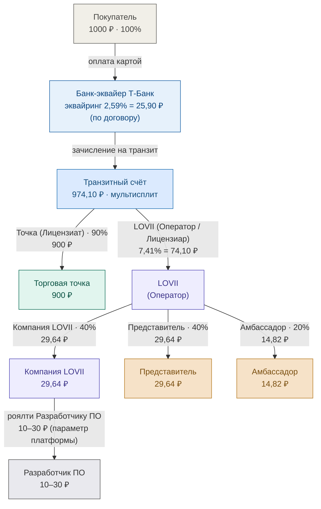
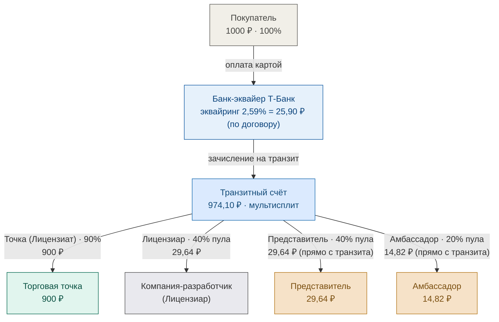
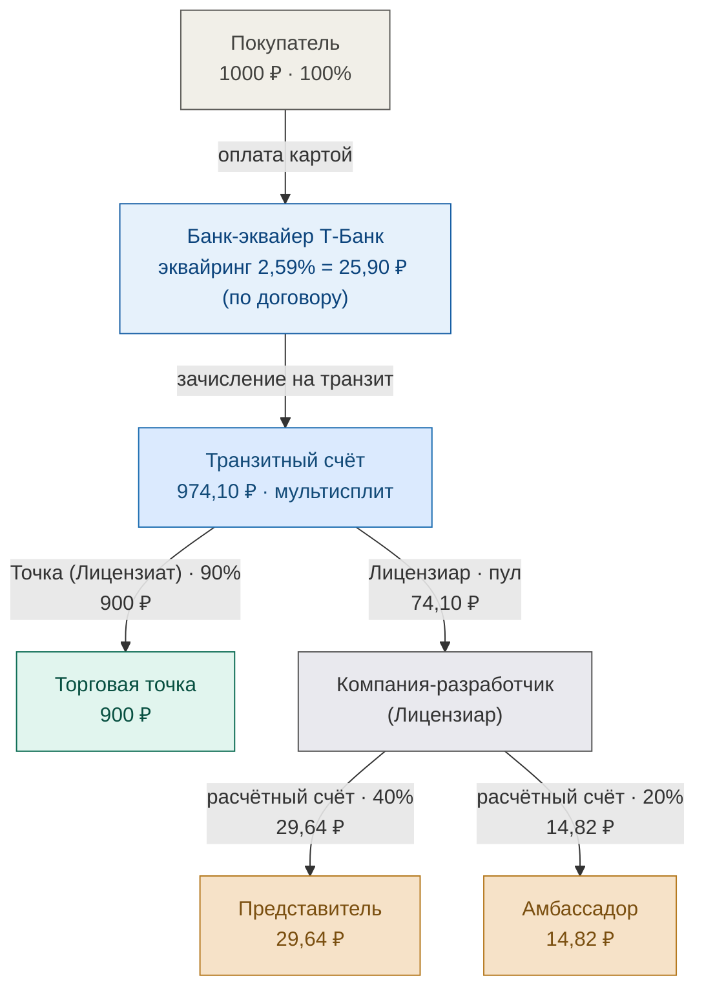
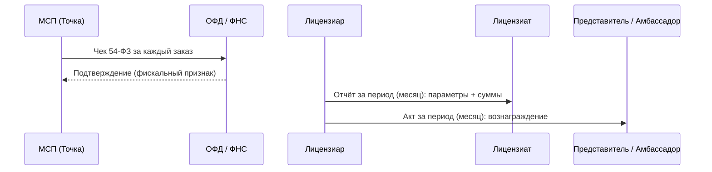

# Сравнение схем движения средств LOVII (черновик сравнения)

> Черновик для визуального выбора одной схемы. Изменения пока только в `lovii_docs`,
> не опубликовано. Документооборот — отдельным разделом в конце (общий для всех схем).

**Источник цифр эквайринга** — Договор Т-Банк № МР-08.26/АКС_01, Приложение № 3:
Карта **2,59%** (мин 3,49 ₽), **СБП 0,7%**, T-Pay **2,59%** (мин 3,49 ₽).
Вывод средств: перечисление третьему лицу (п. 3.4) **0,5%**; перевод «Получателю» **1% мин 30 ₽**.

**Внутренний сплит (40/40/20) и нагрузка МСП 10%** — параметры платформы (модель),
а не ставки договора. Показаны как значения по умолчанию; финализируются в соглашении.

Условие примера: заказ **1000 ₽**, нагрузка МСП 10% → точка получает **900 ₽**.
Пул комиссии (платформы) = 10% − эквайринг: **74,10 ₽** (карта/T-Pay) или **93,00 ₽** (СБП).
На СБП доли больше: 37,20 / 37,20 / 18,60 ₽ вместо 29,64 / 29,64 / 14,82 ₽.

---

## Сравнительная таблица

| | Схема 1: LOVII-оператор | Схема 2: Лицензиар = Компания-разработчик, с транзита | Схема 3: Лицензиар = Компания-разработчик, с расчётного счёта |
|---|---|---|---|
| Кто Лицензиар / Оператор | LOVII | Компания-разработчик | Компания-разработчик |
| Куда идёт пул комиссии | LOVII (оператор) | Транзит → 3 получателя (Лицензиар, Представитель, Амбассадор) | Лицензиар целиком (на расчётный счёт) |
| Выплата Представителю / Амбассадору | от LOVII (из пула) | **прямо с транзитного счёта** | от Лицензиара (с расчётного счёта) |
| Отдельная выплата Разработчику ПО | да (роялти из доли Компании) | нет (роль совмещена) | нет (роль совмещена) |
| Число получателей на транзите | 2 (Точка + LOVII) | 4 (Точка + Лицензиар + Пред + Амб) | 2 (Точка + Лицензиар) |

---

## Схема 1 — LOVII-оператор (выплаты от LOVII)

## Схема 2 — Лицензиар = Компания-разработчик, выплаты с транзита

## Схема 3 — Лицензиар = Компания-разработчик, выплаты с расчётного счёта

> На СБП (0,7%) структура идентична, но пул = 93,00 ₽, доли: 37,20 / 37,20 / 18,60 ₽.

---

## Документооборот (общий для всех схем — черновик)

1. **Чек ОФД** — Торговая точка (МСП) пробивает кассовый чек 54-ФЗ **за каждый заказ**.
   Поток: ККТ → ОФД → ФНС. Чек привязан к заказу (номер/сумма/способ оплаты).
2. **Отчёт Лицензиара → Лицензиату** — за период (**месяц по умолчанию**): все параметры
   и суммы (заказы, комиссии, распределение). Аналог пакета сверки Adyen (Accounting/Payout report).
3. **Акты Представителей / Амбассадоров** — за период (**месяц по умолчанию**): вознаграждение
   за период (агентский акт). Готовит Лицензиар.

---

