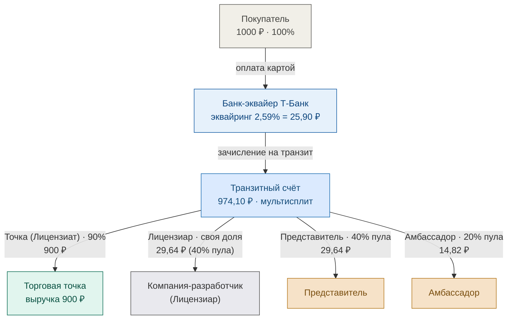

# Схема движения средств LOVII — Лицензиар: Компания-разработчик (выплаты с транзита)

> Альтернативная схема на примере заказа **1000 ₽** (параллельно базовой схеме из `money_flow_lovii.md`):
> роль **Лицензиара выполняет Компания-разработчик** (а не LOVII), а выплаты
> **Представителю и Амбассадору идут напрямую с транзитного счёта**, минуя счёт лицензиара.
> Ниже — базовая (плановая) ставка и все варианты по тарифам банка Т-Банк
> (Карта 2,59% / СБП 0,7% / T-Pay 2,59%). Нагрузка на МСП = 10% (точка получает 900 ₽).
> Документооборот (чеки 54-ФЗ, акты) — отдельной схемой; здесь только движение средств.

## Базовая схема (плановая ставка эквайринга 3,5%)

## Варианты по тарифам банка на приём средств

Условие: **нагрузка на МСП всегда 10%** (точка получает 900 ₽). Пул комиссии =
**10% − эквайринг**; из него Т-Банк по инструкции переводит **40% Лицензиару** (его доля),
**40% Представителю** и **20% Амбассадору** — последние две выплаты **напрямую с транзита**.
Три тарифа Т-Банка (Приложение № 3 к договору № МР-08.26/АКС_01):

| Тариф эквайринга | Эквайринг | Пул (10% − эквайринг) | Банк, ₽ | Пул, ₽ | Лицензиар (40% пула) | Представитель (40% пула, с транзита) | Амбассадор (20% пула, с транзита) |
|---|---|---|---|---|---|---|---|
| Карта 2,59% | 2,59% | 7,41% | 25,90 | 74,10 | 29,64 | 29,64 | 14,82 |
| СБП 0,7% | 0,7% | 9,3% | 7,00 | 93,00 | 37,20 | 37,20 | 18,60 |
| T-Pay 2,59% | 2,59% | 7,41% | 25,90 | 74,10 | 29,64 | 29,64 | 14,82 |

### Схема А — Карта (эквайринг 2,59%)

### Схема Б — СБП (эквайринг 0,7%)

### Схема В — T-Pay (эквайринг 2,59%)

## Чем отличается от базовой схемы (`money_flow_lovii.md`)

- **Лицензиар — Компания-разработчик**, а не LOVII. Транзитный счёт Т-Банка делит платёж
  на **4 получателя**: Торговая точка (900 ₽), Лицензиар (40% пула), Представитель (40% пула)
  и Амбассадор (20% пула).
- **Выплаты Представителю и Амбассадору идут напрямую с транзитного счёта** по инструкции
  банку — минуя расчётный счёт Лицензиара.
- Отдельной выплаты роялти **Разработчику ПО нет**: роль лицензиара и разработчика
  совмещена в одной компании. Доля Лицензиара = 40% пула (например, 29,64 ₽ по карте / 37,20 ₽ по СБП).
- Баланс: транзит 900 + пул; пул распределяется 40/40/20 (Лицензиар / Представитель / Амбассадор).

## Пояснения

- **Банк-эквайер** удерживает комиссию по тарифу (Карта 2,59% = 25,90 ₽ / СБП 0,7% = 7 ₽
  / T-Pay 2,59% = 25,90 ₽) + перечисление 0,5% на вывод получателю (договор Т-Банк
  № МР-08.26/АКС_01). Точка в реальности получает чуть больше 900 ₽ из-за меньшей комиссии.
- **Транзитный счёт Т-Банка** — на него поступает полная сумма; банк по инструкции делит её
  на Точку, Лицензиара, Представителя и Амбассадора (мультисплит).
- **Компания-разработчик (Лицензиар)** получает свою долю (40% пула) и оформляет акты
  представителям/амбассадам (по агентским договорам), даже если сами деньги ушли с транзита.
- **Торговая точка (Лицензиат ИП/ООО)** получает **90% = 900 ₽** выручки.
- **Документооборот** (кассовый чек 54-ФЗ от точки, акты от лицензиара) — отдельной схемой.
- В доход **Компании-разработчика (Лицензиара)** попадает только её доля (40% пула),
  а не вся сумма заказа.

