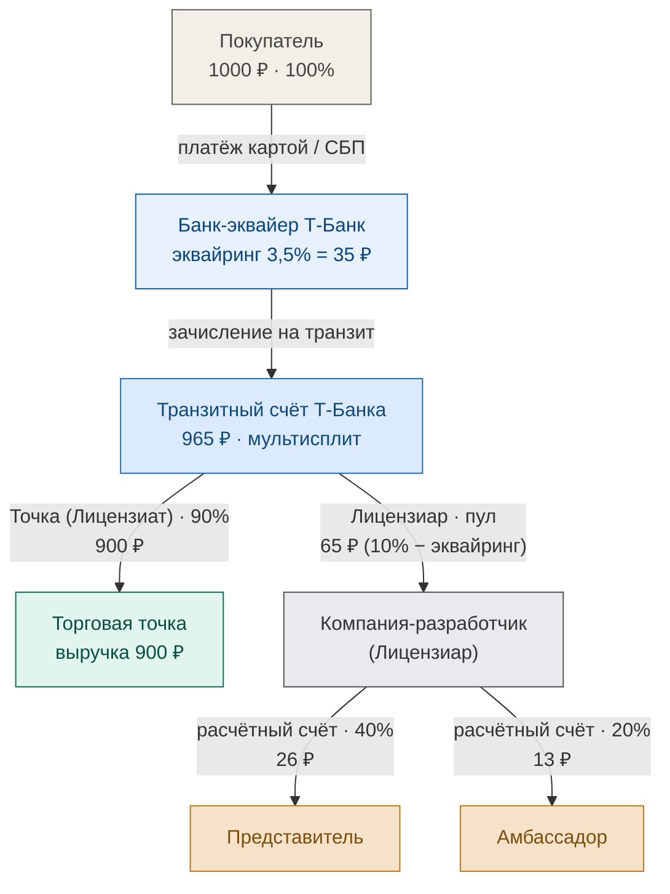
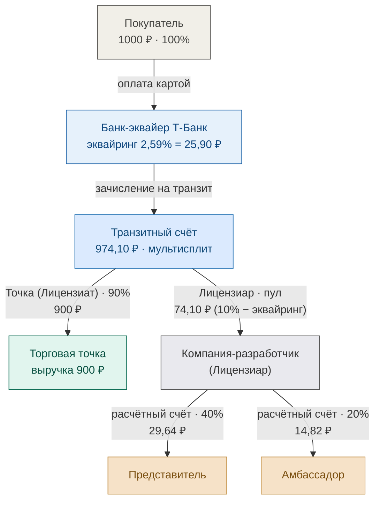
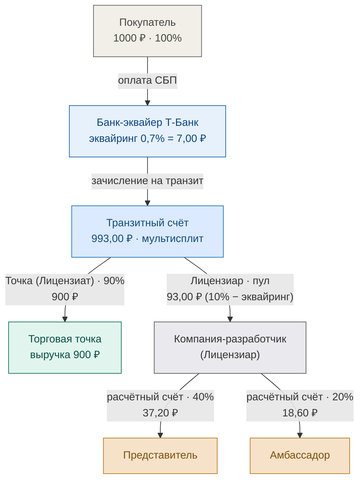

# Схема движения средств LOVII — Лицензиар: Компания-разработчик (выплаты с расчётного счёта)

> Альтернативная схема на примере заказа **1000 ₽** (параллельно базовой схеме из `money_flow_lovii.md`):
> роль **Лицензиара выполняет Компания-разработчик** (а не LOVII). Пул комиссии целиком
> поступает **на расчётный счёт Компании-разработчик**, а выплаты **Представителю и Амбассадору
> идут уже с этого расчётного счёта** (а не прямо с транзита). Ниже — базовая (плановая)
> ставка и все варианты по тарифам банка Т-Банк (Карта 2,59% / СБП 0,7% / T-Pay 2,59%).
> Нагрузка на МСП = 10% (точка получает 900 ₽). Документооборот (чеки 54-ФЗ, акты) —
> отдельной схемой; здесь только движение средств.

## Базовая схема (плановая ставка эквайринга 3,5%)

## Варианты по тарифам банка на приём средств

Условие: **нагрузка на МСП всегда 10%** (точка получает 900 ₽). Пул комиссии =
**10% − эквайринг** и целиком поступает Лицензиару; Лицензиар удерживает **40%** (маржа)
и перечисляет **Представителю 40%** и **Амбассадору 20%** со своего расчётного счёта.
Три тарифа Т-Банка (Приложение № 3 к договору № МР-08.26/АКС_01):

| Тариф эквайринга | Эквайринг | Пул (10% − эквайринг) | Банк, ₽ | Пул, ₽ (на счёт лицензиара) | Лицензиар удерживает (40%) | Представитель из счёта лицензиара (40%) | Амбассадор из счёта лицензиара (20%) |
|---|---|---|---|---|---|---|---|
| Карта 2,59% | 2,59% | 7,41% | 25,90 | 74,10 | 29,64 | 29,64 | 14,82 |
| СБП 0,7% | 0,7% | 9,3% | 7,00 | 93,00 | 37,20 | 37,20 | 18,60 |
| T-Pay 2,59% | 2,59% | 7,41% | 25,90 | 74,10 | 29,64 | 29,64 | 14,82 |

### Схема А — Карта (эквайринг 2,59%)

### Схема Б — СБП (эквайринг 0,7%)

### Схема В — T-Pay (эквайринг 2,59%)

## Чем отличается от базовой схемы (`money_flow_lovii.md`) и от варианта с транзита

- **Лицензиар — Компания-разработчик**, а не LOVII. Транзитный счёт Т-Банка делает
  мультисплит на **2 получателя**: Торговая точка (900 ₽) и Компания-разработчик (пул).
- **Пул целиком поступает на расчётный счёт Компании-разработчик (Лицензиара)**.
  Далее Лицензиар сам перечисляет выплаты: **Представителю 40%** и **Амбассадору 20%**
  со своего расчётного счёта, а **40% оставляет себе** (маржа).
- В отличие от варианта `money_flow_dev_operator.md` (где выплаты рисуются как прямые
  отчисления с транзитного счёта), здесь **путь средств**: транзит → Лицензиар →
  Представитель/Амбассадор.
- Отдельной выплаты роялти **Разработчику ПО нет**: роль лицензиара и разработчика
  совмещена в одной компании. Маржа лицензиара = 40% пула (например, 29,64 ₽ по карте / 37,20 ₽ по СБП).
- Баланс: транзит 900 + пул; лицензиар получает пул, выплачивает 60% (представители +
  амбассадоры), оставляет 40%.

## Пояснения

- **Банк-эквайер** удерживает комиссию по тарифу (Карта 2,59% = 25,90 ₽ / СБП 0,7% = 7 ₽
  / T-Pay 2,59% = 25,90 ₽) + перечисление 0,5% на вывод получателю (договор Т-Банк
  № МР-08.26/АКС_01). Точка в реальности получает чуть больше 900 ₽ из-за меньшей комиссии.
- **Транзитный счёт Т-Банка** — на него поступает полная сумма; банк делит её на Точку и Лицензиара.
- **Компания-разработчик (Лицензиар)** получает пул на расчётный счёт и далее сам формирует
  выплаты представителям/амбассадам (по агентским договорам / актам).
- **Торговая точка (Лицензиат ИП/ООО)** получает **90% = 900 ₽** выручки.
- **Документооборот** (кассовый чек 54-ФЗ от точки, акты от лицензиара) — отдельной схемой.
- В доход **Компании-разработчика (Лицензиара)** попадает только комиссия платформы
  (40% пула после выплат представителям/амбассадам), а не вся сумма заказа.

