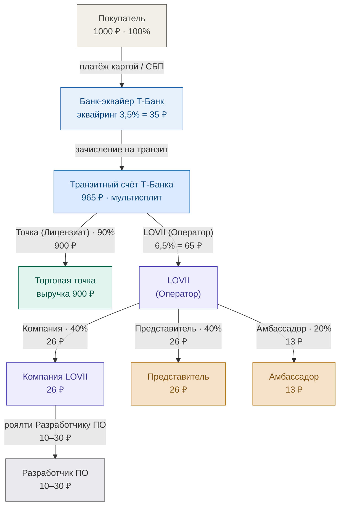
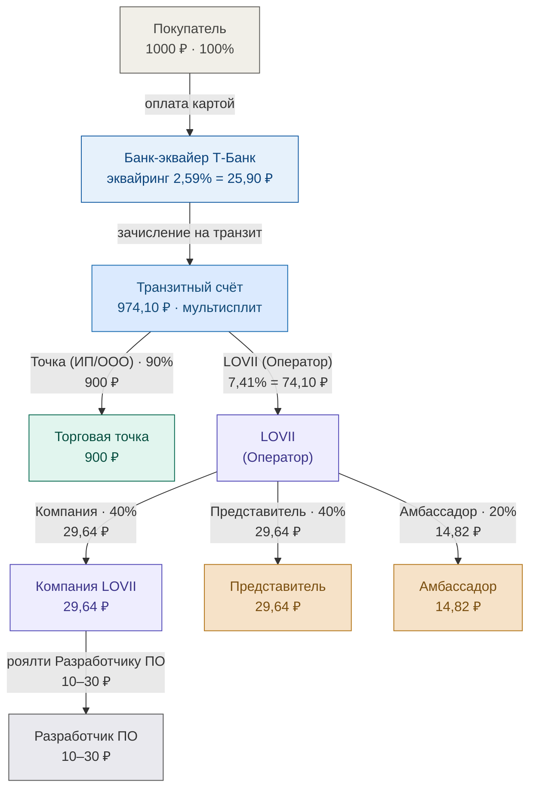
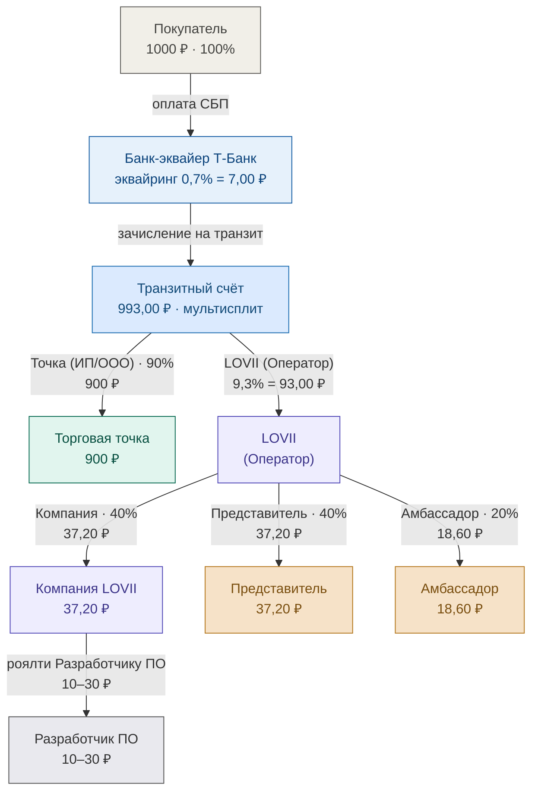
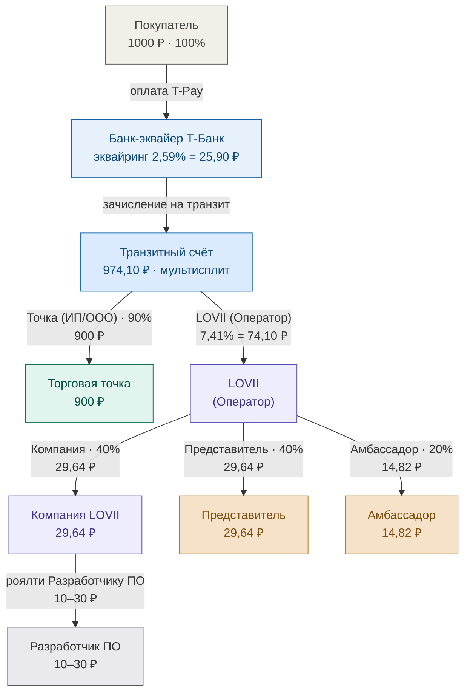

# Схема движения средств LOVII

> Подробная схема на примере заказа **1000 ₽** (базовая схема маркетплейса, без арендодателя; источник — `FINANCIAL_MODEL.md`): от покупателя через банк-эквайер и транзитный счёт Т-Банка до торговой точки (Лицензиата ИП/ООО) и комиссии LOVII, которая затем делится между Компанией, Представителем и Амбассадором. На каждом этапе — доля (%) и сумма (₽). Документооборот (чеки 54-ФЗ, акты, квитанции) — отдельной схемой; здесь только движение средств.

## Пояснения (на примере заказа 1000 ₽)

- **Источник цифр** — `FINANCIAL_MODEL.md` (базовая схема маркетплейса, без арендодателя). Сумма заказа 1000 ₽ выбрана, чтобы сразу видеть, кому сколько достаётся.
- **Банк-эквайер** удерживает **3,5% = 35 ₽** (плановая ставка модели). По реальному договору Т-Банк № МР-08.26/АКС_01: эквайринг карты 2,59% (25,90 ₽) / СБП 0,7% (7 ₽) + **перечисление 0,5%** на вывод получателю ≈ **3,1% по карте** — точка в реальности получает чуть больше 900 ₽.
- **Транзитный счёт Т-Банка** — на него поступает полная сумма, банк выполняет мультисплит.
- **Торговая точка (Лицензиат ИП/ООО)** получает **90% = 900 ₽** выручки (в модели; реально — чуть больше из-за меньшей комиссии банка).
- **LOVII (Оператор)** — комиссия **6,5% = 65 ₽**, делится 40/40/20: **Компания 26 ₽ · Представитель 26 ₽ · Амбассадор 13 ₽**.
- **Разработчик ПО** — роялти 1–3% от оборота (10–30 ₽ с 1000 ₽), вычитается из доли Компании. Чистая маржа Компании ≈ **11–31 ₽**.
- В доход **Аксиомы/Компании** попадает только комиссия платформы, а не вся сумма заказа (полная сумма — транзитные средства).
- **Документооборот** (кассовый чек 54-ФЗ от точки, квитанция/акты от LOVII) — отдельной схемой.

---

## Варианты по тарифам банка на приём средств

Условие: **нагрузка на МСП всегда 10%** (точка получает 900 ₽ с 1000 ₽). Доля LOVII =
**10% − эквайринг**. Три тарифа Т-Банка (Приложение № 3 к договору № МР-08.26/АКС_01):

| Тариф эквайринга | Эквайринг | LOVII (10% − эквайринг) | Банк, ₽ | LOVII, ₽ | Компания (40%) | Представитель (40%) | Амбассадор (20%) | Чистая Компания* |
|---|---|---|---|---|---|---|---|---|
| Карта 2,59% | 2,59% | 7,41% | 25,90 | 74,10 | 29,64 | 29,64 | 14,82 | −0,36 … 19,64 |
| СБП 0,7% | 0,7% | 9,3% | 7,00 | 93,00 | 37,20 | 37,20 | 18,60 | 7,20 … 27,20 |
| T-Pay 2,59% | 2,59% | 7,41% | 25,90 | 74,10 | 29,64 | 29,64 | 14,82 | −0,36 … 19,64 |

\*Чистая Компания = доля Компании минус роялти Разработчику ПО (1–3% оборота = 10–30 ₽).
**Вывод:** доходность платформы сильно зависит от способа оплаты — на СБП LOVII получает
93 ₽ против 74,10 ₽ на карте/T-Pay. При карте/T-Pay и роялти 3% маржа Компании уходит в
легкий минус (29,64 − 30 = −0,36 ₽) — сигнал поставить потолок роялти или поднять долю
Компании. Схемы ниже — те же 1000 ₽, но с конкретным тарифом.

> Примечание: в нагрузку 10% здесь включён только эквайринг. Поверх этого Т-Банк берёт
> **Перечисление 0,5%** при выводе средств получателю/платформе (см. базовую схему выше) —
> это отдельная мини-комиссия, она чуть уменьшает итоговый нетто точки и LOVII.

### Схема А — оплата картой (эквайринг 2,59%)

### Схема Б — оплата СБП (эквайринг 0,7%)

### Схема В — T-Pay (эквайринг 2,59%)

