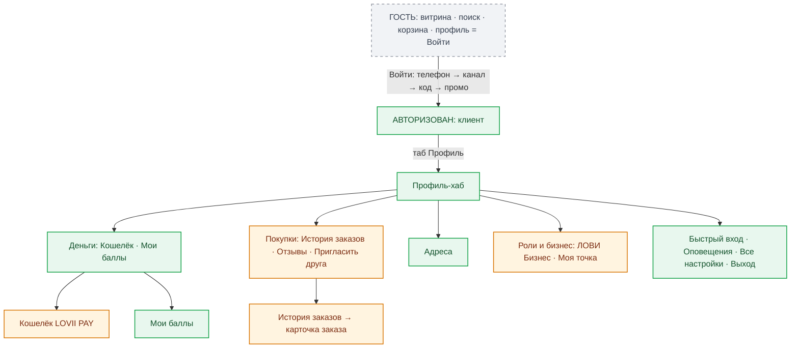

# RES-003 — Роль «Клиент»: экраны, меню профиля, дубли и чего не хватает

**Дата:** 2026-09-13 · **База:** lovii-app staging `09c14fb` · **Серия:** ролевые карты 1/4 (далее: представитель RES-004, амбассадор RES-005, МСП RES-006).
**Запрос владельца:** «выделяем только экраны клиента; какие экраны доступны после регистрации/авторизации; какие пункты меню дублируются; что доступно в профиле; как правильно настроить профиль и каких функций не хватает».
**Источники:** `ProfileModule.vue` (1025 строк, пересборка по обратной связи 2026-09-12), `ProfileAuth.vue`, `SettingsSheet.vue`, `ProfileWallet.vue`, `router/index.ts` (гарды), `roles.store.ts`, `cart-module` (гостевая сессия).

---

## 1. Кто такой клиент и что меняет авторизация

Клиент — базовая роль без флагов: она есть у каждого, роли (представитель/амбассадор/МСП) лишь **добавляются** сверху. Покупательский контур (главная → поиск → витрина → товар → корзина) одинаков для гостя и авторизованного; авторизация включает деньги, историю, адреса и личные данные.

### Гость vs авторизованный — точная дельта

| Контур | Гость | После входа |
|---|---|---|
| Главная, популярные, поиск, витрина, товар | ✅ полностью | ✅ без изменений |
| Корзина | ✅ копит (гостевые корзины по магазинам) | ✅ + мёрж гостевых корзин при входе (core GuestSession) |
| Оформление заказа | ✅ открывается (фронт не гардает), сабмит требует сессию | ✅ полностью; адрес без id сохраняется автоматически |
| Профиль | карточка «Войдите в свой аккаунт» + кнопка «Войти» | хаб (см. §3) |
| Кошелёк, баллы, заказы, адреса, редактирование | ⛔ редирект в Профиль (гард роутера) | ✅ |
| ЛОВИ Бизнес, кабинеты ролей | ⛔ редирект в Профиль | ✅ (роли — по флагам GET /profile) |
| Оплата / результат оплаты | ⛔ редирект в Профиль | ✅ |
| Push на устройстве, Face ID/ПИН | ❌ | ✅ |

---

## 2. Экраны клиента после авторизации — полный список

| Экран | Путь | Что даёт | Оценка |
|---|---|---|---|
| Кошелёк LOVII PAY | `/profile/wallet` | мультикарта счетов (личная PAY / карты МСП / номинальный), «Счёт» за месяц, история проводок, глубокая ссылка `?account=ID` на конкретную карту | доработать: тир-бейдж хардкод, история 48 без пагинации, ошибка истории = пусто |
| Мои баллы | `/profile/balance` | баланс кэшбэк-баллов (дом числа — canon PARAMS), история, пустое состояние | готово; пагинации нет |
| История заказов | `/profile/orders` | карточки со статусами, пагинация | доработать: нет отмены/повтора, сбой = вечный скелетон |
| Карточка заказа | `/profile/orders/:id` | состав, квитанция (не фискальная), «Оплатить» неоплаченным | готово |
| Мои адреса | `/profile/addresses` + create/edit | список, выбор текущего, карта, каскад город→улица→дом, удаление с двойным подтверждением | готово; тумблер «по умолчанию» есть в модели, нет в UI |
| Редактирование профиля | `/profile/edit` | аватар с кропом, ФИО, пол, дата рождения, email | готово; телефон не редактируется (только показ) |
| Верификация e-mail | `/profile/edit/email/verify` | код из письма, кулдаун, смена адреса | готово |
| Настройки (оверлей) | SettingsSheet | тема, размер текста, анимации, push, согласия рассылок, очистка кэша, версия | готово |
| Быстрый вход (оверлей) | QuickAccessSheet | Face ID (WebAuthn) / ПИН 4–8, локально | готово |
| Выход | POST auth/logout | подтверждение в шите | готово |
| Отзывы · Пригласить друга | — | некликабельные строки «Скоро» | заглушки (осознанно) |
| ЛОВИ Бизнес / Моя точка / кабинеты | см. RES-004–006 | только при ролях/заявках | отдельные доки |

---

## 3. Профиль: как он устроен сейчас

Структура (двухколоночная ≥640px, стек на мобильном) — `ProfileModule.vue`:

**Хедер участника:** аватар/инициалы, имя (или «Мой профиль»), телефон в международном формате, кнопка-карандаш → `/profile/edit`.

**Колонка А (покупатель):**
1. Карты и счета — карусель PayCard с точками: личная LOVII PAY, карты МСП (если есть), номинальный счёт (SZ-043). Под каруселью одна кнопка — «Выписка по карте» (`?account=ID` активного слайда).
2. Меню-группы (порядок фиксирован комментарием в коде «новый пункт добирается в конец своей группы»):
   - **Деньги:** Кошелёк · Мои баллы
   - **Адреса:** Мои адреса
   - **Покупки:** История заказов · Отзывы (Скоро) · Пригласить друга (Скоро)

**Колонка Б (сервис и роли):**
3. **Роли и бизнес:** ЛОВИ Бизнес (живой субтитл: «Подключить торговую точку онлайн» / «Заявка на модерации» / «Ваша точка на витрине») · Моя точка (только при верифицированной заявке)
4. **Кабинеты** (только при выданных платформой ролях): Кабинет представителя · Кабинет амбассадора · Мой магазин
5. **Быстрый вход** (подпись: «Face ID или ПИН-код» / включённые способы)
6. **Оповещения:** тумблер Push-уведомления («статусы заказов на этом устройстве») · тумблер Письма о новостях (email-согласие) · Все настройки
7. **Выйти из аккаунта** (подтверждение в шите)

**Футер:** карточка «Поддержка» (SZ-002 B8) — контакт для обращений.

---

## 4. Дубли пунктов меню — что нашёл в коде

| # | Дубль | Где | Суть | Что делать |
|---|---|---|---|---|
| Д1 | **Push и email управляются из двух мест** | меню профиля (тумблеры «Push-уведомления», «Письма о новостях») **и** «Все настройки» (разделы «Уведомления», «Рассылки и акции») | одни и те же состояния (push-подписка устройства, consent email) имеют два независимых UI. Это не ошибка данных, но пользователь не поймёт, где «настоящий» переключатель, и половина настроек выглядит продублированной | P1: в меню профиля оставить один блок оповещений — либо убрать тумблеры и оставить строку «Оповещения →» (открывает настройки), либо убрать разделы из SettingsSheet. Рекомендую второе: профиль — место живых тумблеров, SettingsSheet — общий список |
| Д2 | **«Кошелёк» ↔ «Выписка по карте»** | кнопка под каруселью карт и пункт меню «Деньги → Кошелёк» ведут в один экран `/profile/wallet` (второй — с `?account=` активной карты) | исторический дубль уже частично убран: в коде комментарий «„Кошелёк" дублировал ссылку в ту же вкладку и переехал в группу „Деньги"». Остаток — кнопка-глубокая ссылка на карту | допустимо оставить (разные сценарии: «все деньги» vs «выписка конкретной карты»), но подпись у кнопки лучше «Выписка по карте №•• 1234» — сейчас не видно, по какой карте откроется |
| Д3 | **Три входа в пространство МСП** | «ЛОВИ Бизнес» + «Моя точка» + «Мой магазин» (последний — при роли msp) | у верифицированного партнёра с ролью в профиле одновременно три смежных пункта: лендинг со статусной строкой, заглушка «управление в следующем обновлении» и кабинет. Смысловые пересечения максимальны | P1: после верификации скрывать/сворачивать «Моя точка» (его контент уже в кабинете и на лендинге) — оставить ровно один вход «Мой магазин» + лендинг для статусов |
| Д4 | «Мои адреса» (меню) и выбор адреса в чекауте | оверлей выбора vs полноценный список | это **не** дубль меню — контекстный доступ к одной сущности. Но два разных UI на выбор адреса (шит чекаута и AddressesView) — следить за консистентностью | не трогать; при правках адресов править оба |
| Д5 | Входы в заказы | меню профиля + редиректы после оплаты | контекстные, легитимные | не трогать |

---

## 5. Чего в профиле не хватает (и как правильно донастроить)

### П1 — доделать до прода / сразу после

1. **Удаление аккаунта — отсутствует.** В `ProfileEditForm.vue` лежит заготовка `<button v-if="false">` с иконкой корзины — кнопку специально отключили, UI-пути нет. При этом бэкенд готов: в core есть деактивация (`DeactivateAccountTest`, команда `PurgeDeactivatedUsersCommand`). Право на удаление своих данных — требование 152-ФЗ и правило площадки. Правильно: включить кнопку в «Редактировании» (последняя секция, negative-цвет, двойное подтверждение, текст «заказы и история сохраняются в течение N дней» — период из PARAMS).
2. **Смена телефона — отсутствует.** Телефон показан в хедере и не редактируется (в `/profile/edit` правятся только аватар/ФИО/пол/ДР/email). Это осознанно сложно (телефон = идентификатор UID), но у клиента нет даже пути «хочу сменить номер → напиши в поддержку». Правильно: пока — строка «Смена номера — через поддержку» со ссылкой на карточку «Поддержка» из футера; самсервис смены — в бэклог (OTP-подтверждение обоих номеров).
3. **Дубль Д1 (оповещения) — свернуть** (см. таблицу выше).
4. **Тумблер «адрес по умолчанию»** — флаг есть в модели адреса, UI не выводит. При 2+ адресах клиент каждый раз вручную выбирает в чекауте. Правильно: тумблер в карточке адреса + авто-подстановка дефолта в чекаут.

### П2 — не спешить (после релиза)

5. **Избранные заведения** — в app нет вовсе (в демо-эталоне блок был). Для частого клиента это главный ретеншн-инструмент. Место: сердечко на витрине + группа «Покупки → Избранное».
6. **Повтор заказа** — в карточке заказа нет «Повторить» (корзина тем же составом). Самый дешёвый рост частоты покупок; делать после стабилизации чекаута.
7. **Активные устройства/сессии** — сейчас только Face ID/ПИН на устройстве; списка устройств нет (в core есть `UserDeviceRegistry`, new-device письма шлются). Правильно добавить раздел «Безопасность»: устройства + выход со всех.
8. **Промокоды клиента** — купонов/промокодов в клиентском контуре нет (промо-шаг входа — фейк, см. RES-002). Когда появятся: место — «Деньги» рядом с баллами + поле в чекауте.
9. **Отзывы / Пригласить друга** — заглушки «Скоро»; включать только с реальными контурами.

### Как правильно настроить профиль (сводный принцип)

Профиль сейчас построен верно по иерархии «деньги → адреса → покупки» слева, «сервис → роли → настройки» справа — эта структура совпадает с эталоном lovii-demo и её надо сохранять. Донастройка сводится к трём правилам: **(а)** один экран — один переключатель (убрать Д1), **(б)** одна сущность — один главный вход (убрать Д3, оставить «Мой магазин»), **(в)** юридически обязательные функции не могут быть «Скоро» (удаление аккаунта — включить до прода). Всё остальное из §5 — здоровый бэклог, а не долг перед релизом.

---

## 6. Готовность клиентского контура к проду

| Блок | Статус | Комментарий |
|---|---|---|
| Покупка: главная → поиск → витрина → товар → корзина → чекаут → оплата | ✅ работает | блокеры экранов витрины — общие для всех ролей: см. RES-002 P0-2 (error-состояния), P0-3 (`/payment/fake`) |
| Профиль-хаб, кошелёк, баллы, адреса, редактирование | ✅ работает | шероховатости P1 из RES-002 (пагинация кошелька, тир-бейдж) |
| Удаление аккаунта | ⛔ нет | P1-юридика, см. §5.1 — единственный «клиентский» кандидат в прод-блокеры |
| Меню | ✅ структурно верно | дубли Д1/Д3 — наводка порядка, не блокер |

**Вывод по клиенту:** контур готов к проду сильнее остальных ролей; из специфично клиентского на прод критично только включение удаления аккаунта. Остальное — качество после релиза.
