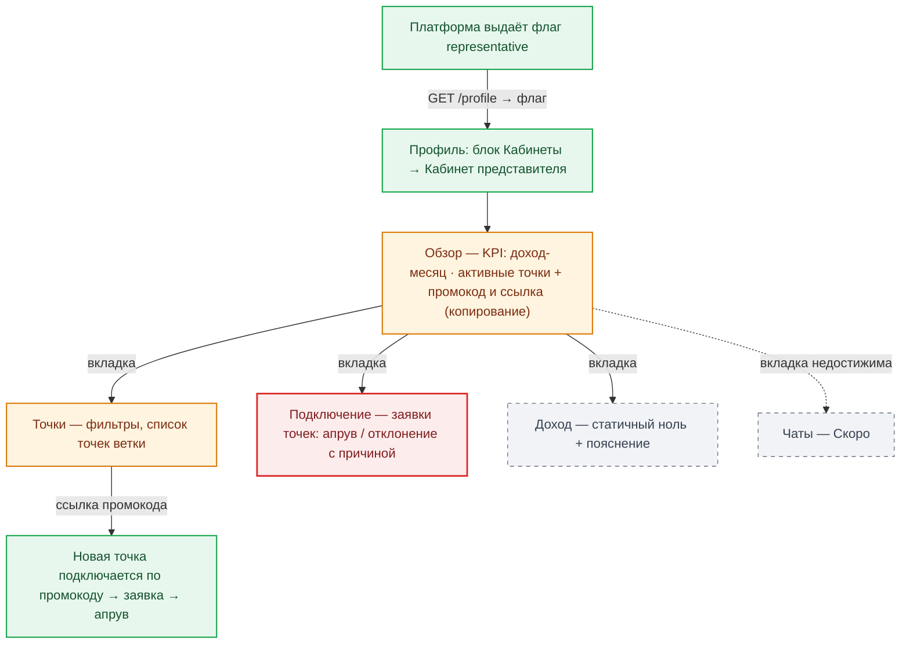

# RES-004 — Роль «Представитель»: сценарий, экраны, что доделать

**Дата:** 2026-09-13 · **База:** lovii-app staging `09c14fb` · **Серия:** ролевые карты 2/4 (RES-003 клиент ← эта → RES-005 амбассадор).
**Запрос владельца:** «сценарий и экраны для представителя».
**Источники:** `roles-module/representative/*` (Overview/Points/Approvals/Income), `CabinetLayout.vue`, `router/index.ts` (гард `rolesGuard('representative')`), `roles.store.ts`, канон `TASKS/SZ-038-roles-rep-amb-msp.md`, `TASKS/SZ-042-rep-subscription-gate.md`, core `RepresentativePromoTest` / `RepresentativeApprovalTest`.

---

## 1. Кто такой представитель и как попадает в роль

Представитель — платформенная роль «растит сеть точек»: имеет персональный промокод, точки его ветки подключаются по этому промокоду, он подтверждает («апрувит») заявки точек своей ветки и получает доход с оборота сети (доходная часть — после финконтура). Роль **не покупается и не выбирается**: флаг `representative` выдаёт платформа (GET /profile → roles store; UI не подбирает роли — коммент SZ-038 в гарде роутера). Самостоятельного «стать представителем» в app нет — это правильно, выдача идёт через админский контур (core: `IssueRepresentativeCodeCommand`, привязка по промокоду — `RepresentativePromoTest`).

**Сценарий (жизненный цикл):**

1. Платформа решает выдать роль (админ/команда) → у пользователя в профиле появляется блок «Кабинеты» со строкой «Кабинет представителя».
2. Вход → кабинет (гард: гость и авторизованный без флага уходят в Профиль).
3. Обзор: KPI + промокод → копирует ссылку регистрации → раздаёт владельцам точек.
4. Владелец точки подключается по промокоду (попадает в ветку представителя) и подаёт заявку точки через ЛОВИ Бизнес.
5. Представитель во вкладке «Подключение» апрувит/отклоняет заявки своей ветки.
6. Точки ветки работают; доход представителя появится с финконтура (сейчас честный ноль).

---

## 2. Экраны роли — полный список

| Экран | Путь | Функционал | Оценка |
|---|---|---|---|
| Обзор | `/cabinet/representative` | KPI «Доход · месяц» и «Активные точки» (реальные данные); промокод для точек с подсказкой и копированием ссылки регистрации (QR нет — текст + копирование, без внешних библиотек) | доработать: доход — хардкод-ноль до финконтура |
| Точки | `/cabinet/representative/points` | список точек ветки, фильтры; пустое состояние отправляет к промокоду на «Обзоре» | готово (контент зависит от ветки) |
| Подключение | `/cabinet/representative/approvals` | очередь заявок точек: **апрув «Открыть счёт»** / отклонение с причиной | **блокер: апрув без подтверждения** — случайный тап необратим |
| Доход | `/cabinet/representative/income` | статичный ноль + честное пояснение «до финконтура» | заглушка (осознанная, до фазы 3 финконтура) |
| Чаты | `/cabinet/representative/chats` | «Скоро» | заглушка; **недостижима** — см. блокер ниже |

**⛔ Единый блокер кабинетов (тот же, что в RES-002):** `CabinetLayout` объявляет обязательные пропсы `title`/`tabs`/`accent`, но роутер монтирует его без `props` — **таб-бар и заголовок не рендерятся**, вкладки «Точки/Подключение/Доход/Чаты» недостижимы навигацией (только прямым URL), кнопка «Клиент» делает `rolesStore.reset()` **без перехода** — пользователь запирается в кабинете. Проверено: `CabinetLayout.vue:20-42` (`exitToClient` без `router.push`), `router/index.ts:371-406`.

---

## 3. Что доделать перед продом (именно для представителя)

| Приоритет | Задача | Как правильно |
|---|---|---|
| **P0** | Таб-бар кабинета не рендерится + «Клиент» не возвращает | передать пропсы в роутере (или собрать табы внутри `CabinetLayout` по роли) и добавить `router.push({ name: "ProfileView" })` в `exitToClient` |
| **P0** | Апрув «Открыть счёт» без подтверждения | диалог подтверждения в системе (как двойное удаление адреса): «Открыть счёт для „Название точки"? Действие необратимо» +原因 при отклонении уже есть |
| P1 | Промокод-ссылка не проверяется на бите | копирование строки — ок, но стоит показывать полный URL, который копируется (сейчас пользователь не видит, что именно уйдёт владельцу точки) |
| P1 | KPI без контекста | «Активные точки» — сколько и каких; клик → вкладка «Точки» с тем же фильтром (связка обзор↔список) |
| P2 | Доход-ноль | оставить как есть до финконтура — честная заглушка, не трогать |
| P2 | Подписка-гейт представителя | канон SZ-042 (гейт по подписке) — решается на уровне правил платформы, не экрана; в app пока ничего не гейтится — сверить при реализации |

**Где усилия не нужны:** чаты (осознанная фаза), QR-код промокода (текст+копирование достаточно для первой фазы), доход (ждёт финконтура).

## 4. Готовность к проду

Без P0-пары (таб-бар + подтверждение апрува) роль представителя на прод **выпускать нельзя**: даже выданная одному тестовому представителю роль даст запертого в кабинете человека и необратимый тап по «Открыть счёт». Обе правки локализованы (1 файл layout + 1 диалог в Approvals) — закрываются за одну итерацию вместе с общей P0-пачкой RES-002.
