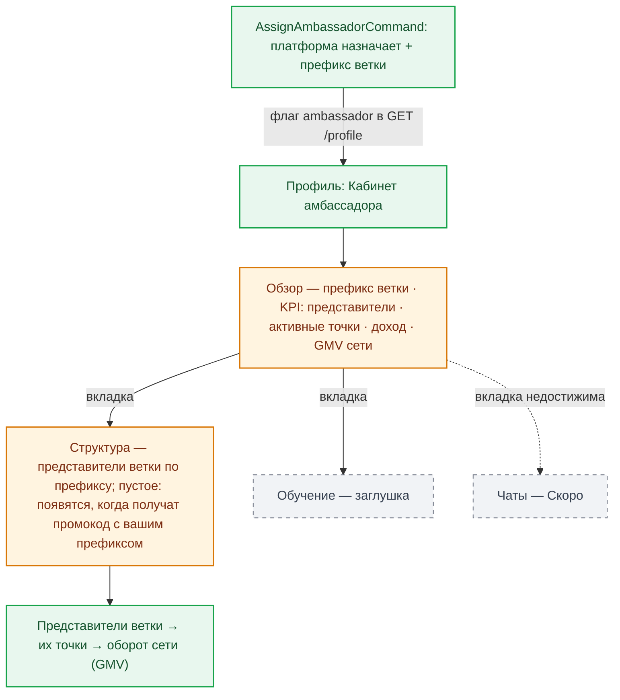

# RES-005 — Роль «Амбассадор»: сценарий, экраны, что доделать

**Дата:** 2026-09-13 · **База:** lovii-app staging `09c14fb` · **Серия:** ролевые карты 3/4 (RES-004 представитель ← эта → RES-006 МСП).
**Запрос владельца:** «затем для амбассадора».
**Источники:** `roles-module/ambassador/*` (Overview/Reps/Training), `CabinetLayout.vue`, `router/index.ts` (гард `rolesGuard('ambassador')`), core `AmbassadorEndpointsTest`, канон `TASKS/SZ-038-roles-rep-amb-msp.md`.

---

## 1. Кто такой амбассадор и как попадает в роль

Амбассадор — верхний уровень партнёрской сети: имеет **префикс ветки**, под которым живут его представители; получает доход с оборота сети ветки (GMV). Роль выдаёт только платформа — в core это админская команда `AssignAmbassadorCommand`, никаких самостоятельных входов/заявок в app нет (гард роутера: гость и авторизованный без флага `ambassador` уходят в Профиль). Амбассадор при этом может оставаться клиентом и даже представителем — роли совмещаются.

**Сценарий (жизненный цикл):**

1. Платформа назначает амбассадора (`AssignAmbassadorCommand`) → генерируется префикс ветки.
2. Пользователь видит в профиле блок «Кабинеты» → «Кабинет амбассадора» (акцент gold).
3. Обзор: префикс + KPI (представители, активные точки, доход, GMV сети).
4. Представители появляются в ветке, когда регистрируются с префиксом амбассадора.
5. Обучение — контур уроков (сейчас заглушка), чаты — «Скоро».

---

## 2. Экраны роли — полный список

| Экран | Путь | Функционал | Оценка |
|---|---|---|---|
| Обзор | `/cabinet/ambassador` | карточка префикса ветки; KPI: «Представителей», «Активные точки», «Доход · месяц», «GMV сети · месяц» | доработать: доход и GMV — хардкод-ноль; **поля из API игнорируются** (сервер отдаёт больше, чем UI показывает) |
| Структура | `/cabinet/ambassador/reps` | список представителей ветки по префиксу; пустое состояние с объяснением механизма роста ветки | готово (контент — от сети) |
| Обучение | `/cabinet/ambassador/training` | уроки — заглушка | заглушка (осознанная фаза) |
| Чаты | `/cabinet/ambassador/chats` | «Скоро» | заглушка; недостижима (блокер кабинетов) |

**⛔ Единый блокер кабинетов (RES-002/RES-004):** таб-бар и заголовок `CabinetLayout` не рендерятся (роутер не передаёт пропсы), вкладки недостижимы, «Клиент» не возвращает. Для амбассадора дополнительно не применяется и акцент gold (он в пропсе `accent`, который тоже не доезжает).

---

## 3. Что доделать (для амбассадора)

| Приоритет | Задача | Как правильно |
|---|---|---|
| **P0 (общая)** | Таб-бар кабинета + «Клиент» | та же правка, что для представителя — решается одним фиксом `CabinetLayout`/роутера на все три роли |
| P1 | Показывать данные из API, которые уже приходят | обзор рисует нули, хотя сервер отдаёт поля — перед рендером сверить контракт (AmbassadorEndpointsTest) и выводить реальные числа даже до финконтура (доход может остаться нулевым честно, но представители/точки — уже реальные) |
| P1 | Связка обзор ↔ структура | KPI «Представителей» кликабелен → вкладка «Структура» (сейчас две плоскости не связаны) |
| P2 | Обучение | контур уроков — отдельная фаза с контентом; не блокер, честная «Скоро» |
| P2 | Доход/GMV | только после финконтура (ledger-фаза) — не трогать до того |

**Где усилия не нужны:** чаты, обучение, доход — все три честно подписаны, соответствуют фазам; QR/промокод амбассадора не нужен (ветка растёт через промокоды представителей).

## 4. Готовность к проду

Амбассадорская роль наименее чувствительна к проду: клиентов с ролью на старте нет (назначение — ручная команда платформы), а её контент — витринный. Правило релиза: **P0-фикс кабинета обязателен** (иначе первый же назначенный амбассадор запрётся без навигации), остальное — P1/P2, можно после. Назначение первых амбассадоров имеет смысл отложить до P1-связки «обзор↔структура», чтобы они сразу видели реальную структуру, а не нули.
