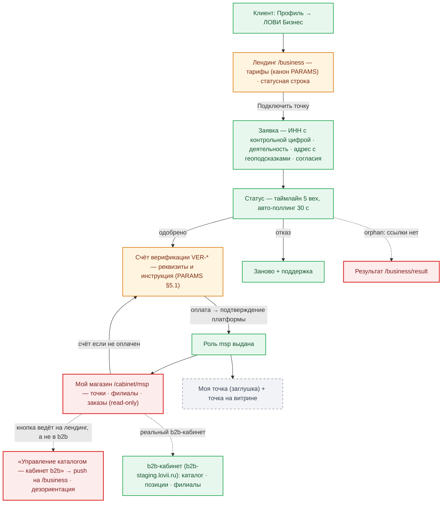

# RES-006 — Роль «МСП» (магазин): путь до точки, кабинет, чек-лист прод-готовности

**Дата:** 2026-09-13 · **База:** lovii-app staging `09c14fb` (core `81db393`, b2b `a4358a3`) · **Серия:** ролевые карты 4/4 — финальная, с чек-листом подготовки к проду.
**Запрос владельца:** «затем для МСП, и с МСП наша задача сегодня закончить и подготовить к проду».
**Источники:** `business-module/*`, `roles-module/msp/*` (Overview/Payment), `CabinetLayout.vue`, router-гард `rolesGuard('msp')`, core `PartnerApplicationTest` / `RepresentativePromoTest`, канон `PARAMS.md §5.1` (реквизиты), `TASKS/SZ-007`, `SZ-011`, `SZ-013`, `SZ-036`, `SZ-038`.

---

## 1. Кто такой МСП и полный путь до точки

МСП — магазин-партнёр платформы: проходит онлайн-подключение, верификацию, получает роль и витрину. Каталог и операционка живут в отдельном **b2b-кабинете** (Laravel+Filament, `b2b-staging.lovii.ru`); в app — путь подключения + обзорная витрина точки.

**Сценарий (жизненный цикл от клиента до точки):**

1. Клиент в профиле → «ЛОВИ Бизнес» (живой субтитл подсказывает состояние).
2. Лендинг: тарифы (канон PARAMS), «как это работает» → «Подключить точку».
3. Заявка: ИНН с контрольной цифрой, тип деятельности, адрес с геоподсказками, согласия.
4. Модерация: статус-таймлайн 5 вех с авто-поллингом; отказ → «заново» + поддержка.
5. Одобрение → **счёт верификации** (`VER-*`): реквизиты и инструкция в app (канон PARAMS §5.1).
6. Оплата счёта → платформа подтверждает → выдаёт роль `msp`.
7. Профиль: «Мой магазин» (кабинет) + «Моя точка»; точка появляется на витрине.
8. Управление каталогом/операционкой — в b2b-кабинете.

---

## 2. Экраны роли/пути — полный список

| Экран | Путь | Функционал | Оценка |
|---|---|---|---|
| Лендинг ЛОВИ Бизнес | `/business` | тарифы, «как это работает», статусная строка текущей заявки | доработать: сбой загрузки статуса молчит (субтитл в профиле при этом живой) |
| Заявка точки | `/business/apply` | ИНН с контрольной цифрой, тип деятельности, адрес с геоподсказками, согласия | готово — лучший UX воронки |
| Статус заявки | `/business/status` | таймлайн 5 вех, авто-поллинг 30 с, отказ → «заново» | готово; поллинг без потолка |
| Результат заявки | `/business/result` | успех/провал | **блокер: orphan — ни одна ссылка не ведёт** |
| Моя точка | `/business/point` | имя точки + «управление в следующем обновлении» | заглушка (осознанная) |
| Мой магазин (обзор) | `/cabinet/msp` | карточки точек: имя, тариф, товары/филиалы/адреса; последние заказы | **блокер: любая ошибка API рендерится как «нет точки»** (красная строка без различения «сеть недоступна» и «заявок нет») — толкает партнёра к повторной заявке |
| Счёт верификации | `/cabinet/msp/payment` | счёт `VER-*`, реквизиты, инструкция | доработать: реквизиты зависят от env прода; статус оплаты сам не обновляется |
| Чаты | `/cabinet/msp/chats` | — | отдельной вкладки чатов в МСП-ветке нет; чаты недостижимы глобально (блокер кабинетов) |
| **b2b-кабинет** | внешний (b2b) | каталог, позиции, филиалы, операционка | отдельный продукт — самостоятельный чек-лист релиза b2b |

**⛔ Блокер кабинетов** (общий с RES-004/005): таб-бар `CabinetLayout` не рендерится, «Клиент» не возвращает. МСП-кабинет содержит одну вкладку «Обзор» + «Счёт», поэтому визуально пострадал меньше всех — но заголовок и кнопка выхода всё равно мертвы.

## 3. Новая находка этой карты (не входила в RES-002)

**Кнопка «Управление каталогом — кабинет b2b» не ведёт в b2b.** В `MspOverview.vue` обработчик — `router.push({ name: "BusinessLandingView" })`: партнёр, нажав «управление каталогом», попадает на промо-лендинг в app. Это самая дезориентирующая кнопка МСП-кабинета: подпись обещает внешний инструмент, действие возвращает на маркетинг. Правильно: вести на b2b-URL из env (как реквизиты счёта) с открытием в новом окне; если b2b-кабинет ещё не готов к показу — честно сменить подпись на «Каталог — скоро» и не обещать кабинет.

---

## 4. Чек-лист готовности МСП-контура к проду

### App (править сейчас)

| # | Приоритет | Задача | Где |
|---|---|---|---|
| 1 | **P0** | Кабинеты: пропсы таб-бара + «Клиент» с переходом | `CabinetLayout.vue:20-42`, `router/index.ts:371-456` |
| 2 | **P0** | Различать ошибки МСП-обзора: «нет заявки/точки» ≠ «сеть недоступна» — Retry при сбое, никакого «повтора заявки» по сетевой ошибке | `MspOverview.vue` (обработка `error`) |
| 3 | **P0** | Кнопка b2b: реальный URL из env или честная «Скоро» | `MspOverview.vue` (`navigateToBusiness`) |
| 4 | **P0** | Orphan `/business/result`: убрать или вести на него из статуса по завершении | router + `BusinessStatusView` |
| 5 | P1 | Реквизиты счёта верификации — prod-env (НЕ staging-значения PARAMS §5.1) + сверка с договором Т-Банка | env + `MspPayment.vue` |
| 6 | P1 | Статус оплаты счёта: поллинг/обновление после возврата (сейчас партнёр сам не понимает, что оплата прошла) | `MspPayment.vue` + core callback |
| 7 | P1 | Поллинг бизнес-статуса с потолком (сейчас бесконечный) | `BusinessStatusView` |
| 8 | P1 | Дубли входов МСП: «ЛОВИ Бизнес» + «Моя точка» + «Мой магазин» — свернуть до одного главного (см. RES-003 Д3) | `ProfileModule.vue` |

### Core/B2B (вне app, но в контуре точки)

| # | Приоритет | Задача |
|---|---|---|
| 9 | P1 | Автоподтверждение оплаты VER-счёта → выдача роли msp без ручного шага (или явный регламент ручного подтверждения для поддержки) |
| 10 | P1 | b2b-кабинет: собственный релиз-чеклист (авторизация, создание точки/филиалов, каталог) — вне этого дока |

### Что НЕ мешает проду

- «Моя точка»-заглушка (честная), чаты, витринные тизеры «Скоро», СБП/фискальный чек (RES-002 P2) — осознанные фазы.

**Итог по МСП:** путь «клиент → заявка → верификация → роль» функционально полный и лучший по UX в app; к проду его держат 4 P0-позиции app-стороны (№1–4) — все локальные, закрываются одной итерацией. После этого МСП-контур можно показывать первым реальным партнёрам, управляя каталогом через b2b.
