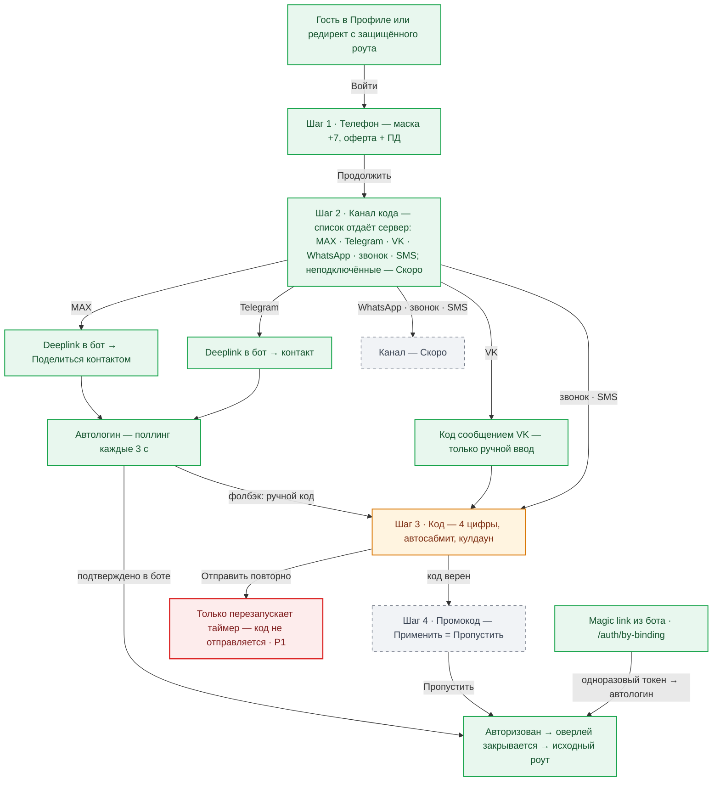
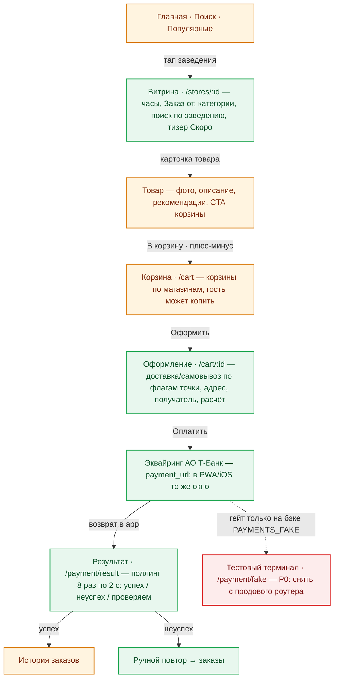
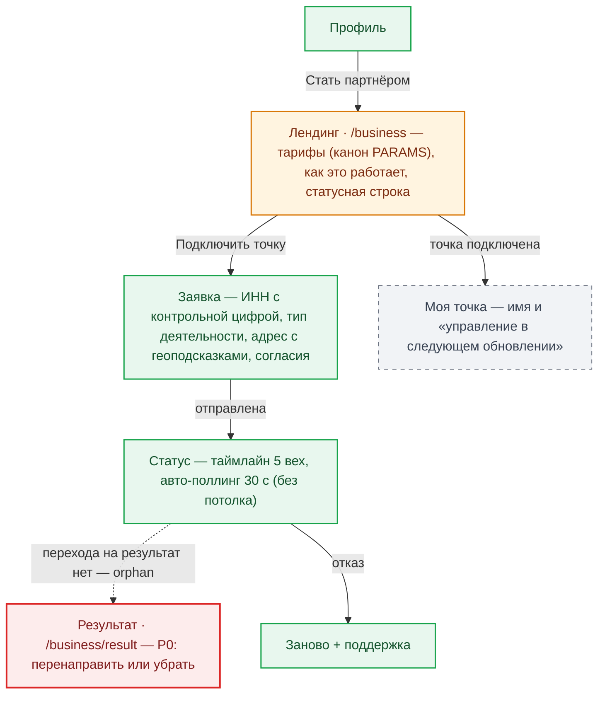
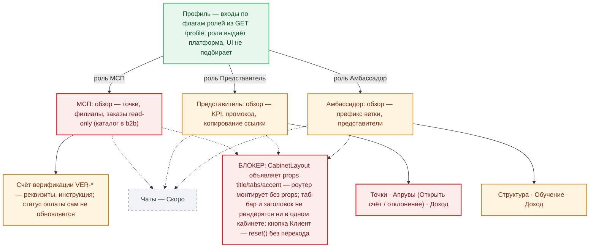

# Карта экранов lovii-app — схема навигации (Mermaid)

**Дата:** 2026-09-13 · **База:** lovii-app staging `09c14fb`
**Формат:** Mermaid — рендерится интерактивно прямо в GitHub (зум, копирование, быстрые правки текстом).
**Данные и оценки экранов:** [RES-002-app-screens-audit.md](RES-002-app-screens-audit.md) — функционал, три состояния, приоритеты P0/P1/P2. PNG-снапшот карты: [2026-09-13-app-screens-map.png](2026-09-13-app-screens-map.png).

**Как читать.** Стрелка = пользовательский переход «нажал это → попал сюда»; подпись на стрелке — действие. Пунктирная стрелка = разрыв, невидимая или проблемная связь. Цвет узла — оценка готовности из RES-002:

| Цвет | Статус | Смысл |
|---|---|---|
| 🟩 зелёный | готово | можно не трогать перед продом |
| 🟧 оранжевый | доработать | хардкод, UX-риск — P1/P2 |
| 🟥 красный | блокер | P0 — без этого на прод нельзя |
| ⬜ серый пунктир | заглушка | осознанная фаза «Скоро» — не трогать |

Защищённые роуты (кошелёк, баллы, заказы, адреса, бизнес, кабинеты, оплата) для гостя редиректят в Профиль — вход живёт там как оверлей.

---

## 1. Полная карта — 6 зон

```mermaid
flowchart TD
  Splash["Заставка · первый запуск"]:::done
  Geo["Выбор адреса · карта"]:::done

  subgraph SHELL["Зона 2 · Оболочка клиента — 4 таба"]
    Home["Главная · /"]:::fix
    Popular["Популярные заведения · /popular"]:::fix
    Stores["Поиск · /stores"]:::blk
    Cart["Корзина · /cart"]:::fix
    Profile["Профиль · /profile"]:::done
  end

  subgraph IN["Зона 1 · Старт и вход — оверлеи"]
    Phone["Вход: телефон"]:::done
    Channel["Вход: канал кода"]:::done
    Code["Вход: код · 4 цифры"]:::fix
    Promo["Вход: промокод"]:::stub
    Magic["Magic link из бота · /auth/by-binding"]:::done
  end

  subgraph BUY["Зона 3 · Покупка"]
    StoreView["Витрина магазина · /stores/:id"]:::done
    Product["Карточка товара"]:::fix
    Checkout["Оформление заказа · /cart/:id"]:::done
    Acq["Оплата · эквайринг Т-Банк"]:::done
    PayResult["Результат оплаты"]:::done
    Fake["Тестовый терминал · /payment/fake"]:::blk
  end

  subgraph PROF["Зона 4 · Профиль — хаб"]
    Wallet["Кошелёк LOVII PAY"]:::fix
    Balance["Мои баллы"]:::done
    Orders["История заказов"]:::fix
    OrderCard["Карточка заказа"]:::done
    Addresses["Адреса · список/создание/правка"]:::done
    ProfileEdit["Редактирование профиля"]:::done
    EmailVerify["Верификация e-mail"]:::done
    Ov["Оверлеи: Настройки · Face ID/ПИН"]:::done
  end

  subgraph BIZ["Зона 5 · ЛОВИ Бизнес — путь МСП"]
    BizLanding["Лендинг · /business"]:::fix
    BizApply["Заявка точки"]:::done
    BizStatus["Статус заявки"]:::done
    BizResult["Результат · /business/result"]:::blk
    MyPoint["Моя точка"]:::stub
  end

  subgraph CAB["Зона 6 · Кабинеты ролей"]
    MspOverview["МСП: обзор"]:::blk
    MspPayment["МСП: счёт верификации"]:::fix
    RepOverview["Представитель: обзор"]:::fix
    RepTabs["Точки · апрувы · доход"]:::blk
    AmbOverview["Амбассадор: обзор"]:::fix
    AmbTabs["Структура · обучение · доход"]:::fix
    Chats["Чаты всех ролей"]:::stub
    LayoutBug["CabinetLayout без props — таб-бар не рендерится · Клиент не возвращает"]:::blk
  end

  Splash -->|"авто-переход"| Geo
  Geo -->|"адрес выбран"| Home
  Splash -.->|"пропустить"| Home

  Profile -->|"гость: Войти"| Phone
  Phone -->|"номер введён"| Channel
  Channel -->|"канал выбран"| Code
  Code -->|"код верен"| Promo
  Promo -->|"Пропустить"| Profile
  Magic -->|"одноразовый токен → автологин"| Home

  Home -->|"Все"| Popular
  Home -->|"тап заведения"| StoreView
  Popular -->|"тап заведения"| StoreView
  Stores -->|"результат поиска"| StoreView
  StoreView -->|"карточка товара"| Product
  Product -->|"В корзину"| Cart
  Cart -->|"Оформить"| Checkout
  Checkout -->|"Оплатить"| Acq
  Acq -->|"возврат в app"| PayResult
  PayResult -->|"успех"| Orders
  Acq -.->|"только dev/staging"| Fake

  Profile --> Wallet
  Profile --> Balance
  Profile --> Orders
  Profile --> Addresses
  Profile --> ProfileEdit
  Profile -.->|"шестерёнка"| Ov
  ProfileEdit -->|"сменить e-mail"| EmailVerify
  Orders -->|"карточка"| OrderCard
  OrderCard -->|"Оплатить неоплаченный"| Acq

  Profile -->|"Стать партнёром"| BizLanding
  BizLanding -->|"Подключить точку"| BizApply
  BizApply -->|"заявка отправлена"| BizStatus
  BizStatus -.->|"ссылки на результат нет — orphan"| BizResult
  BizLanding -->|"точка подключена"| MyPoint

  Profile -->|"роль: МСП"| MspOverview
  Profile -->|"роль: Представитель"| RepOverview
  Profile -->|"роль: Амбассадор"| AmbOverview
  MspOverview -->|"счёт VER-*"| MspPayment
  RepOverview --> RepTabs
  AmbOverview --> AmbTabs
  MspOverview -.-> Chats
  RepOverview -.-> Chats
  AmbOverview -.-> Chats
  MspOverview -.-> LayoutBug
  RepOverview -.-> LayoutBug
  AmbOverview -.-> LayoutBug

  classDef done fill:#e8f7ee,stroke:#16a34a,color:#14532d,stroke-width:1.5px
  classDef fix fill:#fff4e0,stroke:#d97706,color:#7c2d12,stroke-width:1.5px
  classDef blk fill:#fdecec,stroke:#dc2626,color:#7f1d1d,stroke-width:2px
  classDef stub fill:#f1f3f6,stroke:#6b7280,color:#374151,stroke-dasharray:5 5
```

---

## 2. Зона 1 — вход: от телефона до авторизации

---

## 3. Зона 3 — покупка: от витрины до оплаты

---

## 4. Зона 5 — ЛОВИ Бизнес: путь МСП до точки

---

## 5. Зона 6 — кабинеты ролей и единый блокер

---

## 6. Куда смотреть перед продом (краткая выжимка P0)

Полный список с обоснованиями — RES-002 §4. На схеме выше это красные узлы и пунктирные разрывы:

1. **Кабинеты ролей** — передать пропсы в `CabinetLayout` (или собрать табы внутри по роли) + починить «Клиент» переходом в профиль.
2. **Error-состояния витринных экранов** (главная, поиск, витрина, товар, корзина, заказы, адреса) — сейчас сбой API = вечный скелетон; нужен единый паттерн «Не удалось загрузить → Повторить».
3. **`/payment/fake`** — снять с продового роутера (env-гейт на фронте) + подтверждение на «Открыть счёт» у представителя.
4. **`/business/result`** — orphan-роут: перенаправить или убрать; ошибки МСП не должны показываться как «нет точки».

Править эту карту нужно текстом в md — GitHub перерисует схему сам; PNG-снапшот обновлять только при согласовании версий.
