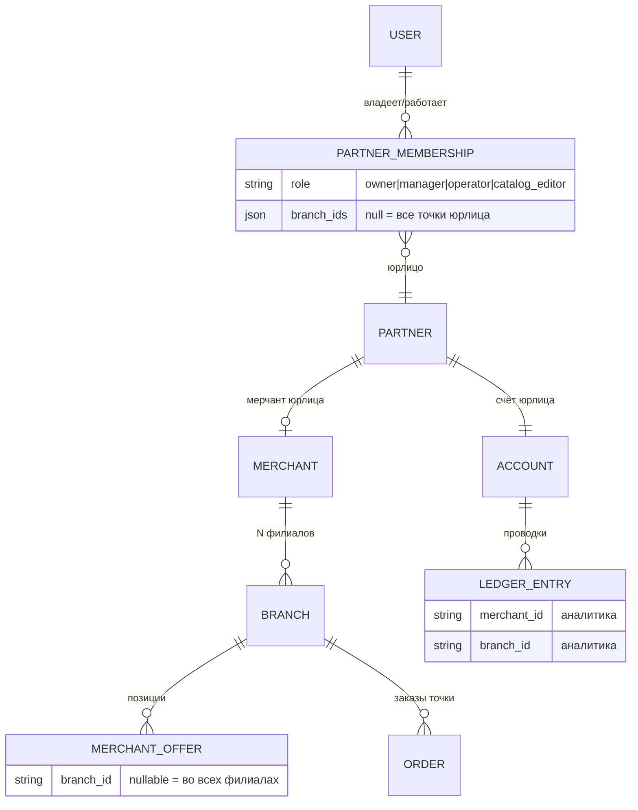

# МСП-контур: приведение интерфейсов к канону ДС + модель «несколько юрлиц → филиалы»

> Артефакт Task 20-и · 2026-09-14 · lovii_docs/artifacts/
> Вход: фидбек владельца по результатам живого теста staging.

## 0. Контекст и статус

Владелец подтвердил, что смена статусов заказа на staging заработала («прошло») —
инцидент окна деплоя закрыт, UX-хотфикс `421fd0e` работает. Одновременно даны два
новых требования:

1. **«Интерфейсы очень далеки от канонов дизайн-системы»** — МСП-экраны
   lovii-app нужно привести к канону ДС.
2. **«Вообще никак не предусмотрено, если у меня два юрлица и у каждого может
   любое число филиалов»** — в продукте нет модели мульти-юрлиц с филиалами.

Состояние окружения: сессия перезапущена, рабочие копии `lovii-core`/`lovii-app`
утрачены, токен GitHub не сохранился (протокол — не хранить в файлах). Построчная
сверка кода и реализация **заблокированы до восстановления доступа**. Локально
живы `lovii-design`, `lovii_docs`, `lovii-demo` — этого хватило для ресёрча.
Документ = ресёрч + гэп-анализ + целевой дизайн; реализация — после токена.

⚠️ Локальная копия ДС — v1.13.3 (клон не обновлялся); в сводке проекта канон
значится v1.16.1. Значения токенов стабильны с v1.9.1, поэтому выводы корректны,
но при восстановлении доступа сверить CHANGELOG 1.14…1.16 на предмет новых
компонентов, попадающих в §A.5.

---

## 1. TL;DR

1. Канон ДС **уже содержит готовый референс кабинета бизнеса** —
   `examples/02-business-dashboard.html`: хедер `.app-header` + `.role-pill`,
   KPI-карточки `.kpi`, список заказов `.list-card` → `.row`, статусы soft-парами
   (`.s-new` / `.s-ship` / `.s-done` / `.s-cancel`). МСП-экраны app собирались
   вне этой системы (локальные стили, не-канонические альфы) — отсюда эффект
   «далеки от канона». Приведение = проецирование существующих экранов на
   готовый референс, без изобретения нового.
2. **Мультифилиальность одного мерчанта канонизирована и работает** (SZ-013:
   «у мерчанта может быть N филиалов», `merchant_offers.branch_id` + тоггл
   «во всех филиалах»; SZ-011: скоуп сотрудников по `membership.branch_ids`).
   Отсутствует ровно одно звено: **«1 пользователь → N юрлиц»** — ни модели,
   ни API, ни переключателя контекста в UI.
3. Решение — не новая сущность сверху, а раскрытие существующей иерархии
   `partners → merchants → branches`: точка входа владения — уже существующие
   в b2b memberships; добавить API «мои юрлица», параметризовать msp-эндпоинты
   по партнёрству и ввести **канонический контекст-свитчер**
   (`.pill-btn` в хедере → bottom-sheet со списком `.district-row` — оба
   паттерна уже в каноне, новое — только их связка).
4. Параллельно — доканонизация: `DATA_MODEL.md` и `API_SPEC.md` не содержат
   b2b-сущностей вообще (задокументированный дрейф канона от реализации).
5. Порядок работ: Ф0 доки → Ф1 core → Ф2 app (свитчер + ДС-приведение) →
   Ф3 b2b → Ф4 финансы/карты.

---

## 2. Часть A — МСП-интерфейсы vs канон ДС

### A.1 Референс канона для кабинетов

- `examples/02-business-dashboard.html` (роль «Бизнес», каркас 1120px на ≥640px,
  480px на мобильном) — прямой прообраз МСП-кабинета:
  - заголовок-метрика `.page-title` 26/800 + `.page-sub` 14 dim;
  - переключатель периода `.segments` / `.segment` (active = card + shadow-soft);
  - KPI-грид `.kpi-grid` → `.kpi` (`.label` 12/600 dim, `.value` 26/800,
    дельта-пилюля; акцентная `.kpi.accent` = kpi-soft + градиентный текст);
  - бар-чарт `.chart-card` → `.bars` (gradient-brand, muted/tiff-варианты);
  - список заказов `.list-card` → `.list-head` + `.row` (`.avatar` 36 с
    инициалами + `.row-title`/`.row-sub` + `.pill` статуса + `.row-sum` 14/700);
  - действия `.btn.btn-ghost` + `.btn.btn-primary` h48.
- Статусы заказов в каноне — **soft-пары**, ничего другого:
  | Статус | Класс | Пара |
  |---|---|---|
  | Новый | `.pill.s-new` | soft-pink → pink-dark |
  | В пути | `.pill.s-ship` | soft-gold → gold-text |
  | Доставлен | `.pill.s-done` | soft-tiffany → tiffany-text |
  | Отменён | `.pill.s-cancel` | grey-soft → #999 |
  Промежуточные статусы нашей машины (accepted/preparing/ready/
  handed_to_delivery/on_the_way) укладываются в эту же систему: кухня = gold,
  готов к выдаче = tiffany, у курьера = gold/tiffany, финалы = tiffany/grey.
- `docs/06-application.md`: «роль → каркас» — клиент 480 / бизнес 1120 /
  партнёр 760. Мобильный МСП-слой app живёт в 480-каркасе; b2b (Filament) —
  отдельный продукт, в ДС не входит.
- `docs/11-brand-voice`: «на ты», без канцелярита/КАПСА/эмоджи, «!» ≤1 на экран
  (в ошибках и деньгах — 0), кнопки-глаголы ≤18 знаков, ошибка без вины + с
  действием, числа tabular-nums. Хотфикс `421fd0e` (честные тексты ошибок смены
  статуса) уже движется в эту сторону.

### A.2 Инвентарь текущих МСП-экранов

По `artifacts/roles-screens-spec.md` (§МСП) и реализации Task 20 (коммиты core
`52fae2d`, app `5b2042c`, хотфикс `421fd0e`):

| Экран | Содержимое | Реализация |
|---|---|---|
| `msp/index` Заявка | статус-карточка, stepper 5 шагов, данные заявки | app |
| `msp/catalog` Мой магазин | read-only обзор + «Открыть кабинет» (b2b), товары | app |
| Заказы | список + карточка заказа, смена статуса списком переходов, отмена с причиной, WebPush, звук-луп до принятия | app (Task 20) |
| `msp/pay` Платёж | счёт 1 ₽, код VER-*, реквизиты, «платёж с р/с» | app |
| `msp/help` Инструкция | mentor-card, шаги | app |

Известные ДС-отклонения уже на уровне спеки: раздел «Цвета и токены»
`roles-screens-spec.md` задаёт альфы `0.08` (`rgba(10,186,181,0.08)` и т.д.) —
**это не канонические токены** (канон: `--lv-soft-*` = 0.12 в светлой, 0.18/0.20
в тёмной) и «роль = основной тон» конфликтует с правилом «один акцент в кадре —
pink» (docs/05 «тихая тёмная тема»). Дрейф начался в документации и закономерно
продолжился в коде. Ф0 должен вычистить это и в спеке.

### A.3 Чек-лист приведения по экранам

| Экран | Канонические компоненты | Правила |
|---|---|---|
| Заявка | статус-карточка на `gradient-ink` + kicker + tier-badge (референс `03-partner-portal` `.status-card`), stepper = `.timeline`/`.milestone` (done=tiffany, now=pink+пульс, будущее=dim), форма = `.f-field`+`.lb`, оферта = `.check-row` | поля 14px, focus ring-field, ошибки `.err` 11/600 |
| Каталог | KPI `.kpi` (товары/остатки), товары = `.list-card`/`.row` (row-icon soft-пара), empty-state формула, CTA `.cta-btn` «Открыть кабинет» | одна primary на экран; «до верификации» — empty-state, не серая заглушка |
| Заказы (список) | KPI-грид (новые/в работе/готовы), `.list-card`/`.row` с avatar-инициалами и `.pill` статуса, фильтры `.seg`/`.tabs` | tabular-nums в суммах; ellipsis в row-title |
| Заказы (карточка) | шапка + `.timeline` статусов; **смена статуса = `.sheet`** со списком переходов (`.row`, каждая строка ≥44px, chevron), отмена = sheet с `.f-field` причины; тост-подтверждение | не модалка по центру (запрещена каноном); авто-refresh после ошибки (уже сделано в 421fd0e); статусы — soft-пары из A.1 |
| Платёж | pay-card (сумма 16/800 tabular), код VER-* = паттерн `.promo-code` (dashed, градиентный текст) + `.copy-mini`, реквизиты = `.legal`, чеклист = `.check-row` | «!» = 0; возврат без обещания «мгновенно» |
| Инструкция | `.timeline` шагов + `.list-card` ссылок, mentor-card = `.promo-card tone-*` | кнопки-глаголы |

Общий слой (все экраны): Inter 400–800 (заголовки 800), шкала 26/20/18/16/14/
13/12/11/10, боковые 16px / секция 20px / head-gap 12px, радиусы только
`--lv-r-*`, тени soft/lift, focus-visible розовый 2px, цели ≥36px (строки ≥44px),
тёмная тема только переопределением токенов `data-theme`, иконки — SVG-спрайт
(эмоджи запрещены), состояния docs/09 §6 (default/hover/active/focus/disabled/
loading/empty/enter), `prefers-reduced-motion`, skeleton на загрузках.

### A.4 Типовые нарушения — чек-лист построчной сверки кода

Сверка требует клона lovii-app (блокер). Искать и вычищать:

1. хардкод hex/rgba/теней вне `var(--lv-*)`;
2. альфы 0.08 вместо soft-пар 0.12/0.18;
3. самодельные кнопки/чипы вместо `.cta-btn`/`.ghost-btn`/`.stat-pill`/`.status-pill`;
4. цифры денег без `tabular-nums`;
5. отсутствие `focus-visible`;
6. тап-цели <36px;
7. самодельные empty вместо формулы (иконка 44 dim + заголовок 16/800 + текст
   13 dim ≤34ch + CTA);
8. смена статуса не в bottom-sheet;
9. тёмная тема не через переопределение токенов (дубли светлых значений);
10. иконки-эмоджи или не из спрайта.

### A.5 Расширение канона: контекст-свитчер юрлица/точки

В каноне **нет** переключателя организации/филиала (проверено: токены, docs/07/
09/10/12, референсы — только `.role-pill` как статическая метка). Центральные
модалки и dropdown'ы запрещены. Канонические кандидаты, из которых собирается
паттерн:

- **триггер**: `.pill-btn` (h36, surface, иконка 16 pink) в `.app-header` —
  показывает имя текущего юрлица (или «Все точки»);
- **выбор**: `.sheet` (bottom-sheet, r-xl, max-h 72dvh) со списком
  `.district-row` (h56: название 14/600 + метаданные 12 dim «N точек · город»;
  active = розовый бордер + soft-pink + `.stat-pill pink` «Выбран»);
- идентификация роли — существующий `.role-pill`.

Новизна — только связка «триггер → sheet → два уровня (юрлицо → точка)».
Оформление — по процедуре расширения ДС (docs/12 §3): слой B
`css/lovii-components.css` + сниппет docs/07 + анатомия docs/09 + живое демо в
examples/08 + реестр docs/12 + стражи check-sync. **Железное правило AGENTS.md:
новый паттерн сначала коммитится в lovii-design, потом разноска потребителям** —
прямые правки стилей реализаций запрещены.

### A.6 Блокер

Построчная сверка и правка требуют клона `lovii-app` → нужен токен GitHub
(протокол: токен в чат, в файлы не писать).

---

## 3. Часть B — модель «1 пользователь → N юрлиц → N филиалов»

### B.1 Что уже есть и переиспользуется

| Есть | Где | Что даёт |
|---|---|---|
| Иерархия `partners → merchants → branches` | b2b-реализация, STATUS/FINDINGS; в каноне только TASKS | юрлицо (partners, `dadata_party`, VER-верификация) → мерчант → филиалы |
| «У мерчанта может быть N филиалов» | SZ-013 (реализовано, приёмка «Достаточно») | мультифилиальность внутри юрлица: `merchant_offers.branch_id` nullable + тоггл «во всех филиалах»; однофилиальный мерчант — авто-привязка |
| Скоуп сотрудников по филиалам | SZ-011/SZ-010: роли `owner/manager/operator/catalog_editor`, `membership.branch_ids` (null = все точки) | готовая механика «человек ↔ юрлицо ↔ точки» внутри одного партнёрства |
| Мульти-тенантность | SZ-011: «партнёр A не видит/не редактирует данные партнёра B» | изоляция между юрлицами уже есть; не хватает навигации между СВОИМИ |
| Финансовая аналитика | FIN_BALANCE_REFERRAL_BRIEF: `accounts` (владелец user **или** partner/ИНН), `ledger_entries` с `merchant_id`/`branch_id`; SZ-040 резолв по `branch_id` | контур готов к филиальной детализации |
| Формальный допуск нескольких МСП | DATA_MODEL: `User ||--o{ MspAccount` | слот в канон-модели, не раскрытый полями/правилами |
| Прецедент решения | archive: «создаёт любое число МСП или торговых точек» (2026-08-31); BACKLOG: «2 МСП → 3 карты» | владельцем мульти-МСП уже признан, отложен, не реализован |

### B.2 Чего нет (гэп-лист)

1. **Владение несколькими partners одним user не определено**: вход в b2b
   жёстко связывает «человека и кабинет» по телефону (FINANCIAL_CONTOUR §3,
   шаг 3); не описано, что видит владелец двух юрлиц.
2. **Нет API «мои юрлица»**: `GET /business/applications/current` —
   сингулярное; msp-эндпоинты не параметризованы партнёрством.
3. **Нет переключателя контекста в UI** (ни в каноне ДС, ни в app): SCREEN_MAP
   и roles-screens-spec знают только переключение **ролей** («Клиент» ↔ Партнёр/…).
4. **Дрейф канона**: `DATA_MODEL.md` не содержит Merchant/Branch/Partner/
   `merchant_offers.branch_id`; `API_SPEC.md` не содержит b2b/витринных
   эндпоинтов; вся b2b-модель живёт в TASKS/STATUS.
5. **Оферта**: один «Лицензиат (ЮЛ/ИП)» без модели филиалов; сценарий
   `LOVI_BUSINESS_SCENARIO` — каждая заявка отдельная точка с новым ИНН, без
   выбора существующего юрлица.
6. **Правила начислений при сетевом владении**: точка привязана к
   регистрационному промокоду навсегда (SZ-034 фаза A: перепривязок нет);
   стыковка со «вторым юрлицом того же владельца» не определена.

### B.3 Целевая модель данных

Правила модели:

- один user = 0..N memberships; `owner` — полный доступ к юрлицу и его точкам;
  сотруднические роли — с существующим скоупом `branch_ids`;
- заявка на новую точку из app: шаг 1 — «юридическое лицо»: выбрать
  существующее (по memberships) или создать новое (текущий сценарий с ИНН);
- точка (branch) сохраняет собственный регистрационный промокод и привязку к
  представителю (перепривязок нет — SZ-034); юрлицо второго юрлица может вести
  к другому представителю — это норма, пул считается по точке;
- счёт (accounts) — на юрлицо; бизнес-карта — на юрлицо (развилка B.9.5).

### B.4 API (контекст юрлица)

Контекст — **stateless через путь**, без заголовков-сессий (чище в логах,
правах и кэше):

| Метод | Путь | Назначение |
|---|---|---|
| GET | `/api/v1/business/memberships` | мои юрлица: id, название, роль, счётчики точек/заявок, верифицированность |
| GET | `/api/v1/business/partners/{partnerId}/branches` | точки юрлица (для второго уровня свитчера) |
| GET | `/api/v1/msp/partners/{partnerId}/overview` | обзор контекста (товары/остатки/заказы) |
| GET | `/api/v1/msp/partners/{partnerId}/orders` / `orders/{id}` | заказы контекста |
| PATCH | `/api/v1/msp/partners/{partnerId}/orders/{id}/status` | смена статуса (текущий контракт) |
| GET | `/api/v1/msp/partners/{partnerId}/payment` | счёт верификации юрлица |
| POST | `/api/v1/business/applications` | + опциональное `partner_id` (точка под существующим юрлицом) |

- Guard'ы: `partnerId` резолвится только через memberships пользователя
  (иначе — `order_not_owned`-семантика, уже отработанная в Task 20);
- `GET /business/applications/current` остаётся как совместимость (возврат
  единственного юрлица; при N>1 — `multiple_partners` подсказка перейти на
  memberships) — либо deprecate сразу, решит Ф1;
- b2b использует те же memberships (Filament multi-tenancy, Ф3).

### B.5 UX переключения

- **app, МСП-слой**: в хедере `.role-pill` «Бизнес» + `.pill-btn` с именем
  текущего юрлица. Тап → sheet уровень 1 — юрлица (`.district-row`: название +
  «N точек · ИНН ••1234»; active — «Выбран»); если в юрлице N>1 точек — второй
  уровень в том же sheet (точки юрлица) или `.seg` «Юрлицо / Точка».
- **1 юрлицо и 1 точка** (доминирующий кейс) — свитчер скрыт, контекст
  неявный: лишний клик не навязываем (SZ-013-логика авто-привязки, но в UI).
- **0 юрлиц** — empty-state «Добавьте первую точку» + CTA на заявку.
- Все msp-экраны читают данные контекста; смена контекста = сброс списков и
  скелетоны; выбранный контекст — в `localStorage` (аналог роли).
- **b2b (Ф3)**: Filament multi-tenancy — тенант-меню в шапке кабинета;
  memberships маппятся на Filament-тенантов.
- **Заявка (`msp/index`)** превращается в «мои юрлица и заявки»: список
  партнёрств + статусные карточки заявок + CTA «Добавить точку» (шаг выбора
  юрлица — B.3).

### B.6 Финансовый контур при N юрлиц

- Счёт и вывод — на юрлицо (`accounts`, канал push/pull по `legal_status` юрлица);
- пул 10% и сплит 40/40/20 считаются **по точке** (branch → merchant → partner);
  регистрационный промокод точки определяет представителя/амбассадора — без
  перепривязок (SZ-034);
- VER-платёж — на заявки: код `VER-<partner_id>-<суффикс>` привязан к
  партнёрству; матчинг ИНН/счёт/наименование — юрлицо-центрично (уже так);
- бизнес-карта на каждую МСП («2 МСП → 3 карты») — BACKLOG, Ф4 после решения
  B.9.5.

### B.7 Оферта / комплаенс

- При модели «N партнёрств на одного владельца» действующая оферта
  («Лицензиат — ЮЛ/ИП») читается как «один договор на юрлицо» — правки текста
  не требуется, требуется проверка юристом сценария «одно физлицо = несколько
  Лицензиатов»;
- при модели «один partner с несколькими мерчантами» оферта требует правки
  (обособленные подразделения) — развилка B.9.1.

### B.8 Фазовый план

| Фаза | Содержимое | Оценка |
|---|---|---|
| Ф0 доки | DATA_MODEL.md v1.2 (+partners/merchants/branches/memberships), API_SPEC (+b2b/msp-контур), SCREEN_MAP (msp), чистка «0.08» в roles-screens-spec | 0.5 дн |
| Ф1 core | memberships-модель/гварды, GET memberships, параметризация msp-эндпоинтов по partnerId, Pest-тесты, **деплой core до app** (урок Task 20-з) | 2–3 дн |
| Ф2 app | ДС-расширение (контекст-свитчер) + приведение МСП-экранов к чек-листу A.3 + контекст в mspStore + тексты | 3–5 дн |
| Ф3 b2b | Filament multi-tenancy по memberships, скоупы | 2 дн |
| Ф4 финансы | бизнес-карты юрлиц, сплит-правила N-юрлиц, сверки | после решений владельца |

Порядок выкатов: core → дождаться deploy-staging → app (зафиксированный урок).

### B.9 Открытые вопросы владельцу (развилки)

1. **Юрлица одного владельца** — отдельные партнёрства (N partners) или одно
   партнёрство с несколькими мерчантами? (влияет на оферту, счета, карты)
2. Может ли пользователь быть **сотрудником чужого юрлица** (не owner)?
   Механика memberships это уже поддерживает.
3. **Витрина**: у точек одного юрлица общая витрина или раздельная?
   (связано с открытым хвостом SZ-013 — поиск офферов «во всех филиалах»)
4. Кто из ролей видит **все точки** юрлица — только owner?
5. **Бизнес-карта** — на юрлицо или на точку?

---

## 4. Источники

- `lovii-design`: README/AGENTS/CHANGELOG (1.13.3), tokens/tokens.css v1.11,
  css/lovii-components.css, docs/03/05/06/09/10/11/12, checklist.md,
  examples/02-business-dashboard.html, examples/03-partner-portal.html
- `lovii_docs`: canon/DATA_MODEL.md, canon/API_SPEC.md, canon/SCREEN_MAP.md,
  canon/LOVI_BUSINESS_SCENARIO.md, canon/FINANCIAL_CONTOUR.md §3,
  canon/FIN_BALANCE_REFERRAL_BRIEF.md, canon/BACKLOG.md §6,
  canon/TASKS/SZ-038-roles-rep-amb-msp.md,
  canon/TASKS/SZ-013-b2b-position-branch-binding.md,
  canon/TASKS/SZ-011-b2b-cabinet-full-sweep.md,
  canon/TASKS/SZ-034-representative-cabinet.md,
  canon/TASKS/SZ-040-billing-ledger-pool.md, archive/AUDIT_REGISTRATION.md,
  archive/DRAFT_REGISTRATION.md
- `artifacts/roles-screens-spec.md` (§МСП, §API, §Цвета, §Edge-cases)
- Сводка сессий Task 18–20: машина статусов, коммиты core `52fae2d` / app
  `5b2042c` / хотфикс `421fd0e`, инцидент окна деплоя и урок порядка выкатов
