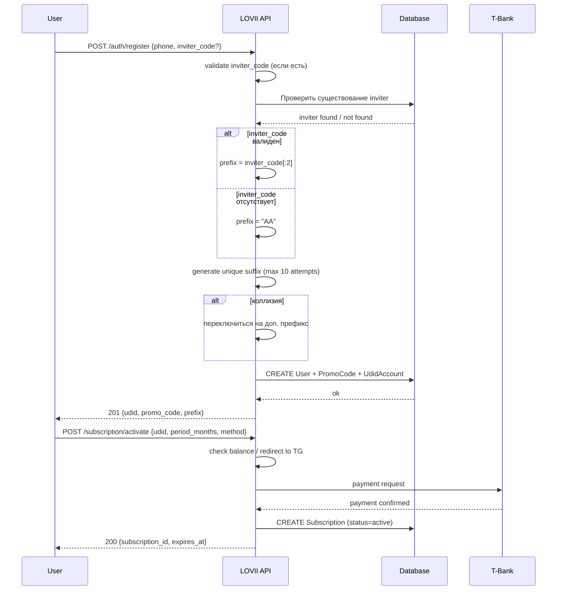
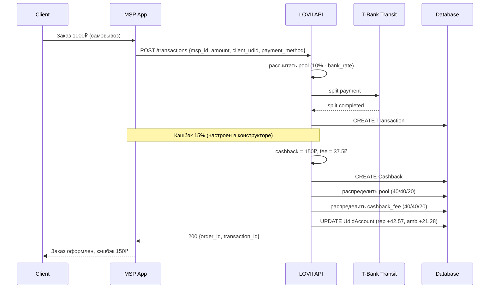

# LOVII — Спецификация API
## API Specification

<!-- fact-guard: allow — API_SPEC содержит эндпоинты с числовыми параметрами (лимиты, пороги); канон: PARAMS.md, BRD.md §7 -->

**Версия:** 1.1  
**Дата:** 2026-08-25  
**Base URL:** `https://api.lovii.ru/api/v1`

---

## 1. Sequence-диаграмма: Регистрация пользователя



---

## 2. Sequence-диаграмма: Транзакция с кэшбэком



---

## 3. Эндпоинты

### 3.1. POST /auth/register

**Описание:** Регистрация нового пользователя.

**Request:**
```json
{
  "phone": "+79991234567",
  "email": "user@example.com",
  "full_name": "Иванов Иван",
  "inviter_code": "BJ3M9K"
}
```

**Response 201:**
```json
{
  "udid": "usr_abc123def456",
  "promo_code": "BJ7K2P",
  "prefix": "BJ",
  "invited_by": "BJ3M9K"
}
```

**Errors:**
- `400` — невалидный phone
- `404 PROMO_NOT_FOUND` — inviter_code не существует
- `409 PROMO_RESERVED` — попытка использовать AAAAAA

---

### 3.2. POST /promo/change

**Описание:** Смена промокода (не чаще 1 раза в 30 дней).

**Request:**
```json
{
  "udid": "usr_abc123def456"
}
```

**Response 200:**
```json
{
  "old_promo": "BJ3M9K",
  "new_promo": "BJ9P7L",
  "next_change_available_at": "2026-09-25T10:00:00Z"
}
```

**Errors:**
- `429 PROMO_CHANGE_TOO_EARLY` — последняя смена была < 30 дней назад

---

### 3.3. POST /subscription/activate

**Описание:** Активация подписки.

**Request:**
```json
{
  "udid": "usr_abc123def456",
  "period_months": 12,
  "payment_method": "mixed",
  "udid_balance_amount": 1000,
  "card_amount": 2000
}
```

**Response 200:**
```json
{
  "subscription_id": "sub_xyz789",
  "started_at": "2026-08-25T10:00:00Z",
  "expires_at": "2027-08-25T10:00:00Z",
  "status": "active"
}
```

---

### 3.4. POST /transactions

**Описание:** Создание транзакции (заказа).

**Request:**
```json
{
  "msp_id": "msp_123",
  "client_udid": "usr_buyer456",
  "amount": 1000,
  "payment_method": "card"
}
```

**Примечание:** `promo_code` в запросе не передаётся. Сервер сам определяет `rep_udid`/`ambassador_prefix` по регистрационному промокоду МСП через `msp_id` (см. BRD.md, раздел 7.2 и `resolve_distribution_parties()` — логика распределения пула 40/40/20).

**НДС (с 01.01.2026, ФЗ №425-ФЗ, договор Т-Банк №МР-08.26/АКС_01):** комиссия банка по картам облагается НДС 22% сверху — эффективная ставка `2.59% + 22% = 3.16%` (на чек 1000₽: bank_effective = 3.16%, bank ₽ = 31.60). T-Pay и СБП — **без НДС (VAT-free)**: T-Pay `2.59%` (bank ₽ = 25.90), СБП `0.7%` (bank ₽ = 7.00). Пул = `10% − эффективная ставка банка` (карта: 6.84% → 68.40₽; T-Pay: 7.41% → 74.10₽; СБП: 9.3% → 93.00₽). Распределение пула 40/40/20.

**Response 200:**
```json
{
  "transaction_id": "txn_abc",
  "pool_amount": 68.40,
  "distribution": {
    "company": 27.36,
    "representative": 27.36,
    "ambassador": 13.68
  }
}
```

---

### 3.5. POST /cashback/accrue

**Описание:** Начисление кэшбэка (внутренний вызов из конструктора лояльности).

**Request:**
```json
{
  "transaction_id": "txn_abc",
  "client_udid": "usr_buyer456",
  "cashback_percent": 15
}
```

**Response 200:**
```json
{
  "cashback_id": "cb_xyz",
  "client_received": 150.00,
  "platform_fee": 37.50,
  "distribution": {
    "company": 15.00,
    "representative": 15.00,
    "ambassador": 7.50
  }
}
```

---

### 3.6. GET /status/{udid}

**Описание:** Получить текущий статус представителя.

**Response 200:**
```json
{
  "udid": "usr_abc",
  "status": "Мэр",
  "msp_count": 42,
  "cities_count": 1,
  "network_gmv_30d": 1850000,
  "assigned_at": "2026-07-15T03:00:00Z"
}
```

---

### 3.7. POST /account/transfer

**Описание:** Перевод между UDID-счетами.

**Request:**
```json
{
  "from_udid": "usr_sender",
  "to_udid": "usr_receiver",
  "amount": 500
}
```

**Response 200:**
```json
{
  "transfer_id": "tr_xyz",
  "from_balance_after": 1500.00,
  "to_balance_after": 2500.00
}
```

**Errors:**
- `404 UDID_NOT_FOUND` — получатель не существует
- `402 BALANCE_TOO_LOW` — недостаточно средств

---

### 3.8. POST /account/withdraw

**Описание:** Вывод средств с UDID-счёта через СБП. **Вывод доступен только при активной подписке** (иначе баланс — только для оплаты товаров/тарифа внутри платформы). Доступен только для `pull`-канала (Представитель, Амбассадор, МСП-Самозанятый) — см. BRD.md, раздел 8.4. Для МСП со статусом ИП/ООО выплата идёт автоматически по `push`-каналу, этот эндпоинт для них недоступен.

**Request:**
```json
{
  "udid": "usr_abc",
  "amount": 10000,
  "sbp_phone": "+79991234567"
}
```

**Response 200:**
```json
{
  "withdrawal_id": "wd_xyz",
  "amount": 10000,
  "bank_commission": 100.00,
  "commission_paid_by": "company",
  "balance_after": 2500.00
}
```

**Errors:**
- `402 BALANCE_TOO_LOW` — недостаточно средств на балансе (минимум 1 ₽)
- `400 PUSH_CHANNEL_ONLY` — попытка вызвать этот эндпоинт для МСП со статусом ИП/ООО (у них push, а не pull)

> **Комиссия за вывод** — см. `PARAMS.md` §1.6 (канон): самозанятый ≤ 3 000 ₽ — 30 ₽
> (удерживается из суммы); ≥ 3 000 ₽ — 1% (min 100 ₽), платит Компания.

---

### 3.9. POST /events/register

**Описание:** Регистрация на событие (Школа / Академия / Каникулы).

**Request:**
```json
{
  "udid": "usr_abc",
  "event_type": "Школа",
  "role": "mentor"
}
```

**Errors:**
- `403 SUBSCRIPTION_INACTIVE` — подписка истекла
- `403 STATUS_INSUFFICIENT` — статус не позволяет участвовать

---

### 3.10. POST /ambassador/create

**Описание:** Создание нового Амбассадора (только для Основателя).

**Request:**
```json
{
  "phone": "+79991234567",
  "full_name": "Петров Пётр",
  "assigned_prefix": "BJ"
}
```

**Response 201:**
```json
{
  "udid": "usr_ambassador",
  "promo_code": "BJ7K2P",
  "prefix": "BJ"
}
```

---

### 3.11. GET /admin/promos/collisions

**Описание:** Получить список коллизий (только для админа).

**Response 200:**
```json
{
  "collisions": [
    {
      "prefix": "BJ",
      "attempted_suffix": "7K2P",
      "switched_to_prefix": "B1",
      "timestamp": "2026-08-25T10:00:00Z"
    }
  ]
}
```

---

### 3.12. POST /promo/validate

**Описание:** Валидация промокода (для UI).

**Request:**
```json
{
  "code": "BJ3M9K"
}
```

**Response 200:**
```json
{
  "valid": true,
  "prefix": "BJ",
  "owner_udid": "usr_xyz"
}
```

---
