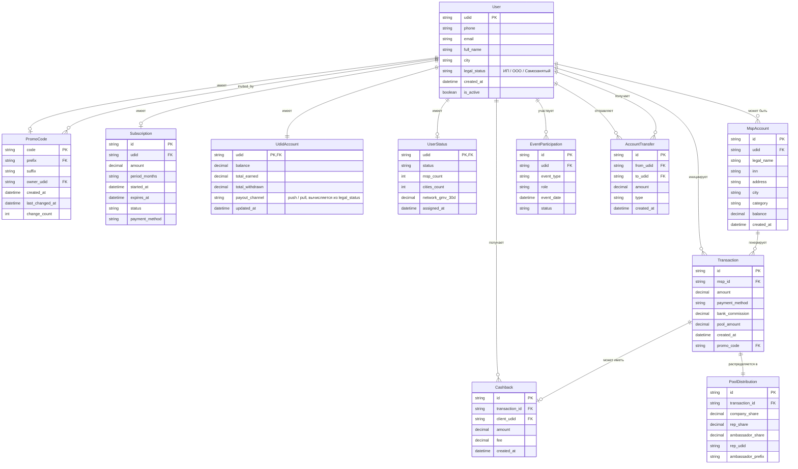

# LOVII — Модель данных
## Data Model Specification

<!-- fact-guard: allow — DATA_MODEL содержит схему данных с числовыми типами (decimal, percent); канон: PARAMS.md §1.1–§7 -->

**Версия:** 1.1  
**Дата:** 2026-08-25

---

## 1. ER-диаграмма



---

## 2. Сущности (JSON-схемы)

### 2.1. User

```json
{
  "$schema": "http://json-schema.org/draft-07/schema#",
  "type": "object",
  "title": "User",
  "required": ["udid", "phone", "created_at"],
  "properties": {
    "udid": {
      "type": "string",
      "description": "Уникальный идентификатор пользователя"
    },
    "phone": {
      "type": "string",
      "pattern": "^\\+7\\d{10}$"
    },
    "email": {
      "type": "string",
      "format": "email"
    },
    "full_name": {
      "type": "string"
    },
    "city": {
      "type": "string"
    },
    "legal_status": {
      "type": "string",
      "enum": ["ИП", "ООО", "Самозанятый"],
      "description": "Определяет канал выплаты (push/pull) и не связан со статусом Представитель/Мэр/Губернатор"
    },
    "created_at": {
      "type": "string",
      "format": "date-time"
    },
    "is_active": {
      "type": "boolean",
      "default": true
    }
  }
}
```

### 2.2. PromoCode

```json
{
  "$schema": "http://json-schema.org/draft-07/schema#",
  "type": "object",
  "title": "PromoCode",
  "required": ["code", "prefix", "suffix", "owner_udid"],
  "properties": {
    "code": {
      "type": "string",
      "pattern": "^[2-9A-HJ-NP-Z]{6}$",
      "description": "6-символьный промокод"
    },
    "prefix": {
      "type": "string",
      "pattern": "^[2-9A-HJ-NP-Z]{2}$"
    },
    "suffix": {
      "type": "string",
      "pattern": "^[2-9A-HJ-NP-Z]{4}$"
    },
    "owner_udid": {
      "type": "string"
    },
    "invited_by_code": {
      "type": "string",
      "description": "Промокод пригласившего"
    },
    "created_at": {
      "type": "string",
      "format": "date-time"
    },
    "last_changed_at": {
      "type": "string",
      "format": "date-time",
      "nullable": true
    },
    "change_count": {
      "type": "integer",
      "minimum": 0,
      "default": 0
    },
    "is_reserved": {
      "type": "boolean",
      "default": false,
      "description": "True для зарезервированных (AAAAAA)"
    }
  }
}
```

### 2.3. Subscription

```json
{
  "$schema": "http://json-schema.org/draft-07/schema#",
  "type": "object",
  "title": "Subscription",
  "required": ["udid", "amount", "period_months", "expires_at", "status"],
  "properties": {
    "id": {"type": "string"},
    "udid": {"type": "string"},
    "amount": {"type": "number", "minimum": 0},
    "period_months": {"type": "integer", "minimum": 1, "maximum": 12},
    "started_at": {"type": "string", "format": "date-time"},
    "expires_at": {"type": "string", "format": "date-time"},
    "status": {
      "type": "string",
      "enum": ["active", "expired", "pending"]
    },
    "payment_method": {
      "type": "string",
      "enum": ["card", "sbp", "udid_balance", "mixed"]
    },
    "auto_renew": {
      "type": "boolean",
      "default": false
    }
  }
}
```

### 2.4. UdidAccount

```json
{
  "$schema": "http://json-schema.org/draft-07/schema#",
  "type": "object",
  "title": "UdidAccount",
  "required": ["udid", "balance"],
  "properties": {
    "udid": {"type": "string"},
    "balance": {"type": "number", "description": "Может уходить в отрицательное значение при клоубэке после вывода (см. edge case 37)"},
    "total_earned": {"type": "number", "minimum": 0, "default": 0},
    "total_withdrawn": {"type": "number", "minimum": 0, "default": 0},
    "payout_channel": {
      "type": "string",
      "enum": ["push", "pull"],
      "description": "push — только МСП с legal_status ИП/ООО, ежедневно, без минимума. pull — все остальные, минимум 10000 по запросу"
    },
    "updated_at": {"type": "string", "format": "date-time"}
  }
}
```

### 2.5. Transaction

```json
{
  "$schema": "http://json-schema.org/draft-07/schema#",
  "type": "object",
  "title": "Transaction",
  "required": ["id", "msp_id", "amount", "payment_method", "pool_amount"],
  "properties": {
    "id": {"type": "string"},
    "msp_id": {"type": "string"},
    "amount": {"type": "number", "minimum": 0},
    "payment_method": {
      "type": "string",
      "enum": ["card", "sbp", "tpay"]
    },
    "bank_commission": {"type": "number", "minimum": 0},
    "pool_amount": {"type": "number", "minimum": 0},
    "promo_code": {"type": "string"},
    "client_udid": {"type": "string"},
    "created_at": {"type": "string", "format": "date-time"},
    "status": {
      "type": "string",
      "enum": ["pending", "completed", "refunded", "chargeback"]
    }
  }
}
```

### 2.6. Cashback

```json
{
  "$schema": "http://json-schema.org/draft-07/schema#",
  "type": "object",
  "title": "Cashback",
  "required": ["transaction_id", "client_udid", "amount"],
  "properties": {
    "id": {"type": "string"},
    "transaction_id": {"type": "string"},
    "client_udid": {"type": "string"},
    "amount": {"type": "number", "minimum": 0},
    "fee": {"type": "number", "minimum": 0, "description": "25% от amount"},
    "created_at": {"type": "string", "format": "date-time"}
  }
}
```

### 2.7. PoolDistribution

```json
{
  "$schema": "http://json-schema.org/draft-07/schema#",
  "type": "object",
  "title": "PoolDistribution",
  "required": ["transaction_id", "company_share", "rep_share", "ambassador_share"],
  "properties": {
    "id": {"type": "string"},
    "transaction_id": {"type": "string"},
    "company_share": {"type": "number", "minimum": 0},
    "rep_share": {"type": "number", "minimum": 0},
    "ambassador_share": {"type": "number", "minimum": 0},
    "rep_udid": {"type": "string"},
    "ambassador_prefix": {"type": "string"}
  }
}
```

### 2.8. UserStatus

```json
{
  "$schema": "http://json-schema.org/draft-07/schema#",
  "type": "object",
  "title": "UserStatus",
  "required": ["udid", "status"],
  "properties": {
    "udid": {"type": "string"},
    "status": {
      "type": "string",
      "enum": ["Представитель", "Мэр", "Губернатор"]
    },
    "msp_count": {"type": "integer", "minimum": 0},
    "cities_count": {"type": "integer", "minimum": 0},
    "network_gmv_30d": {"type": "number", "minimum": 0},
    "assigned_at": {"type": "string", "format": "date-time"}
  }
}
```

---
