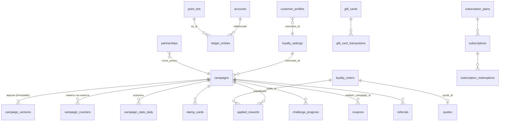

# 04 · Модель данных

> DDL — [`schema/schema.sql`](schema/schema.sql) (PostgreSQL 15+, схема `loyalty`). Здесь — смысл сущностей, ключевые решения и потоки данных. Деньги — `BIGINT` в копейках (`*_minor`), баллы — `BIGINT` (1 балл = 1 ₽).

---

## 1. ER-диаграмма (упрощённо)



---

## 2. Сущности

### 2.1 Настройки точки — `loyalty_settings`
Одна строка на ТСП. Хранит категорию бизнеса и маржу (для подсказок), политику начисления (`accrue_on`), потолки стекинга (`max_total_discount_pct`, `max_merchant_cashback_pct`, `max_points_share_pct`, `max_coupons_per_order`), список сотрудников (`staff_customer_ids`), признак тарифа PRO.

### 2.2 Кампании — `campaigns` + `campaign_versions`
- `campaigns` — изменяемая «шапка»: статус, бюджет (`budget_total / used / reserved`), счётчик использований, `current_version`.
- `campaign_versions` — **неизменяемые** снимки Spec (триггер запрещает UPDATE/DELETE). `spec_hash` — sha256 канонического JSON для детерминированных тестов и дедупликации.
- Публикация: `INSERT campaign_versions (version = current_version + 1)` + `UPDATE campaigns SET current_version, status='active'` в одной транзакции.
- Системные кампании (`is_system = true`, напр. `platform_base`) принадлежат платформе, `merchant_id` = служебный.
- `partner_merchant_id` — для кросс-промо: кампания хранится у выдающей стороны, `coupons.redeemer_merchant_id` указывает на принимающую.

### 2.3 Профиль клиента у точки — `customer_profiles`
Материализованные метрики клиента *в контексте конкретного ТСП*: `orders_total`, `last_purchase_at`, `visits_30d`, `spent_90d_minor`, `median_interval_days` (для персонального win-back), `tier`, `segments[]`, `winback_step`, `is_staff`. Обновляется синхронно при commit/reverse (счётчики) и ночным воркером (скользящие окна, сегменты, RFM, уровни).

Системные сегменты (пересчёт ежедневно):

| Код | Правило |
|---|---|
| `new` | `orders_total = 0` или первая покупка < 14 дней |
| `regular` | `visits_90d >= 3` |
| `sleeping` | `days_since_last_purchase >= max(30, 1.5 × median_interval_days)` и `orders_total >= 2` |
| `vip_platform` | статус LOVII = VIP |
| `top10` | верхние 10 % по `spent_90d_minor` у точки |

### 2.4 Леджер — `accounts`, `point_lots`, `ledger_entries`, `point_debts`

**Двойная запись.** Каждая проводка дебетует один счёт и кредитует другой:

| Операция | Дебет | Кредит | kind |
|---|---|---|---|
| Начисление промо-баллов ТСП | `merchant_funding` (₽, копейки) | `customer_points` | `accrual` |
| Начисление базового кэшбэка | `platform_funding` | `customer_points` | `accrual` |
| Списание баллов в оплату | `customer_points` | `points_liability` (обязательства перед ТСП, погашаемые расчётами) | `redemption` |
| Сгорание лота | `customer_points` | `merchant_funding` / `platform_funding` (возврат источнику) | `expiry` |
| Возврат чека: снятие начисленного | `customer_points` | источник | `reversal_accrual` |
| Возврат чека: возврат списанного | `points_liability` | `customer_points` | `reversal_redemption` |

Инвариант: `accounts.balance(customer_points) = Σ point_lots.amount_left` (проверяется ночной сверкой).

**Лоты.** Любое начисление создаёт лот: `funding`, `merchant_id` (чьи промо-баллы), `expires_at` (NULL = бессрочные базовые), `campaign_id/version`, `order_id`. Списание — FIFO: сначала лоты *этой точки* с ближайшим сроком, затем прочие срочные, затем бессрочные (см. 03 §5.5). Частичный индекс `point_lots_fifo_idx` обслуживает выбор.

**Долги.** Если при возврате начисленные баллы уже потрачены и базового баланса не хватает — создаётся `point_debts`, следующее начисление гасит долг проводкой `debt_settle`.

**Идемпотентность.** `ledger_entries.idempotency_key` уникален: `"{order_id}:{campaign_id}:{action_index}:{kind}"` (для reverse — с `refund_id`).

### 2.5 Заказы и атрибуция — `loyalty_orders`, `quotes`, `applied_rewards`, `campaign_counters`
- `quotes` — результат предрасчёта с TTL 15 мин и зафиксированными версиями кампаний; `reserved_minor` резервирует бюджет (снимается при commit/истечении).
- `loyalty_orders` — снимок чека в терминах лояльности (`gross`, `discounts`, `points_redeemed`, `paid_money`, `items`), статус `quoted → committed → (partially_)reversed`, `holdout_campaigns[]` — какие кампании *не* применились из-за контрольной группы (нужно для честного A/B).
- `applied_rewards` — по строке на каждое применённое действие с `campaign_version`, стоимостью для бюджета и `details` (выпавший приз, sku подарка, лот).
- `campaign_counters` — счётчики «на клиента за период» (`period_key`: `2026-09-22` / `2026-W39` / `2026-09` / `all`), инкремент под `FOR UPDATE` в транзакции commit.

### 2.6 Штампы и челленджи — `stamp_cards`, `stamp_events`, `challenge_progress`
- Одна карточка на `(campaign, card_code, customer)`; `pending_reward` — карточка заполнена, награда ждёт следующего подходящего чека или кнопки «Использовать».
- `stamp_events` — журнал ±1 для возвратов и аудита.
- `challenge_progress` — прогресс в окне; `seen_keys` — уникальные sku / номера недель для метрик `unique_sku`, `streak_weeks`.

### 2.7 Купоны и рефералы — `coupons`, `referrals`
- Купон всегда ссылается на **кампанию погашения** (`redeem_campaign_id`, обычно `mechanic = coupon`) и опционально на **кампанию выдачи** (`issued_by_campaign_id`: win-back, birthday, cross-promo). Публичный код — строка без `customer_id` с `max_uses`; персональный — с `customer_id`, `max_uses = 1`.
- `referrals` фиксирует воронку `invited → registered → qualified → rewarded`; `reject_reason` — антифрод.

### 2.8 Абонементы и сертификаты — `subscription_plans`, `subscriptions`, `subscription_redemptions`, `gift_cards`, `gift_card_transactions`
Отдельные инструменты предоплаты. В расчёте чека абонемент участвует действием `redeem_subscription_unit` (класс «цена», первым), сертификат — как платёжный инструмент до расчёта наград (см. 03 §5).

### 2.9 Партнёрства — `partnerships`
Соглашение двух ТСП одной локации для кросс-промо: направление, кто финансирует, лимиты. Кампании LM-12 создаются только при `status = active`.

### 2.10 События, аудит, статистика — `outbox_events`, `audit_log`, `campaign_stats_daily`
- Outbox-паттерн: события пишутся в той же транзакции, публикуются воркером (Kafka/NATS/webhooks).
- `audit_log` — кто/что/когда изменил (кампании, настройки, ручные начисления).
- `campaign_stats_daily` — инкрементальные агрегаты для дашбордов, включая holdout-метрики и воронку подсказок (`hints_shown → hints_converted`).

### 2.11 Согласия — `customer_consents`
Зеркало платформенных согласий по локации: `promo_push`, `promo_email`, `birthday_use`. Планировщик уведомлений читает только отсюда.

---

## 3. Гео-изоляция и производительность

- Все таблицы имеют `location_id`. Рекомендуется **партиционирование по `location_id`** (LIST) для `ledger_entries`, `loyalty_orders`, `applied_rewards`, `point_lots`, `outbox_events` и RLS-политики `app.location_id` для сервисных ролей.
- Горячие чтения quote: активные кампании точки (кэш в Redis, инвалидация по событию `campaign.published/paused`), профиль клиента (`customer_profiles` PK), лоты клиента (частичный индекс), счётчики (`campaign_counters` PK).
- Цель: quote ≤ 150 мс p95 при 20 активных кампаниях и 30 позициях в чеке.
- `ledger_entries` — append-only; ретеншн ≥ 5 лет (бухгалтерская сверка); архив в холодное хранилище по годам.

---

## 4. Миграции и версионирование данных

- Миграции — только вперёд, с `IF NOT EXISTS`; версия схемы в `loyalty.schema_migrations`.
- Изменение формата Spec → новое значение `spec_version`; движок поддерживает N и N−1; миграция версий кампаний не выполняется (старые версии остаются исполняемыми до завершения кампаний).
- Справочник механик/шаблонов **не** хранится в БД (код + тесты), кроме включения по тарифам (`loyalty_settings.pro_plan`).

---

## 5. Примеры запросов

Баланс и ближайшее сгорание клиента:
```sql
SELECT balance, base_balance, promo_balance, next_expiry
FROM loyalty.customer_points_balance
WHERE customer_id = $1 AND location_id = $2;
```

Лоты для списания (FIFO с приоритетом точки):
```sql
SELECT id, amount_left, expires_at
FROM loyalty.point_lots
WHERE customer_id = $1 AND location_id = $2 AND amount_left > 0
  AND (expires_at IS NULL OR expires_at > now())
ORDER BY (merchant_id = $3) DESC, expires_at NULLS LAST, created_at
FOR UPDATE SKIP LOCKED;
```

Кандидаты win-back на сегодня (персональный порог):
```sql
SELECT p.customer_id
FROM loyalty.customer_profiles p
JOIN loyalty.customer_consents c USING (customer_id, location_id)
WHERE p.merchant_id = $1
  AND p.orders_total >= 2
  AND p.last_purchase_at < now() - make_interval(days => GREATEST(30, CEIL(1.5 * COALESCE(p.median_interval_days, 30)))::int)
  AND p.winback_step = 0
  AND c.promo_push;
```

KPI кампании:
```sql
SELECT * FROM loyalty.campaign_kpi WHERE campaign_id = $1;
```
