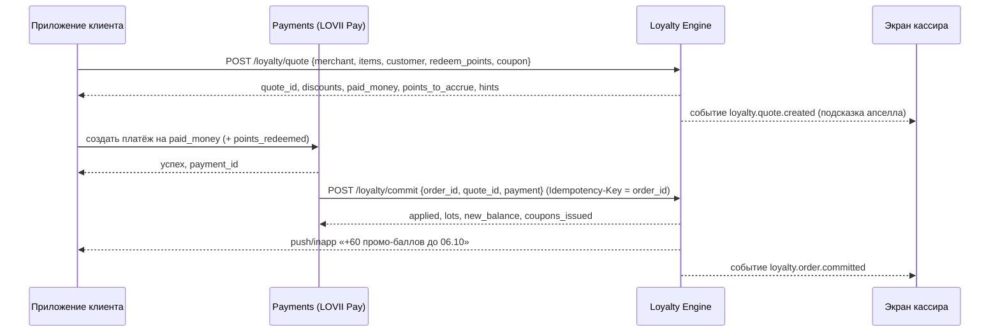

# 05 · API и события

> Формальная спецификация — [`schema/openapi.yaml`](schema/openapi.yaml) (OpenAPI 3.1). Здесь — карта эндпоинтов, соглашения, примеры запросов и каталог событий.

---

## 1. Соглашения

| Тема | Правило |
|---|---|
| База | `https://api.lovii.ru/v1`, JSON, UTF-8 |
| Аутентификация | JWT Bearer платформы LOVII; роли в claims: `customer`, `merchant_owner`, `merchant_staff`, `representative`, `platform_admin`, `service` (кассовые адаптеры, платежи) |
| Авторизация | Merchant API — только свои `merchantId` (или точки представителя); Runtime — роль `service` или приложение клиента с ограничением по `customer_id` из токена |
| Деньги / баллы | Целые: `*_minor` (копейки), `points` (баллы) |
| Идемпотентность | Заголовок `Idempotency-Key` обязателен для POST/PATCH, меняющих состояние; для `commit` ключ = `order_id`; повтор → тот же ответ + `Idempotent-Replay: true` |
| Версионирование | Путь `/v1`; ломающие изменения — `/v2`; deprecation через заголовок `Sunset` за 6 месяцев |
| Ошибки | `{ code, message, details[], trace_id }`; коды `LOY_*` (см. 03 §11) |
| Rate limits | Runtime: 50 rps на точку; ввод промокодов: 5/мин на клиента; Merchant API: 10 rps на пользователя; simulate: 2 rps |
| Локализация | Все тексты `content.*` — русский; API не переводит |
| Часовой пояс | Сервер считает в зоне локации; клиенты передают ISO с зоной |

---

## 2. Карта эндпоинтов

### 2.1 Merchant API (кабинет ТСП)

| Метод | Путь | Назначение |
|---|---|---|
| GET | `/merchants/{id}/loyalty/templates?goal=` | Каталог механик: формы (`params_schema`), пресеты под категорию, доступность по тарифу |
| POST | `/merchants/{id}/loyalty/templates/{tpl}/compile` | params → Spec + прогноз стоимости + предпросмотр (без сохранения) |
| GET/POST | `/merchants/{id}/loyalty/campaigns` | Список / создать черновик (из шаблона или Spec) |
| GET/PATCH/DELETE | `/merchants/{id}/loyalty/campaigns/{cid}` | Карточка с KPI / изменить / архивировать |
| POST | `…/campaigns/{cid}/publish` · `/pause` · `/resume` | Жизненный цикл; publish создаёт неизменяемую версию |
| GET | `…/campaigns/{cid}/versions` | История версий |
| POST | `/merchants/{id}/loyalty/simulate` | Симуляция чека тем же движком |
| GET | `/merchants/{id}/loyalty/analytics/overview` | Сводка: чек, повторные, стоимость, ROI, обязательства по баллам, рекомендации |
| GET | `…/campaigns/{cid}/stats` | По дням + holdout + воронка подсказок |
| GET | `/merchants/{id}/loyalty/customers?segment=` | Клиенты точки (обезличенно) |
| GET/PUT | `/merchants/{id}/loyalty/settings` | Настройки (маржа, потолки стекинга, сотрудники) |
| POST | `/merchants/{id}/loyalty/manual-accruals` | Ручное начисление/списание с аудитом и лимитом |
| POST | `/merchants/{id}/loyalty/coupons/batches` | Пакет одноразовых кодов (печать) |
| GET/POST | `/merchants/{id}/loyalty/partners` · `…/{pid}/accept` | Партнёрства для кросс-промо |

### 2.2 Runtime API (касса / QR-оплата / платежи)

| Метод | Путь | Назначение |
|---|---|---|
| POST | `/loyalty/quote` | Предрасчёт: скидки, списание баллов, начисления, подсказки; `quote_id` на 15 мин |
| POST | `/loyalty/commit` | Фиксация после оплаты; идемпотентно по `order_id` |
| POST | `/loyalty/reverse` | Откат при возврате (полный/частичный) |
| POST | `/loyalty/coupons/validate` | Проверка кода без корзины |
| POST | `/loyalty/checkin` | Визит по QR без покупки (V2) |
| GET | `/loyalty/wallet/{customerId}?merchant_id=` | Баланс и лоты (для экрана кассира) |

### 2.3 Customer API (приложение LOVII)

| Метод | Путь | Назначение |
|---|---|---|
| GET | `/me/loyalty/offers?merchant_id=&location_id=` | Лента «Акции рядом» / предложения точки с прогрессом |
| GET | `/me/loyalty/progress?merchant_id=` | Штампы, уровень, челленджи, «до порога» |
| GET | `/me/loyalty/wallet` | Баланс, лоты, сгорания |
| GET | `/me/loyalty/coupons` | Мои купоны |
| GET | `/me/loyalty/referral/{merchantId}` | Ссылка/QR и статус приглашений |
| GET | `/me/loyalty/subscriptions` | Абонементы |
| POST | `/me/loyalty/spin/{orderId}` | Результат мгновенного выигрыша |

---

## 3. Основной поток: QR-оплата в приложении LOVII



Возврат: касса/поддержка → `POST /loyalty/reverse {order_id, refund_id, full|amount}`.

---

## 4. Примеры

### 4.1 Quote

Запрос:
```json
POST /v1/loyalty/quote
{
  "merchant_id": "mrc_daily",
  "order_id": "ord_20260922_0001",
  "customer_id": "cus_1",
  "channel": "qr",
  "items": [
    { "sku": "cd1", "name": "Капучино", "category": "coffee", "price_minor": 22000, "qty": 2 }
  ],
  "coupon_code": null,
  "redeem_points": 0
}
```

Ответ (активны LM-01 порог 450 ₽ → +60 б., LM-06 штампы 6-й кофе, базовый кэшбэк 5 %):
```json
{
  "quote_id": "1f0c5a3e-…",
  "expires_at": "2026-09-22T09:55:00+03:00",
  "gross_total_minor": 44000,
  "discount_total_minor": 0,
  "after_discounts_minor": 44000,
  "points_redeemed": 0,
  "points_redeem_max": 220,
  "paid_money_minor": 44000,
  "points_to_accrue": 22,
  "lots_to_accrue": [
    { "label": "Кэшбэк LOVII", "points": 22, "expires_at": null, "funding": "platform" }
  ],
  "applied": [
    { "campaign_id": "cmp_stamps", "campaign_version": 1, "mechanic": "stamps", "title": "6-й напиток бесплатно", "action_type": "stamp", "points": 0, "discount_minor": 0, "funding": "merchant", "details": { "card": "coffee", "before": 4, "after": 5, "target": 6 } },
    { "campaign_id": "platform_base", "campaign_version": 1, "mechanic": "platform_base", "title": "Кэшбэк LOVII 5 %", "action_type": "accrue_points", "points": 22, "funding": "platform" }
  ],
  "hints": [
    { "type": "threshold_progress", "campaign_id": "cmp_threshold", "text": "До +60 баллов осталось 10 ₽ — добавьте Эспрессо 150 ₽", "remaining_minor": 1000,
      "suggested_item": { "sku": "cd3", "name": "Эспрессо", "price_minor": 15000, "qty": 1 } },
    { "type": "stamps", "campaign_id": "cmp_stamps", "text": "Ещё 1 покупка — и 6-й напиток бесплатно", "progress": { "current": 5, "target": 6 } }
  ],
  "explain": [
    { "campaign_id": "cmp_threshold", "name": "От 450 ₽ — +60 баллов", "result": "skipped", "reason": "condition:0" },
    { "campaign_id": "cmp_stamps", "name": "6-й напиток бесплатно", "result": "applied" },
    { "campaign_id": "platform_base", "name": "Кэшбэк LOVII 5 %", "result": "applied" }
  ]
}
```

### 4.2 Commit (повтор безопасен)

```json
POST /v1/loyalty/commit
Idempotency-Key: ord_20260922_0001
{ "order_id": "ord_20260922_0001", "quote_id": "1f0c5a3e-…",
  "payment": { "method": "qr_lovii_pay", "paid_money_minor": 44000, "paid_points": 0, "payment_id": "pay_77" } }
```

### 4.3 Compile шаблона

```json
POST /v1/merchants/mrc_daily/loyalty/templates/lm-01/compile
{ "params": { "threshold_minor": 45000, "reward": { "type": "points", "amount": 60 }, "ttl_days": 14 } }
→ { "spec": { … }, "estimate": { "cost_month_minor": 420000, "eligible_orders_month": 70, "note": "≈ 31 % чеков пересекут порог", "risk": "low" },
    "preview": { "title": "От 450 ₽ — +60 баллов", "badge": "+60 б.", "checkout_hint": "До +60 баллов осталось {remaining} ₽" } }
```

---

## 5. Каталог событий (outbox → Kafka/NATS + вебхуки)

| Событие | Когда | Ключевые поля `data` | Потребители |
|---|---|---|---|
| `loyalty.campaign.published` / `.paused` / `.budget_exhausted` | Жизненный цикл | `campaign_id, version, mechanic` | Кэш движка, витрина, уведомление ТСП |
| `loyalty.quote.created` | После quote | `quote_id, order_id, hints[]` | Экран кассира (апселл) |
| `loyalty.order.committed` | После commit | `order_id, applied[], points_to_accrue, paid_money_minor` | Аналитика, CRM, кассовые адаптеры |
| `loyalty.order.reversed` | После reverse | `order_id, refund_id, points_clawed_back` | Аналитика, поддержка |
| `loyalty.reward.applied` | По каждому действию | `campaign_id, version, action_type, cost_minor, holdout: false` | Аналитика (атрибуция) |
| `loyalty.points.accrued` / `.redeemed` / `.expiring` / `.expired` | Леджер / планировщик | `customer_id, lot_id, points, expires_at, merchant_id` | Пуши («сгорает через 3 дня»), кошелёк |
| `loyalty.stamp.added` / `loyalty.stamp_card.completed` | Штампы | `card, count, target` | Пуши, витрина |
| `loyalty.coupon.issued` / `.redeemed` | Купоны | `coupon_id, redeemer_merchant_id, issuer_merchant_id, expires_at` | Кошелёк, партнёр (кросс-промо) |
| `loyalty.referral.qualified` / `.rewarded` | Рефералы | `referrer_id, referee_id, order_id` | Пуши, антифрод |
| `loyalty.tier.changed` | Пересчёт уровней | `customer_id, from, to` | Пуши |
| `loyalty.challenge.completed` | Челленджи | `challenge, reward` | Пуши |
| `loyalty.subscription.purchased` / `.redeemed` | Абонементы | `plan_id, units_left` | Кошелёк |
| `loyalty.gift_card.purchased` / `.redeemed` | Сертификаты | `gift_card_id, balance_minor` | Кошелёк, бухгалтерия |
| `loyalty.hint.shown` / `.converted` | Подсказки | `hint_type, campaign_id, order_id` | Аналитика воронки |

Формат конверта — `components.schemas.Event` в OpenAPI. Вебхуки подписываются HMAC-SHA256 (`X-Lovii-Signature`), доставка at-least-once с экспоненциальными повторами (1 мин → 24 ч), дедупликация по `id`.

Персональные данные в событиях — только `customer_id` (UUID), без телефона/имени.

---

## 6. Совместимость с текущей платформой LOVII

- Кошелёк LOVII PAY уже показывает операции «Кэшбек · Пекарня „Слойка“», «Бонус „Приведи друга“», «Оплата баллами». Runtime API добавляет к этим операциям поле `lot` (метка, срок) и `campaign` (название), чтобы история операций объясняла источник.
- Экран статуса (PAY / PASS / VIP) остаётся платформенным; `customer.status` доступен кампаниям как аудитория.
- Существующие акции витрины («Слойка с вишней −30 % ежедневно до 20:00», «Пицца 2×1 по выходным», «−15 % на сеты по промокоду МИЯ15») выражаются механиками LM-05, LM-02/LM-06 и LM-13 соответственно — при миграции их следует пересоздать как кампании, чтобы получить учёт и аналитику.
