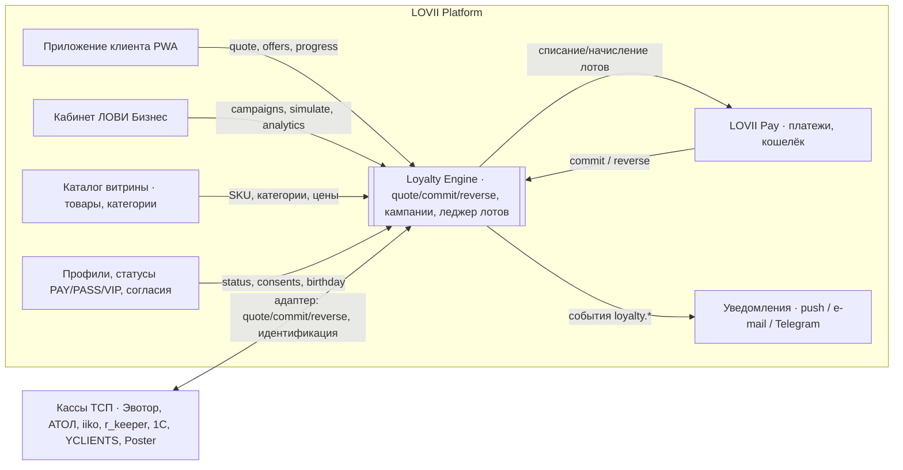

# 08 · Интеграции: QR-оплата, кассы, уведомления, офлайн

> Как движок лояльности встраивается в существующую платформу LOVII (LOVII Pay, витрина, кошелёк, пуши) и во внешние кассы ТСП. MVP работает **без** кассовой интеграции — через QR-оплату LOVII; кассовые адаптеры — V2.

---

## 1. Контекст платформы (Context Map)



Границы ответственности:
- **LOVII Pay** — деньги и *базовый* баланс баллов клиента (кошелёк). Loyalty Engine ведёт **лоты** (структуру баланса: источник, срок) и проводки; итоговый баланс клиента = сумма лотов — единый источник правды по баллам должен быть **один**: рекомендуется перенести хранение баланса в леджер лотов (`loyalty.point_lots`) и отдавать LOVII Pay агрегат через `/loyalty/wallet`. До миграции — двусторонняя сверка ночью.
- **Каталог** — источник SKU/категорий для условий, фильтров и подсказок; движок хранит только ссылки и снимки в чеках.
- **Профили** — статусы, согласия, дата рождения; движок читает по API/событиям, не копирует ПДн (только `customer_id`, `birthday_in_days` вычисляется на стороне профилей или передаётся как число).

---

## 2. Поток QR-оплаты (MVP, без кассы)

1. Клиент открывает точку в приложении, собирает корзину (или кассир — на своём экране, корзина синхронизируется по `order_id`).
2. Приложение вызывает `POST /loyalty/quote` при каждом изменении корзины (debounce 300 мс), показывает прогресс/подсказки/списание.
3. Кассир показывает **динамический QR точки** (TOTP-токен, ротация 30 с) или клиент сканирует статический QR точки — токен подтверждает физическое присутствие (антифрод для штампов/чек-инов).
4. LOVII Pay создаёт платёж на `paid_money_minor` и резервирует `points_redeemed`.
5. После успешной оплаты LOVII Pay вызывает `POST /loyalty/commit` (`Idempotency-Key = order_id`), получает лоты к начислению и списанию; отражает операции в истории кошелька с меткой кампании.
6. Приложение получает событие `loyalty.order.committed` (WebSocket/poll) → `PostPaySheet`.
7. Возврат инициируется кассиром в кабинете → LOVII Pay → `POST /loyalty/reverse`.

Тайминги: quote ≤ 150 мс p95; commit ≤ 300 мс p95; если Loyalty недоступен на commit — платёжный сервис ставит commit в очередь повторов (до 24 ч), клиенту показывается «начисление в обработке».

---

## 3. Идентификация клиента на кассе

| Способ | Где | Надёжность | Примечание |
|---|---|---|---|
| Клиент сканирует QR точки в приложении | MVP | высокая | Токен привязан к точке и времени |
| Кассир сканирует QR клиента (экран «Моя карта») | MVP | высокая | Одноразовый токен клиента 60 с |
| Номер карты LOVII PAY (16 цифр из демо) | V2 | средняя | Только с подтверждением пушем |
| Номер телефона | V2, POS | низкая | Только начисление, не списание; лимиты |
| Гость (без идентификации) | всегда | — | Применяются только публичные скидки класса «цена» (расписания, публичные промокоды); наград нет |

---

## 4. Кассовые адаптеры (V2)

Единый контракт адаптера (сервис-посредник или плагин кассы):

```
Adapter.identify(token|phone)      → customer_id | guest
Adapter.quote(cart, customer_id)   → applied discounts (для чека), points_redeem_max, hints для экрана кассира
Adapter.commit(order_id, payment)  → начисления (после фискализации)
Adapter.reverse(order_id, refund)  → откат
Adapter.catalogSync()              → SKU/категории/цены → Каталог LOVII (ежедневно + по событию)
```

| Касса / система | Тип интеграции | Приоритет | Особенности |
|---|---|---|---|
| Эвотор | приложение в маркете Эвотор (JS API кассы) | V2-1 | Скидки применяются к чеку до фискализации; идентификация по QR клиента через камеру/сканер |
| АТОЛ Sigma | API кассового ПО | V2-1 | Аналогично |
| МойСклад · Касса | облачное API + вебхуки чеков | V2-1 | Каталог из МойСклад |
| iiko (iikoCard / iikoTransport) | API лояльности iiko: внешняя программа лояльности | V2-2 | Общепит; учитывать собственную лояльность iiko — режим «внешний оператор» |
| r_keeper | плагин/интеграционный сервер | V2-2 | |
| 1С:Розница / УНФ | HTTP-сервис 1С, обмен по расписанию | V2-2 | |
| YCLIENTS | API записи и продаж | V2-1 для салонов | Триггер `purchase` при закрытии визита; win-back по записям |
| Poster | API | V2-3 | |
| Без кассы (тетрадь) | экран кассира в кабинете LOVII | MVP | Полный функционал через QR |

Требования к адаптеру: идемпотентность commit/reverse, маппинг SKU кассы ↔ каталог LOVII (таблица соответствий с ручным подтверждением), офлайн-очередь (см. §6), логирование расхождений сумм чека.

---

## 5. Уведомления

- Канал — существующая подсистема LOVII (в демо: `PUSH_NOTIFICATIONS_SPEC`, согласия «Промо-пуши и письма приходят только с согласия — галочка одна»).
- Loyalty Engine **не отправляет** сообщения сам: публикует события с шаблоном и параметрами (`notify` action → `loyalty.notification.requested`), подсистема уведомлений проверяет согласие, частотные лимиты (≤ 2 промо-пуша/нед на клиента по локации, транзакционные — без лимита) и тихие часы (22:00–09:00 локального времени).
- Транзакционные (не требуют промо-согласия): «+60 баллов начислено», «штамп добавлен», «купон использован». Промо (требуют согласия): win-back, день рождения, «сгорает через 3 дня» (спорно — трактовать как сервисное, подтвердить с юристом), новая акция точки.
- Шаблоны — RU, ≤ 50 символов заголовок, ≤ 150 текст, deep-link на экран точки/кошелька.
- Telegram-бот и e-mail — те же события; Telegram используется и для ТСП: «Кампания „От 450 ₽“ исчерпала бюджет», «Сводка недели».

---

## 6. Офлайн-режим и деградация

| Сценарий | Поведение |
|---|---|
| Loyalty Engine недоступен при quote | Приложение/касса показывает «Бонусы посчитаем после оплаты»; скидки класса «цена» из **локального кэша активных кампаний** (кэш обновляется каждые 5 мин, подписан) применяются, если адаптер поддерживает; иначе — без скидок |
| Недоступен при commit | Очередь повторов в платёжном сервисе/адаптере; лимиты и бюджет проверяются при фактическом commit; клиент получает начисление позже |
| Нет интернета у кассы | Адаптер сохраняет чеки локально, отправляет пачкой; `commit` с `context` (без quote) → `recomputed: true` |
| Кэш кампаний устарел > 30 мин | Не применять скидки офлайн (риск переплаты ТСП) |
| Расхождение сумм (касса vs quote) | `LOY_AMOUNT_MISMATCH` → пересчёт по факту; алерт в аудит |

---

## 7. Каталог и данные точки

- Для подсказок движку нужен каталог точки: `sku, name, category, price_minor, is_available`. Источник — витрина LOVII (ТСП уже загружает товары через QR/Excel/Web).
- Категории движка = категории витрины; для механик «по категории» ТСП выбирает из своих категорий; платформенный справочник категорий — для бенчмарков локации.
- Средний чек, распределение чеков по суммам и часам, маржа по категории (задаётся ТСП или пресет) — входы для `estimate()` шаблонов.

---

## 8. Фискализация и 54-ФЗ (для кассовых адаптеров)

- Скидки класса «цена» и оплата промо-баллами ТСП отражаются в чеке как **скидка** на позиции (цена позиции уменьшается; сумма чека = оплачено деньгами). Распределение скидки чека по позициям — пропорционально стоимости (правило адаптера, детерминированное).
- Оплата **базовыми** баллами платформы (1 балл = 1 ₽ с возможностью вывода) с точки зрения ТСП — способ расчёта, который платформа компенсирует ТСП при взаиморасчётах; юридическая квалификация (скидка / оплата третьим лицом / зачёт) — предмет платформенного договора с ТСП, см. [09 §4](09-nfr-security-compliance.md). Адаптер должен поддерживать оба режима: «баллы как скидка» и «баллы как безналичная оплата (зачёт предоплаты)».
- Подарочный сертификат: продажа — чек с признаком «аванс/предоплата», погашение — «зачёт аванса».
- Абонемент: продажа — предоплата за N единиц; списание единицы — чек на 0 ₽ с зачётом аванса либо отсутствие чека (если единица уже фискализирована при продаже) — уточнить у ОФД/бухгалтера ТСП, адаптер конфигурируем.
