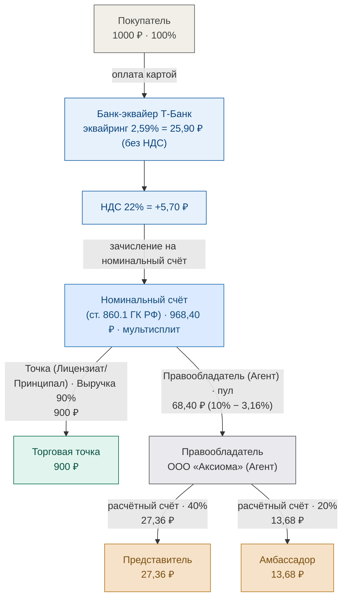
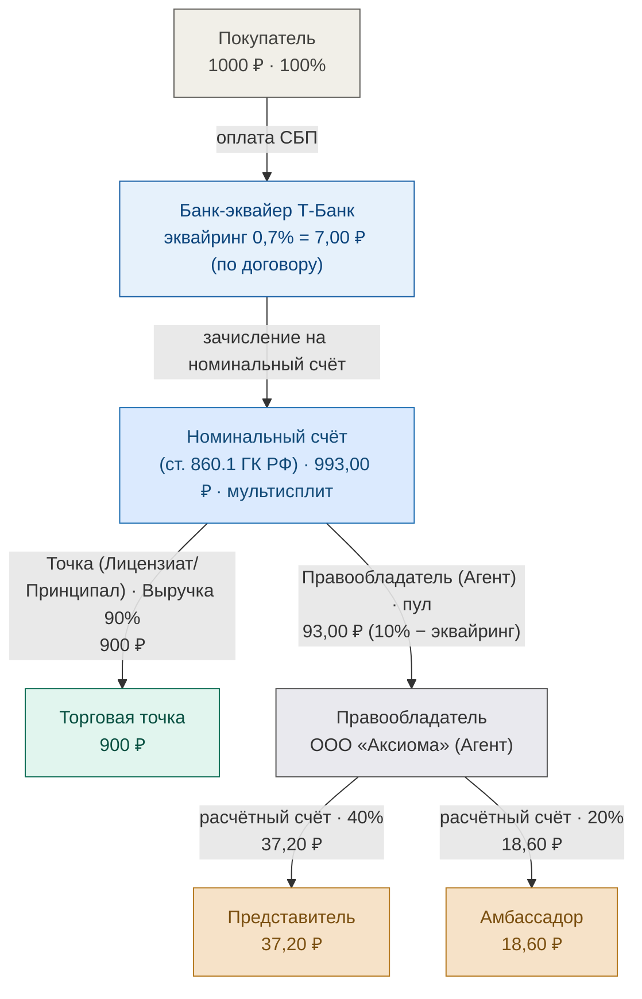
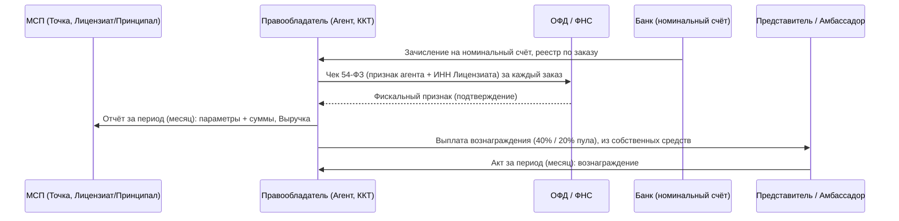

# Движение средств и документооборот LOVII

**LOVII — Виртуальный Оператор Лояльности и Инфраструктура для МСП, далее «Лови».**

| Поле | Значение |
|:---|:---|
| **Версия** | 2.0.3 |
| **Дата публикации** | 2026-08 |
| **Правообладатель** | ООО «Аксиома», ИНН 7842223709 |
| **Сайт платформы** | [app.lovii.ru](https://app.lovii.ru) |

> **История изменений:** v2.0.3 — Карта: добавлена ветка НДС 22% (2,59% + НДС = 3,16% эфф.); пул карты 6,84% / 68,40 ₽; T-Pay/СБП без НДС.

Единый публичный документ платформы LOVII: согласованная схема движения средств
**и** полный документооборот (кассовый чек 54-ФЗ, квитанция, отчёт, акты закрывающие период).

**Правовая модель.** Правообладатель (ООО «Аксиома») действует как **торговый агент
(поверенный) Лицензиата (Принципала)** — от своего имени, но за счёт Принципала
(Глава 52 ГК РФ). Договор купли-продажи Товара/Услуги заключается непосредственно
между Лицензиатом (Принципалом) и Покупателем; Правообладатель стороной этого
договора не является. Приём денежных средств осуществляется через **номинальный
счёт** Правообладателя (ст. 860.1 ГК РФ, банк — АО «Т-Банк»), что прямо исключает
квалификацию деятельности Правообладателя как деятельности платёжного агента по
103-ФЗ (Оферта присоединения, §2.5; Публичная оферта, п. 3.4).

**Источник тарифов на приём средств** — Договор Т-Банк № МР-08.26/АКС_01,
Приложение № 3: эквайринг **Карта 2,59%** (мин 3,49 ₽), **СБП 0,7%**, **T-Pay 2,59%** (мин 3,49 ₽).
Вывод средств получателям по договору: перечисление третьему лицу (п. 3.4) **0,5%**,
перевод «Получателю» **1% мин 30 ₽**.

> **НДС по способам оплаты:** Карта: 2,59% + НДС 22% (3,16% эфф.); T-Pay и СБП — НДС не облагается.

> Нагрузка на Заказ (10%, Лицензиат получает 90% в виде Выручки) и распределение
> Лицензионного вознаграждения между Правообладателем, Представителем и Амбассадором
> (**40 / 40 / 20**) — **коммерческие параметры платформы**, устанавливаются
> «внутренними правилами Правообладателя» (Оферта присоединения, §4.2.2) и тарифами
> Программы, а не являются фиксированными ставками договора банка. Показаны как
> значения по умолчанию на примере заказа 1000 ₽.

---

## 1. Движение средств

Правообладатель — единственная сторона, получающая средства от банка: номинальный
счёт открыт на его имя, и продукт «Мультирасчёты» АО «Т-Банк» делает мультисплит на
**2 получателя** — Торговую точку (Лицензиат/Принципал, Выручка 90%) и
Правообладателя (Лицензионное вознаграждение + удержанный Эквайринг, пул). Пул
целиком поступает на расчётный счёт Правообладателя, который далее **самостоятельно,
из собственных средств** (Оферта присоединения, §6.5.2) перечисляет вознаграждение
Представителю (40% пула) и Амбассадору (20% пула), оставляя себе 40% как
лицензионное вознаграждение за Лицензию.

### 1.1 Карта и T-Pay (эквайринг 2,59%)

#### 1.1.1 Карта (2,59% + НДС 22% = 3,16% эфф.)

#### 1.1.2 T-Pay (2,59%, НДС не облагается)

### 1.2 СБП (эквайринг 0,7%)

### 1.3 Расклад сумм (пример заказа 1000 ₽, нагрузка на Заказ 10%)

| Получатель | Карта (2,59% + НДС 22%) | T-Pay (2,59% без НДС) | СБП (0,7%) |
|---|---|---|---|
| Банк-эквайер (комиссия) | 31,60 ₽ | 25,90 ₽ | 7,00 ₽ |
| Остаток на номинальном счёте | 968,40 ₽ | 974,10 ₽ | 993,00 ₽ |
| Торговая точка (Лицензиат/Принципал) — Выручка, 90% | 900,00 ₽ | 900,00 ₽ | 900,00 ₽ |
| **Пул Лицензионного вознаграждения (Правообладатель)** | **68,40 ₽** | **74,10 ₽** | **93,00 ₽** |
| → Правообладатель удерживает (40%) | 27,36 ₽ | 29,64 ₽ | 37,20 ₽ |
| → Представитель (40%) | 27,36 ₽ | 29,64 ₽ | 37,20 ₽ |
| → Амбассадор (20%) | 13,68 ₽ | 14,82 ₽ | 18,60 ₽ |

При выводе средств получателям применяются комиссии договора (0,5% перечисление
третьему лицу / 1% мин 30 ₽ перевод «Получателю») — точные значения уточняются
при настройке выплат.

---

## 2. Документооборот

### 2.1 Кассовый чек ОФД (за каждый заказ) — выбивает Правообладатель как Агент

В соответствии с Офертой присоединения (§12.2.3), фискализацию расчётов
осуществляет **Правообладатель через собственную ККТ**, а не Лицензиат. Лицензиат
не предоставляет доступов или API-ключей к каким-либо собственным кассовым
системам — обязанность по 54-ФЗ полностью на стороне Правообладателя.

В составе чека Правообладатель автоматически указывает **признак агента** и
**ИНН Лицензиата в качестве Поставщика** (требование ФФД ФНС РФ) — то есть чек
физически формируется одной кассой платформы, но юридически отражает, что
Товар/Услугу продал именно Лицензиат.

Поскольку оплата — 100% предоплата, применяется двухчековая механика:
- чек с признаком расчёта **«Предоплата 100%»** — в момент поступления оплаты на
  номинальный счёт;
- чек с признаком расчёта **«Полный расчёт»** — в момент подтверждения/передачи
  Заказа Лицензиатом, зачитывающий предоплату.

Поток: Правообладатель (ККТ) → ОФД → ФНС. Чек привязан к заказу (номер, сумма,
способ оплаты, ИНН Лицензиата).

### 2.2 Квитанция (подтверждение оформления заказа)
Правообладатель формирует покупателю информационную квитанцию о заказе и
поступлении оплаты сразу при оформлении — до формирования фискального чека.
Квитанция не является кассовым чеком и не заменяет его.

### 2.3 Отчёт Правообладателя Лицензиату (за период)
Правообладатель готовит отчёт для Лицензиата (Принципала) со **всеми параметрами
и цифрами за период** (**месяц по умолчанию**, не позднее 5-го числа следующего
месяца — Оферта присоединения, §6.4.2): заказы, стоимость каждого заказа,
Лицензионное вознаграждение, Эквайринг, Выручка Лицензиата, удержанная
Абонентская плата, итоговые суммы к перечислению.

### 2.4 Акты Представителей и Амбассадоров (за период)
Представители и Амбассадоры готовят акт за период (**месяц по умолчанию**) на
основании отчёта Правообладателя — документ, закрывающий период по вознаграждению,
выплачиваемому Правообладателем из собственных средств.

---

## Смотрите также

- [О проекте LOVII — цифровая платформа локальной экономики](https://axiiom-ru.github.io/lovii/) — главная
- [Публичная оферта на заключение договора купли-продажи товаров и оказания услуг через Платформу «Лови»](https://axiiom-ru.github.io/lovii/docs/Публичная_оферта.html) — правила для покупателей
- [Оферта присоединения на заключение лицензионного договора (простая неисключительная лицензия) на использование Программы для ЭВМ «Платформа Лови» с условиями абонентского договора на техническое сопровождение](https://axiiom-ru.github.io/lovii/docs/Оферта_присоединения.html) — для продавцов и лицензиатов

## Контакты

| Канал | Контакт |
|:---|:---|
| **Сайт Программы** | [app.lovii.ru](https://app.lovii.ru) |
| **Email** | [hello@axiiom.ru](mailto:hello@axiiom.ru), [hello@lovii.ru](mailto:hello@lovii.ru) |
| **Telegram** | [@loviiru](https://t.me/loviiru) |
| **MAX** | [max.ru/channel_lovii](https://max.ru/channel_lovii) |
| **ВКонтакте** | [vk.ru/loviiru](https://vk.ru/loviiru) |
| **Телефон** | +7 911 928 74 78 |

**LOVII:** [app.lovii.ru](https://app.lovii.ru) · [lovii.ru](https://lovii.ru) · [axiiom.ru](https://axiiom.ru)

